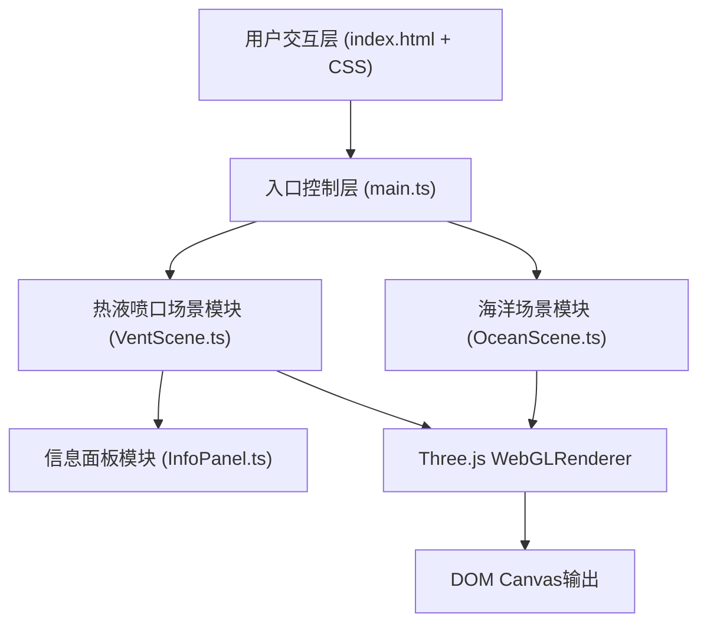

## 1. 架构设计



**模块职责与数据流向：**
- **main.ts**：入口控制器，创建Three.js场景/相机/渲染器，接收用户交互事件并分发到OceanScene和VentScene
- **OceanScene.ts**：海洋水体分层渲染器，接收main.ts的更新指令，输出渲染帧到渲染器
- **VentScene.ts**：热液喷口与生物群落管理器，接收main.ts的缩放/旋转/点击交互，更新粒子参数和生物位置，派发点击事件给InfoPanel
- **InfoPanel.ts**：DOM信息面板控制器，监听VentScene的点击事件，更新DOM展示科普信息

## 2. 技术描述
- **前端框架**：TypeScript 5 + Three.js 0.160 + Vite 5
- **构建工具**：Vite 5
- **辅助库**：lodash（工具函数）、uuid（唯一标识）、simplex-noise@3（噪声生成）
- **后端服务**：无（纯前端静态应用）
- **数据存储**：内置Mock数据（喷口和生物科普信息）

## 3. 项目文件结构
```
.
├── package.json              # 项目依赖与脚本配置
├── vite.config.js            # Vite构建配置
├── tsconfig.json             # TypeScript严格模式配置（目标ES2020）
├── index.html                # 入口HTML页面
└── src/
    ├── main.ts               # 应用入口，初始化场景、相机、渲染器、GUI
    ├── types/                # TypeScript类型定义
    │   └── index.ts          # 喷口、生物、事件等类型
    ├── data/                 # 内置Mock数据
    │   └── species.ts        # 5种生物+3种喷口科普数据
    ├── utils/                # 工具函数
    │   └── easing.ts         # 缓动函数库
    ├── scene/                # 3D场景模块
    │   ├── OceanScene.ts     # 海洋水体分层与光照衰减
    │   └── VentScene.ts      # 热液喷口粒子系统与生物群落
    └── ui/                   # UI交互模块
        └── InfoPanel.ts      # 右上角信息面板DOM控制
```

## 4. 核心类定义

### 4.1 OceanScene 类
```typescript
class OceanScene {
  constructor(scene: THREE.Scene);
  init(): void;                          // 创建4层半透明水体平面
  update(cameraY: number): void;         // 根据相机高度调整层透明度
  setSunAngle(time: number): void;       // 更新海面平行光角度
}
```

### 4.2 VentScene 类
```typescript
class VentScene {
  constructor(scene: THREE.Scene, camera: THREE.Camera, domElement: HTMLElement);
  init(): void;                          // 生成2-4个喷口及周围生物
  update(delta: number): void;           // 更新粒子系统和生物动画
  handleZoom(scale: number): void;       // 缩放时调整粒子参数
  handleRotate(deltaX: number, deltaY: number): void;  // 旋转交互
  onClick(callback: (info: SpeciesInfo | VentInfo) => void): void;  // 注册点击回调
  getVentPositions(): THREE.Vector3[];   // 获取喷口位置供漫游使用
}
```

### 4.3 InfoPanel 类
```typescript
class InfoPanel {
  constructor(container: HTMLElement);
  show(info: SpeciesInfo | VentInfo): void;   // 显示信息（带淡入动画）
  hide(): void;                               // 隐藏面板
}
```

## 5. 数据模型

### 5.1 喷口数据 (VentInfo)
```typescript
interface VentInfo {
  id: string;
  name: string;           // 喷口名称（如"黑烟囱"、"白烟囱"）
  depth: number;          // 深度（米）
  temperature: number;    // 温度估值（℃）
  description: string;    // 200字以内科普介绍
}
```

### 5.2 生物数据 (SpeciesInfo)
```typescript
interface SpeciesInfo {
  id: string;
  name: string;           // 物种名称（如"管虫"、"盲虾"、"巨型贝类"）
  type: 'tubeWorm' | 'blindShrimp' | 'giantClam' | string;
  depth: string;          // 栖息深度范围
  temperature: string;    // 适应温度
  description: string;    // 200字以内科普介绍
}
```

## 6. 性能优化策略
- **粒子池复用**：烟柱粒子使用对象池，避免频繁创建销毁
- **粒子总数上限**：烟柱+生物粒子总数≤8000，每个喷口烟柱≤1500粒子
- **LOD简化**：远处生物使用简化几何体或精灵图
- **帧率自适应**：粒子更新频率根据当前帧率动态调整
- **几何实例化**：管虫和贝类使用InstancedMesh减少Draw Call

## 7. 浏览器兼容性
- 使用WebGL 1.0标准API，兼容主流现代浏览器
- CSS backdrop-filter使用-webkit-前缀兼容Safari
- 响应式布局适配桌面端和移动端
