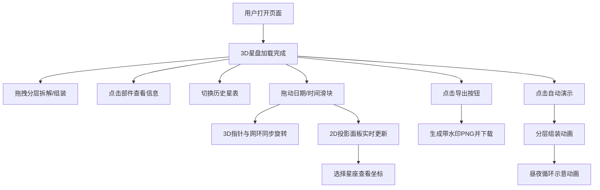

## 1. 产品概述

"星辰仪·历史星图模拟器"是一款运行于浏览器的交互式3D天文仪器模拟应用，面向天文爱好者与历史教育工作者，解决中世纪星盘（Astrolabe）原理学习与演示中，无法直观拆解、旋转和观察星盘各部件工作状态的问题。

- 核心价值：将古老的天文测量仪器数字化复原，通过3D交互、历史星表切换、实时坐标推演，让用户像操作实物一样理解星盘的测时与定位原理。
- 目标用户：天文爱好者、中学/大学历史与天文教师、科技馆演示人员、古典仪器收藏家。

## 2. 核心功能

### 2.1 用户角色

| 角色 | 注册方式 | 核心权限 |
|------|----------|----------|
| 访客用户 | 无需注册，直接访问 | 使用全部功能：拆解星盘、切换星表、推演时间、导出截图 |

### 2.2 功能模块

1. **主场景页面**：3D星盘视图、控制面板、2D投影面板、部件信息卡
2. **星盘交互模块**：分层拖拽拆解/组装、点击高亮、部件信息悬浮卡
3. **历史星表模块**：三套历史数据集切换（托勒密/伊斯兰/第谷）、星表注解
4. **时间推演模块**：日期滑块、时间滑块、指针与网环同步旋转
5. **2D投影模块**：极方位赤经赤纬网格、星座选择、实时高度角/方位角数值
6. **导出模块**：高清PNG截图导出、水印叠加、自动下载
7. **自动演示模块**：分层组装动画（2s/层）、昼夜循环示意（15s）

### 2.3 页面详情

| 页面名称 | 模块名称 | 功能描述 |
|----------|----------|----------|
| 主场景页 | 3D星盘视图 | 四层星盘（网环、指针、底板、外环刻度盘）可独立拖拽分离/组合，点击层高亮发光边缘 |
| 主场景页 | 部件信息卡 | 悬浮显示部件名称（中英双语）与真实星盘中的功能说明 |
| 主场景页 | 控制面板 | 星表下拉菜单、自动演示按钮、导出按钮、汉堡菜单（移动端） |
| 主场景页 | 2D投影面板 | 北极中心极方位网格、北斗七星/猎户座选择、实时高度角与方位角数值 |
| 主场景页 | 时间推演滑块 | 日期滑块（1/1-12/31）、时间滑块（0:00-23:59），实时同步3D旋转与2D投影 |

## 3. 核心流程

**主要用户流程：**
用户进入页面 → 看到完整组装的3D星盘 → 拖拽各层进行拆解观察 → 点击部件查看功能说明 → 切换不同历史星表观察恒星坐标变化 → 拖动日期/时间滑块观察星盘旋转与投影变化 → 选择北斗七星/猎户座查看实时坐标 → 点击导出获取当前读数截图 → 或点击自动演示观看组装与昼夜动画。

## 4. 用户界面设计

### 4.1 设计风格

- **主色调**：羊皮纸黄 `#e8d5a3`（背景）、深赭石色 `#5a3e2b`（文字/边框）、金色 `#c9a84c`（强调色/坐标线）
- **按钮样式**：半透明深色毛玻璃背景 `rgba(40,30,20,0.7)`，1px金色边框，圆角4px，悬停时边框亮度提升
- **字体**：衬线字体用于标题（体现古典学术感），等宽字体用于数据数值显示
- **布局风格**：桌面端左右分栏（左70% 3D场景，右30% 2D投影），移动端上下堆叠
- **视觉效果**：背景带细微噪点与边框磨损磨砂纹理（CSS滤镜），控制面板毛玻璃效果，所有过渡动画0.3-0.5秒缓动

### 4.2 页面设计概览

| 页面名称 | 模块名称 | UI元素 |
|----------|----------|--------|
| 主场景页 | 3D场景区 | 羊皮纸黄背景纹理、居中3D星盘、鼠标拖拽交互、点击高亮发光边缘 |
| 主场景页 | 控制面板 | 右上角半透明深色面板、金色边框、星表下拉、自动演示按钮、导出按钮 |
| 主场景页 | 2D投影面板 | 黑色硬背景 `#0a0a12`、金色坐标线、等宽字体数值、星座选择按钮 |
| 主场景页 | 时间滑块区 | 左下角两个滑块（日期+时间）、滑块轨道金色、滑块头深赭石色 |
| 主场景页 | 部件信息卡 | 浮出式卡片、羊皮纸底色、金色边框、部件名称+功能说明 |

### 4.3 响应式设计

- **桌面端（≥1024px）**：左右布局，左侧70%为3D场景，右侧30%为2D投影面板，控制面板固定右上角
- **移动端（<1024px）**：上下布局，3D场景在上，2D投影面板折叠于下方，控制面板变为可折叠汉堡菜单
- **触摸优化**：拖拽支持touch事件，滑块加大触摸区域

### 4.4 3D场景指导

- **环境与氛围**：暖色调环境光模拟室内烛光/油灯照明，营造古代学者工作室氛围
- **光照设置**：主方向光（暖金色）+ 环境光（微弱暖黄）+ 部件被选中时的边缘自发光效果
- **相机设置**：PerspectiveCamera，初始距离可完整观察星盘，OrbitControls支持环绕观察与缩放
- **构图与焦点**：星盘居中于场景，Z轴分层便于拆解观察，各层间距均匀
- **交互与动画**：拖拽分层时使用弹性缓动，部件选中时发光边缘0.3s淡入，组装动画每层2s平滑插值
- **后处理效果**：轻微泛光（Bloom）增强金色边缘高光，抗锯齿开启
- **性能预算**：3D场景面数控制在10万面以内，目标帧率≥45FPS
