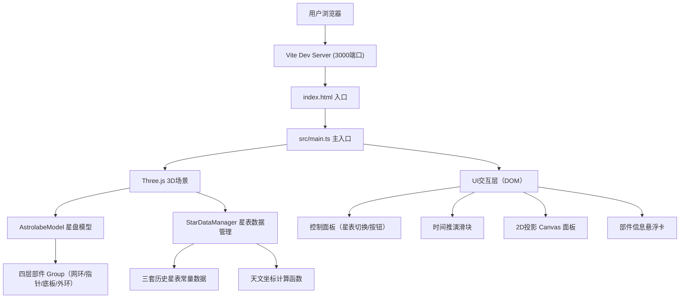
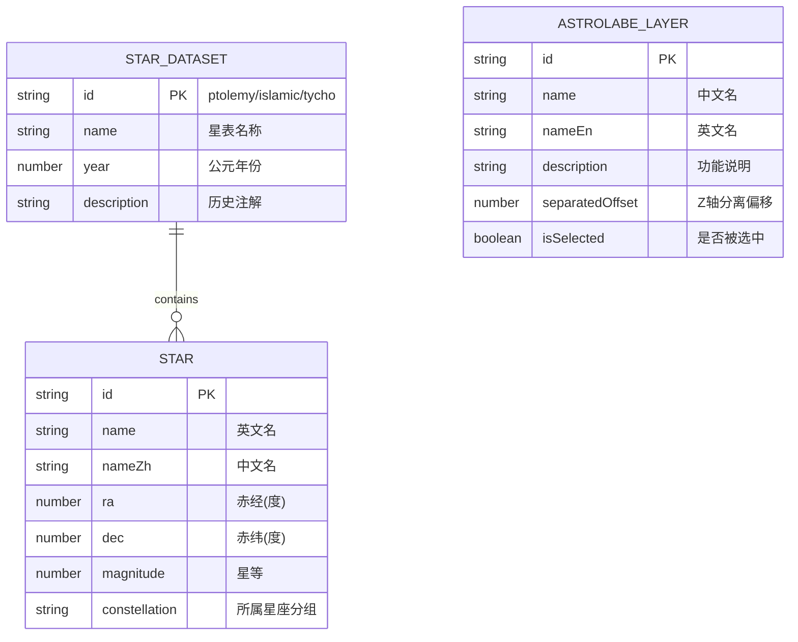

## 1. 架构设计



## 2. 技术描述

- **前端**：TypeScript 5 + Three.js 0.160 + Vite 5（不使用React/Vue，按用户要求直接操作DOM与Three.js）
- **初始化工具**：Vite vanilla-ts 模板
- **后端**：无后端，纯前端单页应用
- **数据库**：无数据库，历史星表数据硬编码为JSON常量数组
- **样式方案**：原生CSS（含CSS变量、滤镜、媒体查询），不使用Tailwind
- **状态管理**：原生事件系统 + 简单状态对象，无需引入Zustand等库
- **依赖包**：
  - `typescript@5`
  - `vite@5`
  - `three@0.160`
  - `@types/three`
  - `lodash`（防抖/节流/深拷贝）
  - `uuid`（可选，用于部件ID生成）

## 3. 路由定义

| 路由 | 用途 |
|------|------|
| `/` | 主应用场景页（唯一页面） |

此应用为单页面应用（SPA），无多路由需求。

## 4. API 定义

无后端API。内部模块接口定义：

### 4.1 AstrolabeModel 接口

```typescript
interface LayerState {
  id: string;
  name: string;
  nameEn: string;
  description: string;
  separatedOffset: number; // 分离时沿Z轴偏移量
  currentOffset: number;
  isSelected: boolean;
  group: THREE.Group;
}

interface AstrolabeModel {
  layers: LayerState[];
  rootGroup: THREE.Group;
  build(): void;
  separateLayer(layerId: string, animate?: boolean): void;
  assembleLayer(layerId: string, animate?: boolean): void;
  assembleAll(animate?: boolean): Promise<void>;
  selectLayer(layerId: string | null): void;
  updateRotation(date: Date, timeHours: number): void;
  updateStarDataset(datasetId: string): void;
  getLayerByIntersect(intersect: THREE.Intersection): LayerState | null;
}
```

### 4.2 StarDataManager 接口

```typescript
interface Star {
  id: string;
  name: string;
  nameZh: string;
  ra: number; // 赤经（度）
  dec: number; // 赤纬（度）
  magnitude: number;
  constellation: 'UrsaMajor' | 'Orion' | 'Other';
}

interface StarDataset {
  id: 'ptolemy' | 'islamic' | 'tycho';
  name: string;
  year: number;
  description: string;
  stars: Star[];
}

interface StarCoordinates {
  altitude: number; // 高度角（度）
  azimuth: number; // 方位角（度）
  hourAngle: number; // 时角
}

interface StarDataManager {
  datasets: Record<string, StarDataset>;
  currentDatasetId: string;
  setDataset(id: string): StarDataset;
  getCurrentDataset(): StarDataset;
  calculateStarPosition(star: Star, date: Date, timeHours: number, observerLat?: number): StarCoordinates;
  getConstellationStars(constellation: 'UrsaMajor' | 'Orion'): Star[];
}
```

## 5. 服务器架构图

无后端服务器。纯前端架构：

```
浏览器 (HTML + CSS + TypeScript)
    ↓
Vite 构建产物 (静态资源)
    ↓
Three.js WebGL 渲染 / Canvas 2D 投影
```

## 6. 数据模型

### 6.1 数据模型定义



### 6.2 初始数据

三套硬编码星表数据（包含北斗七星、猎户座主要恒星，约20-30颗恒星）：

- **ptolemy**（公元150年，托勒密《天文学大成》）：包含其记录的恒星坐标
- **islamic**（公元1000年，伊斯兰星表）：阿拉伯天文学家修正后的坐标
- **tycho**（公元1600年，第谷星表）：第谷·布拉赫高精度观测数据

每套星表中恒星坐标因岁差效应有微小差异，用于体现不同历史时期的观测精度。
