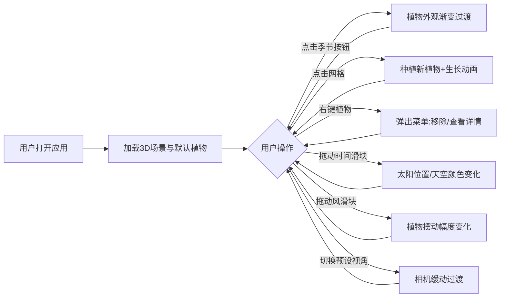

## 1. 产品概述

四季植物景观交互式预览应用，帮助景观设计师在浏览器中直观地预览和调整植物在不同季节下的视觉效果变化，解决传统设计图纸难以展现四季景观差异的问题。

- 目标用户：景观设计师、园林规划师、园艺爱好者
- 核心价值：通过3D可视化呈现植物四季外观变化，辅助景观布局规划决策

## 2. 核心功能

### 2.1 功能模块

1. **3D植物场景渲染**：渲染包含5种植物的小型公园场景，支持四季外观切换与平滑过渡
2. **植物种植与移除**：点击地面种植植物，右键菜单移除或查看植物详情，数据持久化存储
3. **光照与天气模拟**：时间滑块控制太阳位置和光照，风强度滑块控制植物摆动效果
4. **相机导览控制**：OrbitControls自由控制，预设视角快速切换

### 2.2 功能详情

| 模块名称 | 子模块 | 功能描述 |
|---------|-------|---------|
| 3D植物场景 | 四季切换 | 春/夏/秋/冬四季按钮，植物外观1.5秒渐变过渡 |
| 3D植物场景 | 植物种类 | 樱花树、银杏、松树、灌木丛、草地，各有四季外观 |
| 植物管理 | 种植 | 点击10x10半透明网格位置种植，0.8秒生长动画 |
| 植物管理 | 移除 | 右键植物弹出菜单，选择移除 |
| 植物管理 | 详情 | 右键植物查看名称、高度、花期、四季主色调 |
| 植物管理 | 持久化 | 植物数据保存至 localStorage |
| 环境模拟 | 时间控制 | 06:00-20:00滑块，太阳位置与天空颜色实时变化 |
| 环境模拟 | 风强度 | 0-10滑块，控制草地和灌木摆动幅度 |
| 相机控制 | 自由控制 | OrbitControls拖拽旋转、缩放 |
| 相机控制 | 预设视角 | 俯视全景、平视近景、45度人眼视角，0.5秒缓动 |

## 3. 核心流程

## 4. 用户界面设计

### 4.1 设计风格

- 主题：深色科技风（背景 #1a1a2e）
- 主色调：季节代表色（春-粉 #ffb7c5、夏-绿 #4ade80、秋-橙 #fb923c、冬-蓝灰 #94a3b8）
- 按钮：圆形季节按钮，悬停3px发光边框，点击缩放0.9倍弹回
- 字体：无衬线字体，浅灰色，字号14px
- 控件：半透明毛玻璃效果（背景模糊8px）
- 卡片：圆角12px，背景 rgba(0,0,0,0.7)

### 4.2 页面布局

| 区域 | 位置 | UI元素 |
|-----|------|--------|
| 控制面板 | 左侧（桌面）/底部抽屉（移动） | 季节按钮组、时间滑块、风强度滑块、预设视角按钮 |
| 状态显示 | 右上角 | 当前季节名称 + 实时时间（如"秋季 14:30"） |
| 3D场景 | 中央全屏 | Three.js 渲染画布 |
| 右键菜单 | 植物附近浮层 | 移除按钮、植物详情卡片 |

### 4.3 响应式设计

- 屏幕宽度 ≥ 768px：左右分栏布局，控制面板固定左侧
- 屏幕宽度 < 768px：控制面板折叠为底部可展开抽屉
- 触摸设备：优化手势操作，长按替代右键

### 4.4 3D场景指引

- 环境：程序化天空渐变（黎明金橙→正午湛蓝→黄昏橘红）
- 光照：DirectionalLight模拟太阳，AmbientLight环境光
- 相机：PerspectiveCamera，初始45度视角
- 地面：10x10半透明网格辅助种植定位
- 动画：季节过渡1.5s、生长动画0.8s、视角切换0.5s
- 性能：目标30fps+，植物几何体复用，材质统一管理
