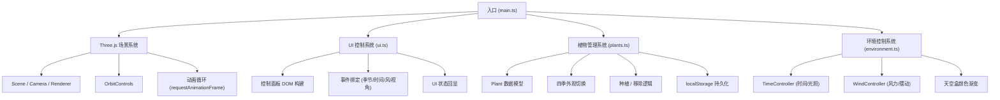

## 1. 架构设计



## 2. 技术栈说明

- **前端框架**：无框架（原生 TypeScript），直接操作 DOM 和 Three.js
- **3D 渲染**：Three.js @0.160.0 + OrbitControls
- **构建工具**：Vite @5.x（支持 TypeScript，开发端口 3000）
- **类型系统**：TypeScript（严格模式，target ES2020）
- **数据持久化**：localStorage（存储植物位置与类型）

## 3. 文件结构

```
.
├── package.json
├── vite.config.js
├── tsconfig.json
├── index.html
└── src/
    ├── main.ts          # 入口：场景初始化、动画循环、模块集成
    ├── plants.ts        # PlantManager：植物数据模型、四季外观、种植移除
    ├── environment.ts   # TimeController / WindController：光照、风、天空
    └── ui.ts            # setupUI：控制面板 DOM、事件绑定、状态回显
```

## 4. 核心模块与接口定义

### 4.1 plants.ts - PlantManager

```typescript
export type Season = 'spring' | 'summer' | 'autumn' | 'winter';

export interface PlantInfo {
  id: string;
  type: PlantType;
  position: { x: number; z: number };
  height: number;
  bloomSeason: Season;
  colors: Record<Season, string>;
}

export type PlantType = 'sakura' | 'ginkgo' | 'pine' | 'bush' | 'grass';

export class PlantManager {
  constructor(scene: THREE.Scene);
  setSeason(season: Season, duration?: number): void;
  plantAt(x: number, z: number, type: PlantType): string;
  removePlant(id: string): boolean;
  getPlantInfo(id: string): PlantInfo | null;
  saveToStorage(): void;
  loadFromStorage(): void;
  update(delta: number, windStrength: number): void;
  getPlants(): PlantInfo[];
  raycast(intersects: THREE.Intersection[]): string | null;
}
```

### 4.2 environment.ts - 环境控制

```typescript
export class TimeController {
  constructor(scene: THREE.Scene, renderer: THREE.WebGLRenderer);
  setTime(hour: number): void;  // 06.0 - 20.0
  getTime(): number;
  getTimeString(): string;      // "14:30"
  update(delta: number): void;
}

export class WindController {
  constructor();
  setStrength(value: number): void;  // 0 - 10
  getStrength(): number;
}

export const envState = {
  time: 12,
  windStrength: 0,
  season: 'summer' as Season
};
```

### 4.3 ui.ts - UI 控制

```typescript
export interface UICallbacks {
  onSeasonChange: (season: Season) => void;
  onTimeChange: (hour: number) => void;
  onWindChange: (strength: number) => void;
  onCameraPreset: (preset: 'top' | 'eye' | 'near') => void;
}

export function setupUI(callbacks: UICallbacks): {
  updateSeason: (s: Season) => void;
  updateTime: (hour: number) => void;
  updateWind: (v: number) => void;
  showPlantMenu: (info: PlantInfo, x: number, y: number) => void;
  hidePlantMenu: () => void;
};
```

### 4.4 main.ts - 场景入口

```typescript
// 初始化 Three.js (Scene, PerspectiveCamera, WebGLRenderer, OrbitControls)
// 创建 PlantManager、TimeController、WindController
// 调用 setupUI 绑定事件
// 启动 requestAnimationFrame 动画循环
// 处理 canvas 点击/右键事件
```

## 5. 关键实现方案

### 5.1 四季植物外观

- 每种植物由多个可变色 Mesh（树干、叶子、花朵等）组成
- 材质使用 `THREE.MeshStandardMaterial`，通过 `material.color.lerp()` 实现 1.5s 颜色渐变
- 冬季落叶植物通过 `visible = false` 隐藏叶子 Mesh，用 `scale.y` 控制枯枝形态
- 草地使用 `InstancedMesh` 批量渲染，减少 draw call

### 5.2 种植与生长动画

- 地面 10x10 GridHelper（半透明），Raycaster 检测点击位置
- 种植时植物整体 `scale = 0`，通过 TWEEN 或自定义缓动在 0.8s 内 grow 到 scale=1
- 植物数据以 JSON 存入 `localStorage['landscape_plants']`，启动时恢复

### 5.3 光照与时间

- DirectionalLight 位置随时间从东半球弧线移动到西半球
- 光色：黎明(06:00) 暖橙 #ff9966 → 正午(12:00) 亮白 #ffffff → 黄昏(20:00) 橘红 #ff6633
- 天空使用 `scene.background = new THREE.Color()`，与光色同步渐变
- AmbientLight 强度随时间变化（正午最强 0.6，晨昏 0.3）

### 5.4 风摆动效果

- 草地/灌木顶点着色器或 CPU 端 update 循环中修改 rotation/position
- 摆动幅度 = windStrength * baseAmplitude，频率 = 1.5Hz
- 使用 sin 函数叠加少量噪声，避免机械感

### 5.5 相机视角缓动

- 三个预设：俯视(0, 20, 0.01)、近景(8, 3, 8)、45度(10, 10, 10)
- 在动画循环中对 camera.position 和 controls.target 做 lerp 插值，0.5s 完成
- OrbitControls 启用 damping，交互更平滑

### 5.6 UI 实现

- 控制面板：fixed 定位，`backdrop-filter: blur(8px)` + `background: rgba(255,255,255,0.08)`
- 季节按钮：圆形 48px，box-shadow 过渡实现发光，transform: scale(0.9) 点击反馈
- 响应式：CSS media query `(min-width: 768px)` 控制左右/底部布局
- 右键菜单：preventDefault contextmenu，动态创建浮层 DOM，绝对定位

## 6. 性能优化策略

- 几何体复用：所有同类植物共享同一个 Geometry 实例
- 材质克隆但共享 uniforms：只修改 color 等少量属性
- InstancedMesh：草地每簇 100 根草 blades，用单个 draw call
- 减少 Raycaster 调用频率：只在 mousedown 时触发
- 动画循环使用 delta time，避免帧率相关的动画速度差异
- 合理设置 pixelRatio（限制为 min(devicePixelRatio, 2)）
