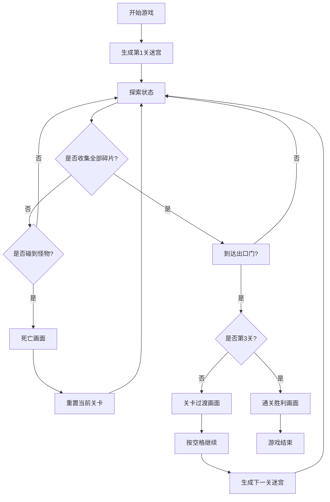

## 1. 产品概述
"暗影蜡烛"是一款基于浏览器的2D像素风解谜游戏，玩家操控一根微弱的小蜡烛在完全黑暗的迷宫中探索，收集微光碎片扩大视野，躲避影子怪物，最终找到出口重见光明。
- 核心玩法：迷宫探索 + 光照策略 + 怪物躲避
- 目标用户：休闲解谜游戏爱好者

## 2. 核心功能

### 2.1 用户角色
| 角色 | 注册方式 | 核心权限 |
|------|----------|----------|
| 玩家 | 无需注册，直接进入游戏 | 体验全部游戏内容 |

### 2.2 功能模块
1. **游戏主界面**：迷宫渲染、光照效果、玩家与怪物渲染、HUD信息显示
2. **迷宫生成系统**：基于 simplex-noise 的随机迷宫生成、路径验证、碎片与出口放置
3. **玩家控制系统**：WASD 键盘输入、平滑移动动画、光照半径管理、碎片收集
4. **怪物AI系统**：影子怪物巡逻与追踪行为、可见性管理、碰撞检测
5. **游戏状态管理**：探索→死亡→胜利状态流转、关卡过渡、3关难度渐进

### 2.3 页面详情
| 页面名称 | 模块名称 | 功能描述 |
|----------|----------|----------|
| 游戏主界面 | 迷宫渲染 | Canvas 2D绘制深灰墙壁、黑色地面、黄色碎片、绿色出口门 |
| 游戏主界面 | 光照系统 | 圆形径向渐变光照、蜡烛火焰噪点闪烁、怪物渐显效果 |
| 游戏主界面 | HUD显示 | 左上角：光照半径/碎片数/关卡，右上角：时间/步数 |
| 游戏主界面 | 输入处理 | WASD移动、空格继续下一关、鼠标隐藏 |
| 失败画面 | 死亡反馈 | 画面闪白0.3秒、显示"烛火熄灭"红色大字、重置关卡 |
| 胜利画面 | 通关反馈 | 白圈扩散动画、显示"重见光明"白色大字、显示步数和时间 |
| 关卡过渡 | 过渡界面 | 显示关卡编号、下一关小地图预览、按空格继续 |

## 3. 核心流程
玩家进入游戏后从第一关开始，操控蜡烛在黑暗迷宫中探索。每走一步短暂照亮周围区域，通过WASD移动避开影子怪物，收集黄色微光碎片扩大光照半径。收集全部碎片后到达绿色出口门进入下一关。被怪物触碰则当前关卡重置。完成3关后游戏通关。

## 4. 用户界面设计
### 4.1 设计风格
- 主色调：纯黑背景 #000000、深灰墙壁 #2a2a2a、暖黄光照 #ffdd66、亮黄碎片 #ffdd00、绿色出口 #00ff88
- 按钮风格：无传统按钮，全部像素风格界面
- 字体：8x8像素字体，标题使用像素字体带蜡烛火焰动画
- 布局：居中画布，HUD信息分布在四角
- 整体风格：极简像素风、幽暗神秘氛围

### 4.2 页面设计概述
| 页面名称 | 模块名称 | UI元素 |
|----------|----------|--------|
| 游戏主界面 | 迷宫区域 | 21x21/25x25/29x29像素网格，墙壁深灰、地面纯黑 |
| 游戏主界面 | 光照效果 | 圆形径向渐变从暖黄到透明，边界噪点闪烁 |
| 游戏主界面 | HUD | 左上角：黄色圆形图标+光照半径、黄色菱形图标+碎片数、"第X关"；右上角：时间、步数 |
| 失败画面 | 覆盖层 | 半透明黑色背景、红色像素大字"烛火熄灭"居中 |
| 胜利画面 | 覆盖层 | 半透明黑色背景、白色像素大字"重见光明"、步数时间统计 |
| 关卡过渡 | 覆盖层 | 半透明黑色背景、关卡编号、小地图预览、"按空格继续"提示 |

### 4.3 响应性
- 桌面端优先，固定画布尺寸居中显示
- 游戏画布按像素比例缩放，保持像素风格清晰

### 4.4 性能要求
- 游戏循环稳定60FPS
- 光照渲染使用 Canvas globalCompositeOperation + 径向渐变
- 每帧增量更新仅玩家周围光照半径+2格区域
- 怪物AI路径计算节流至每0.2秒一次
- 移动动画保证帧率不低于50FPS
