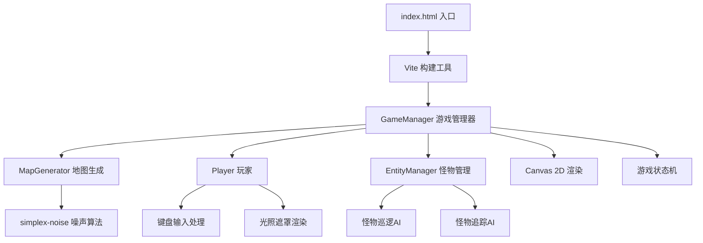

## 1. 架构设计



## 2. 技术描述
- 前端：TypeScript@5 + Vite@5
- 渲染引擎：Canvas 2D API
- 核心依赖：
  - typescript@5：类型安全
  - vite@5：构建与开发服务器
  - lodash：工具函数
  - uuid：唯一标识生成
  - simplex-noise@3：随机迷宫生成算法
- 无后端服务，纯前端游戏

## 3. 目录结构
```
.
├── package.json
├── index.html
├── tsconfig.json
├── vite.config.js
└── src/
    ├── GameManager.ts      # 核心游戏循环、状态管理、渲染调度
    ├── MapGenerator.ts     # 迷宫生成、碎片/出口/怪物位置
    ├── Player.ts           # 玩家控制、移动、光照、收集
    └── EntityManager.ts    # 怪物AI、巡逻、追踪、碰撞
```

## 4. 核心类型定义

### 4.1 游戏状态
```typescript
type GameState = 'exploring' | 'dead' | 'victory' | 'transition';
```

### 4.2 地图格子类型
```typescript
type TileType = 'wall' | 'floor' | 'shard' | 'exit' | 'start';
```

### 4.3 坐标与方向
```typescript
interface Position {
  x: number;
  y: number;
}

type Direction = 'up' | 'down' | 'left' | 'right';
```

### 4.4 怪物状态
```typescript
interface ShadowMonster {
  id: string;
  position: Position;
  path: Position[];
  pathIndex: number;
  state: 'patrol' | 'chase';
  visibility: number; // 0~1 渐显过渡
  moveTimer: number;
  pulseTimer: number;
}
```

### 4.5 关卡配置
```typescript
interface LevelConfig {
  level: number;
  mapSize: number;      // 21, 25, 29
  monsterCount: number; // 3, 5, 7
  shardCount: number;   // 10, 15, 20
  initialRadius: number;
  radiusPerShard: number;
  maxRadius: number;
}
```

## 5. 性能优化策略

### 5.1 渲染优化
- 使用离屏 Canvas 预渲染静态地图
- 每帧仅重绘玩家周围光照半径+2格区域
- 光照使用 `globalCompositeOperation = 'destination-out'` 配合径向渐变
- 完全黑色区域跳过绘制

### 5.2 AI 优化
- 怪物路径计算节流至每 0.2 秒一次
- 使用曼哈顿距离进行快速范围判断
- 追踪状态下使用简单朝向判断，不进行复杂寻路

### 5.3 动画优化
- 使用 requestAnimationFrame 驱动游戏循环
- 移动动画使用线性插值平滑过渡
- 对象池复用怪物与特效对象

## 6. 游戏循环时序
```
每帧 (16.6ms):
├── 输入处理 (1ms)
│   └── WASD 键盘轮询
├── 逻辑更新 (3ms)
│   ├── 玩家移动插值
│   ├── 怪物移动/AI (每0.2s计算路径)
│   ├── 碰撞检测
│   └── 状态流转判断
├── 渲染更新 (8ms)
│   ├── 地图基础层
│   ├── 碎片/出口闪烁
│   ├── 光照遮罩 (径向渐变 + 噪点)
│   ├── 怪物渐显
│   ├── 特效层 (波纹、闪白、扩散)
│   └── HUD文字
└── 状态渲染 (2ms)
    └── 死亡/胜利/过渡覆盖层
```
