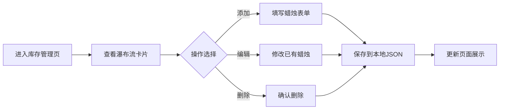

# 香薰蜡烛工坊管理系统 PRD

## 1. 产品概述
一款为小型独立香薰蜡烛工坊量身打造的全栈Web管理系统，解决依赖微信聊天记录管理库存、订单和客户偏好导致的漏记、发错货等问题。
- 核心目标：提升工坊运营效率，实现蜡烛库存、客户订单、偏好记录的数字化管理
- 目标用户：小型独立香薰蜡烛工坊主理人

## 2. 核心功能

### 2.1 用户角色
| 角色 | 注册方式 | 核心权限 |
|------|----------|----------|
| 工坊主 | 默认单用户 | 所有功能的完全访问权限 |

### 2.2 功能模块
1. **蜡烛库存管理**：添加/编辑/删除蜡烛，瀑布流卡片展示，搜索过滤
2. **客户订单管理**：创建订单，订单状态流转，订单详情展开
3. **客户偏好记录**：客户资料，香型偏好雷达图，历史购买记录
4. **批量通知生成器**：多选订单生成通知文本，一键复制

### 2.3 页面详情
| 页面名称 | 模块名称 | 功能描述 |
|----------|----------|----------|
| 库存管理页 | 蜡烛卡片瀑布流 | 展示所有蜡烛，支持按名称/香型搜索，分页显示20条 |
| 库存管理页 | 添加/编辑蜡烛表单 | 名称、香型、颜色、库存、包装、标签、照片上传(base64) |
| 订单管理页 | 订单列表 | 时间倒序排列，显示客户名、商品摘要、状态标签 |
| 订单管理页 | 订单详情展开 | 0.3s过渡动画，显示完整订单信息 |
| 订单管理页 | 创建订单表单 | 多选蜡烛+数量，客户信息，期望日期，状态管理 |
| 客户偏好页 | 客户资料卡 | 客户基本信息、备注、常购包装 |
| 客户偏好页 | 香型偏好雷达图 | 柑橘/花香/木质/草本/东方调占比可视化 |
| 批量通知页 | 订单选择器 | 多选订单生成通知 |
| 批量通知页 | 通知编辑器 | 手动编辑模板，一键复制到剪贴板 |

## 3. 核心流程

### 3.1 蜡烛库存管理流程

### 3.2 订单创建与通知流程

## 4. 用户界面设计

### 4.1 设计风格
- **主色调**：#e8c9a0（旧纸黄）作为页面背景
- **辅色调**：#8b5e3c（深可可棕）用于文字和边框
- **按钮色**：#c7823d（琥珀橙），hover时加深至#a56729
- **导航栏**：左侧固定240px，背景#2c1a0e（深木色），文字#f0e6d3
- **卡片样式**：白色背景，box-shadow: 0 2px 8px rgba(0,0,0,0.08)，悬停上移4px阴影加深
- **按钮**：圆角设计，过渡平滑
- **字体**：选用温暖优雅的衬线/无衬线字体组合

### 4.2 页面设计概览
| 页面名称 | 模块名称 | UI元素 |
|----------|----------|--------|
| 库存管理页 | 瀑布流卡片 | 双列布局，卡片悬停动效，色块展示蜡烛颜色 |
| 订单管理页 | 订单列表 | 状态标签色区分（待调配-灰色、生产中-蓝色、已发货-橙色、已完成-绿色） |
| 客户偏好页 | 雷达图 | 五维香型偏好可视化，暖色填充 |
| 批量通知页 | 文本编辑器 | 仿纸张质感编辑区，复制按钮高亮 |

### 4.3 响应式设计
- 桌面端优先，移动端自适应
- <=768px时：导航栏折叠为汉堡菜单，卡片变单列，字体缩小
- 订单详情展开/收起：0.3秒ease-out过渡动画
- 触摸设备优化按钮点击区域

## 5. 性能约束
- 页面初始加载时间：本地环境不超过2秒
- 瀑布流：虚拟滚动或分页，每次显示20个蜡烛卡片
- 后端接口响应：小于200ms
- 搜索过滤（名称/香型）：500ms内返回结果
