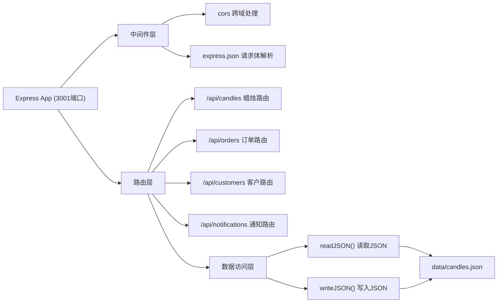
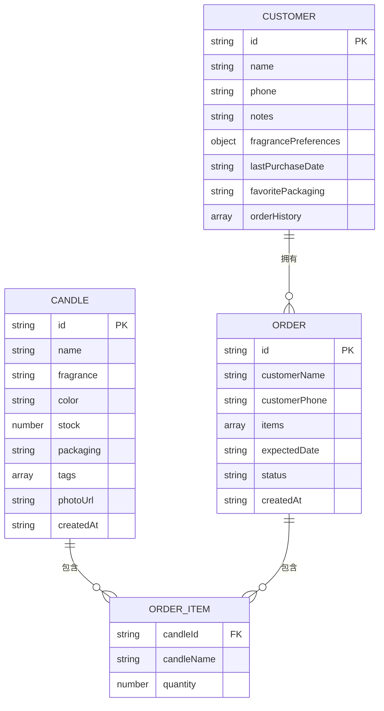

# 香薰蜡烛工坊管理系统 - 技术架构文档

## 1. 架构设计
```mermaid
graph TB
    subgraph "前端 (React 18 + TypeScript + Vite"
        A["App.tsx (路由+全局状态)"]
        B["api.ts (RESTful API封装)
        C["页面组件"]
        C --> C1["库存管理页"]
        C --> C2["订单管理页"]
        C --> C3["客户偏好页"]
        C --> C4["批量通知页"]
        D["通用组件"]
        D --> D1["CandleCard蜡烛卡片"]
        D --> D2["Sidebar导航栏"]
        D --> D3["订单列表项"]
    end

    subgraph "后端 (Node.js + Express + TypeScript
        E["server/index.ts (Express 3001端口)"]
        E --> E1["蜡烛CRUD接口"]
        E --> E2["订单管理接口"]
        E --> E3["客户偏好接口"]
        E --> E4["批量通知接口"]
    end

    subgraph "数据层"
        F["data/candles.json (本地模拟数据库"]
    end

    A --> B
    B -->|HTTP /api/*| E
    E -->|读写| F
```

## 2. 技术栈说明
- **前端框架**: React@18 + React-DOM@18
- **前端构建**: Vite@5 + @vitejs/plugin-react
- **语言**: TypeScript@5（严格模式）
- **状态管理**: React Hooks (useState, useEffect, useContext
- **UI组件库: 原生CSS
- **后端**: Node.js + Express@4
- **跨域**: cors
- **工具库**: uuid（唯一ID), date-fns（日期处理
- **图表**: 自研SVG雷达图
- **拖拽**: react-beautiful-dnd
- **数据库**: 本地JSON文件模拟

## 3. 目录结构
```
.
├── package.json
├── vite.config.js
├── tsconfig.json
├── index.html
├── server/
│   └── index.ts
│   └── types.ts
├── src/
│   ├── App.tsx
│   ├── api.ts
│   ├── types.ts
│   ├── styles/
│   │   └── global.css
│   ├── components/
│   │   ├── Sidebar.tsx
│   │   ├── CandleCard.tsx
│   │   └── OrderItem.tsx
│   │   └── RadarChart.tsx
│   └── pages/
│       ├── InventoryPage.tsx
│       ├── OrdersPage.tsx
│       ├── CustomersPage.tsx
│       └── NotificationsPage.tsx
├── data/
│   └── candles.json
```

## 4. 路由定义
| 路由 | 页面 | 用途 |
|------|------|------|
| / | InventoryPage | 蜡烛库存管理（默认页） |
| /orders | OrdersPage | 客户订单管理 |
| /customers | CustomersPage | 客户偏好记录 |
| /notifications | NotificationsPage | 批量通知生成器 |

## 5. API 接口定义

### 5.1 蜡烛相关接口
```typescript
// Candle 数据模型
interface Candle {
  id: string;
  name: string;
  fragrance: '柑橘调' | '花香调' | '木质调' | '草本调' | '东方调';
  color: string;
  stock: number;
  packaging: '玻璃瓶' | '铁罐' | '布袋';
  tags: string[];
  photoUrl: string; // base64
  createdAt: string;
}

// GET /api/candles - 获取所有蜡烛（支持搜索和分页
// 请求参数: { search?: string; fragrance?: string; page?: number; limit?: number
// 响应: { data: Candle[]; total: number }

// GET /api/candles/:id - 获取单个蜡烛
// 响应: Candle

// POST /api/candles - 创建蜡烛
// 请求体: Omit<Candle, 'id' | 'createdAt'>
// 响应: Candle

// PUT /api/candles/:id - 更新蜡烛
// 请求体: Partial<Candle>
// 响应: Candle

// DELETE /api/candles/:id - 删除蜡烛
// 响应: { success: boolean }
```

### 5.2 订单相关接口
```typescript
// Order 数据模型
type OrderStatus = '待调配' | '生产中' | '已发货' | '已完成';

interface OrderItem {
  candleId: string;
  candleName: string;
  quantity: number;
}

interface Order {
  id: string;
  customerName: string;
  customerPhone: string;
  items: OrderItem[];
  expectedDate: string;
  status: OrderStatus;
  createdAt: string;
}

// GET /api/orders - 获取所有订单（时间倒序
// 响应: Order[]

// GET /api/orders/:id - 获取单个订单
// 响应: Order

// POST /api/orders - 创建订单
// 请求体: Omit<Order, 'id' | 'createdAt'>
// 响应: Order

// PUT /api/orders/:id - 更新订单（含状态变更）
// 请求体: Partial<Order>
// 响应: Order

// DELETE /api/orders/:id - 删除订单
// 响应: { success: boolean }
```

### 5.3 客户偏好接口
```typescript
// Customer 数据模型
interface Customer {
  id: string;
  name: string;
  phone: string;
  notes: string;
  fragrancePreferences: {
    柑橘调: number;
    花香调: number;
    木质调: number;
    草本调: number;
    东方调: number;
  };
  lastPurchaseDate: string | null;
  favoritePackaging: '玻璃瓶' | '铁罐' | '布袋' | null;
  orderHistory: string[];
}

// GET /api/customers - 获取所有客户
// 响应: Customer[]

// GET /api/customers/:id - 获取单个客户
// 响应: Customer

// GET /api/customers/by-phone/:phone - 根据手机号查客户
// 响应: Customer | null

// POST /api/customers - 创建客户
// 请求体: Omit<Customer, 'id'>
// 响应: Customer

// PUT /api/customers/:id - 更新客户
// 请求体: Partial<Customer>
// 响应: Customer
```

### 5.4 批量通知接口
```typescript
// POST /api/notifications/generate
// 请求体: { orderIds: string[] }
// 响应: { text: string }
```

## 6. 服务器架构


## 7. 数据模型

### 7.1 ER 图


### 7.2 JSON 数据文件结构
```json
{
  "candles": [],
  "orders": [],
  "customers": []
}
```

## 8. 数据流说明

### 前端数据流
1. 前端通过 `src/api.ts` 封装所有fetch调用
2. `App.tsx` 管理全局状态和页面路由
3. 页面组件调用api函数获取数据
4. 子组件通过props接收数据和回调

### 后端数据流
1. Express接收HTTP请求
2. 路由匹配对应的处理函数
3. 读取/写入 `data/candles.json`
4. 返回JSON响应
