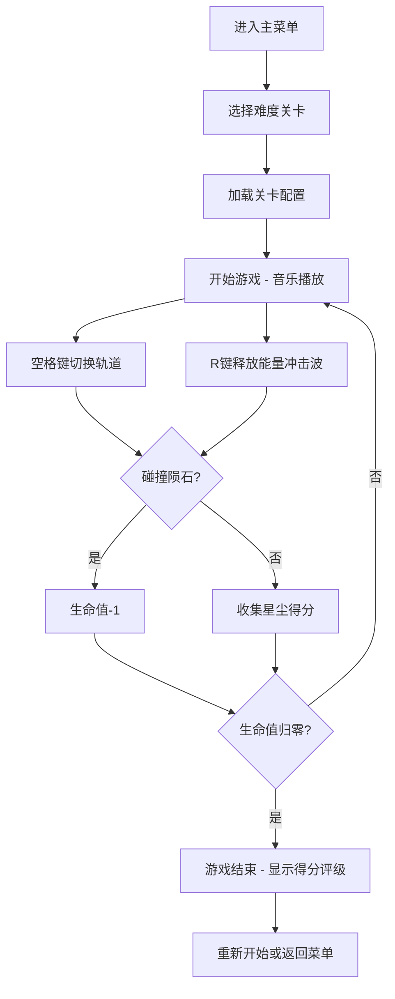

## 1. 产品概述

"星轨编织者"是一款基于浏览器的2D像素风音乐节奏跑酷游戏。玩家操控小飞船在星轨上飞行，同步躲避陨石、收集星尘并积累能量触发轨道爆炸效果。

- 目标用户：喜欢音乐节奏游戏和像素风游戏的休闲玩家
- 市场价值：轻量级浏览器游戏，无需安装，随时随地可玩，音乐节奏与跑酷结合的创新玩法

## 2. 核心功能

### 2.1 用户角色
| 角色 | 注册方式 | 核心权限 |
|------|----------|----------|
| 玩家 | 无需注册 | 游戏游玩、关卡选择、分数记录 |

### 2.2 功能模块
1. **主菜单页面**：动态彩虹描边标题、三个难度关卡选择按钮
2. **游戏页面**：游戏画布、得分显示、生命值显示、能量槽、暂停/结束界面
3. **游戏结束页面**：最终得分、评级展示、重新开始/返回菜单选项

### 2.3 页面详情
| 页面名称 | 模块名称 | 功能描述 |
|----------|----------|----------|
| 主菜单 | 标题区域 | 动态彩虹描边像素字体标题"星轨编织者" |
| 主菜单 | 关卡选择 | 简单/普通/困难三个关卡按钮，悬停变色 |
| 游戏页面 | HUD界面 | 左上角像素风得分和生命值、右上角能量进度条 |
| 游戏页面 | 游戏画布 | 星空背景、星轨、飞船、陨石、星尘、粒子特效 |
| 游戏结束 | 评级展示 | 半透明遮罩、大号像素字体得分和评级 |

## 3. 核心流程

## 4. 用户界面设计

### 4.1 设计风格
- **主色调**：深空蓝 `#0a0a2e` 背景，白色 `#ffffff` 主文字，金色 `#ffaa00` 强调色
- **渐变色彩**：能量槽从蓝色 `#3366ff` 渐变到金色 `#ffcc00`
- **按钮风格**：无衬线白色字体带微弱发光效果，悬停变为金色
- **字体**：像素风格字体（通过CSS实现像素感），配合无衬线字体
- **布局**：全屏16:9画布居中，响应式适配手机竖屏和电脑横屏
- **动效**：标题彩虹描边循环动画、粒子爆发特效、屏幕闪烁反馈、渐变过渡动画

### 4.2 页面设计概览
| 页面名称 | 模块名称 | UI元素 |
|----------|----------|--------|
| 主菜单 | 标题 | 居中大号像素字体、CSS彩虹描边动画循环 |
| 主菜单 | 关卡按钮 | 垂直排列、白色发光文字、悬停金色过渡 |
| 游戏页面 | HUD | 左上角像素数字得分/生命值、右上角渐变能量条 |
| 游戏页面 | 画布 | 16:9比例、居中、背景星空闪烁、三条平行星轨 |
| 游戏结束 | 遮罩 | 半透明黑色覆盖、中央大号得分和评级文字渐变出现 |

### 4.3 响应式设计
- **桌面优先**：画布保持16:9比例，最大宽度适配视口
- **移动适配**：小屏幕下画布按比例缩放，触摸操作支持
- **触摸优化**：支持屏幕点击切换轨道和释放技能

### 4.4 视觉特效
- **星尘收集**：画布中心金色星点粒子爆发（0.3秒）
- **能量冲击波**：全屏白色光晕闪烁（0.1秒）+ 爆破音效
- **飞船受伤**：屏幕边缘红色渐变 + 飞船闪烁（0.5秒）
- **评级出现**：底部弹出、200ms渐变动画
