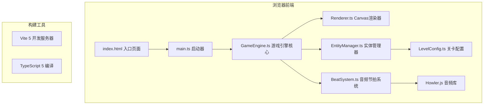

## 1. 架构设计



## 2. 技术说明

- **前端框架**：纯 TypeScript + Canvas 2D（无UI框架）
- **构建工具**：Vite 5
- **类型系统**：TypeScript 5（严格模式，目标 ES2020）
- **音频处理**：Howler.js 2.x
- **工具库**：lodash、uuid
- **渲染方式**：Canvas 2D 原生API，60FPS requestAnimationFrame 循环

## 3. 文件结构

```
project-root/
├── package.json
├── index.html
├── tsconfig.json
├── vite.config.js
└── src/
    ├── main.ts              (入口启动文件)
    ├── GameEngine.ts        (游戏循环核心)
    ├── Renderer.ts          (像素渲染引擎)
    ├── BeatSystem.ts        (音频分析模块)
    ├── EntityManager.ts     (实体管理)
    ├── LevelConfig.ts       (关卡配置)
    └── types.ts             (类型定义)
```

## 4. 核心模块设计

### 4.1 GameEngine 游戏引擎
- 主循环：requestAnimationFrame 60FPS
- 职责：帧更新调度、碰撞检测、节拍同步、状态管理
- 每帧调用顺序：BeatSystem.update → EntityManager.update → 碰撞检测 → Renderer.render

### 4.2 Renderer 渲染器
- 封装 Canvas 2D API
- 绘制内容：背景星空、动态星轨、飞船、陨石、星尘、粒子特效、HUD
- 像素风格渲染：禁用图像平滑、整数坐标、像素化文本

### 4.3 BeatSystem 节拍系统
- Howler.js 加载播放128BPM电子舞曲
- 节拍检测：基于时间计算的节拍触发器
- 输出：BPM值、节拍事件回调、节拍强度值
- 控制台实时BPM输出

### 4.4 EntityManager 实体管理
- 实体类型：Ship（飞船）、Meteor（陨石）、Stardust（星尘）、Explosion（爆炸）、Particle（粒子）
- 对象池：粒子特效限制500个，超出丢弃最早
- 节拍生成：按LevelConfig配置的节拍间隔生成实体

### 4.5 LevelConfig 关卡配置
| 难度 | 轨道数 | 生成频率 | 陨石速度 | 追踪陨石 |
|------|--------|----------|----------|----------|
| 简单 | 2条 | 每4拍 | 慢 | 无 |
| 普通 | 3条 | 每2拍 | 中 | 无 |
| 困难 | 3条 | 每拍 | 快 | 有 |

## 5. 评分系统

| 事件 | 得分 |
|------|------|
| 收集星尘 | +100 |
| 连击加成（连续3个以上） | 每个额外+50 |
| 冲击波摧毁陨石 | 每个+200 |

| 评级 | 分数范围 |
|------|----------|
| S级 | >5000 |
| A级 | 3000-4999 |
| B级 | 1500-2999 |
| C级 | <1500 |

## 6. 操作控制

| 按键 | 功能 | 动画时长 |
|------|------|----------|
| 空格键 | 切换轨道（上/中/下） | 半拍内完成 |
| R键 | 释放能量冲击波（消耗50%能量） | - |

## 7. 性能指标

| 指标 | 要求 |
|------|------|
| 帧率 | 稳定60FPS |
| 单帧渲染 | ≤16.5ms |
| 粒子上限 | 500个 |
| 音频延迟 | ≤50ms |
