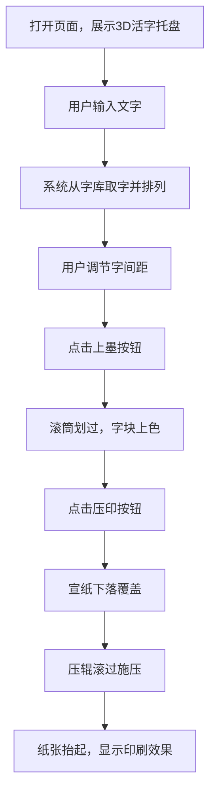

## 1. 产品概述
基于浏览器的3D古代活字印刷排版交互模拟器，让用户沉浸式体验中国古代活字印刷术的完整工序。
- 目标用户：博物馆观众、教育机构师生、传统文化爱好者
- 核心价值：将静态的历史展示变为可交互的3D体验，直观理解活字拣字、排版、上墨、压印的完整流程

## 2. 核心功能

### 2.1 用户角色
本产品为单用户体验，无角色区分。

### 2.2 功能模块
1. **活字托盘展示**：3D木制活字托盘，抽屉式推拉动画，惯性散开与重排效果
2. **文字输入与排版**：文字输入区、字库检索、排字轨道、字间距调节滑块
3. **上墨与压印流程**：滚筒上墨动画、宣纸下落、压辊压印、印刷效果展示
4. **控制面板UI**：半透明毛玻璃面板、古风按钮样式、状态反馈

### 2.3 页面详情
| 页面名称 | 模块名称 | 功能描述 |
|---------|---------|---------|
| 主场景 | 3D活字托盘 | 半透明浅檀木色托盘，内置数百个3D活字块，抽屉式推拉交互，惯性散开动画 |
| 主场景 | 排字轨道 | 位于印版中央，按顺序排列用户选择的活字块，支持字间距0.1mm-1.0mm平滑调节 |
| 主场景 | 上墨滚筒 | 点击上墨按钮后，滚筒自动划过字块顶部，涂抹深红色半透明墨汁材质 |
| 主场景 | 压印系统 | 仿古宣纸下落覆盖，压辊从左到右施压，纸张抬起显示印刷效果 |
| 控制面板 | 文字输入 | 楷体字体输入框，最多20字，实时从字库取字排版 |
| 控制面板 | 间距滑块 | 0.1mm步进，显示当前数值，实时更新字块位置 |
| 控制面板 | 操作按钮 | 上墨、压印按钮，琥珀色#ffb300可操作状态，水波纹点击反馈 |

## 3. 核心流程
用户打开页面后，首先看到3D活字托盘场景。用户在控制面板输入文字，系统自动从字库中取出对应活字块排列在排字轨道上。用户可通过滑块调整字间距，实时预览排版效果。点击上墨按钮，滚筒划过给字块上墨。最后点击压印按钮，宣纸落下、压辊滚过、纸张抬起，显示最终印刷效果。

## 4. 用户界面设计

### 4.1 设计风格
- **主色调**：深檀木色#3e2723（背景）、浅檀木#8d6e63（托盘）、旧象牙白#d7ccc8（活字块）、深咖啡色#4e342e（压辊）、旧纸黄#faebd2（纸张）、琥珀色#ffb300（按钮激活色）
- **字体**：标题使用楷体，控制面板文字使用楷体
- **视觉效果**：木质纹理、半透明毛玻璃面板、纸张边缘卷曲噪音动画、水波纹按钮反馈、贝塞尔曲线缓动动画
- **布局**：3D场景全屏居中，控制面板固定右下角

### 4.2 页面设计概览
| 页面名称 | 模块名称 | UI元素 |
|---------|---------|---------|
| 主场景 | 标题 | 白色楷体"活字排印"，古风印章样式阴影 |
| 主场景 | 3D场景 | Canvas全屏居中，深檀木色背景，木质托盘与活字块 |
| 控制面板 | 容器 | 半透明毛玻璃效果，固定右下角，圆角设计 |
| 控制面板 | 输入框 | 楷体字体，浅木色边框，聚焦琥珀色高亮 |
| 控制面板 | 滑块 | 木纹轨道，琥珀色滑块，实时数值显示 |
| 控制面板 | 按钮 | 木纹底色，可操作时渐变为琥珀色，水波纹点击动画 |

### 4.3 响应式
桌面端优先设计，3D场景自适应窗口尺寸，控制面板保持合理比例。

### 4.4 3D场景指引
- **环境**：深檀木色背景，暖色调环境光，营造古朴氛围
- **灯光**：主光源从左上方45度照射，辅以柔和环境光，突出木质纹理和活字凸起
- **摄像机**：透视相机，初始角度略微俯视，可通过鼠标拖拽轻微旋转视角
- **构图**：活字托盘位于场景中后方，排字轨道位于前景中央，控制面板不遮挡主要操作区
- **交互动画**：托盘抽屉式推拉（带惯性散开）、字块平滑移动、滚筒旋转划过、宣纸飘动下落、压辊滚动施压
- **材质**：木材使用带纹理的物理材质，墨汁使用半透明动态材质，纸张使用带纹理和轻微不透明度变化的材质
- **性能**：30FPS以上稳定帧率，活字块使用几何体实例化优化
