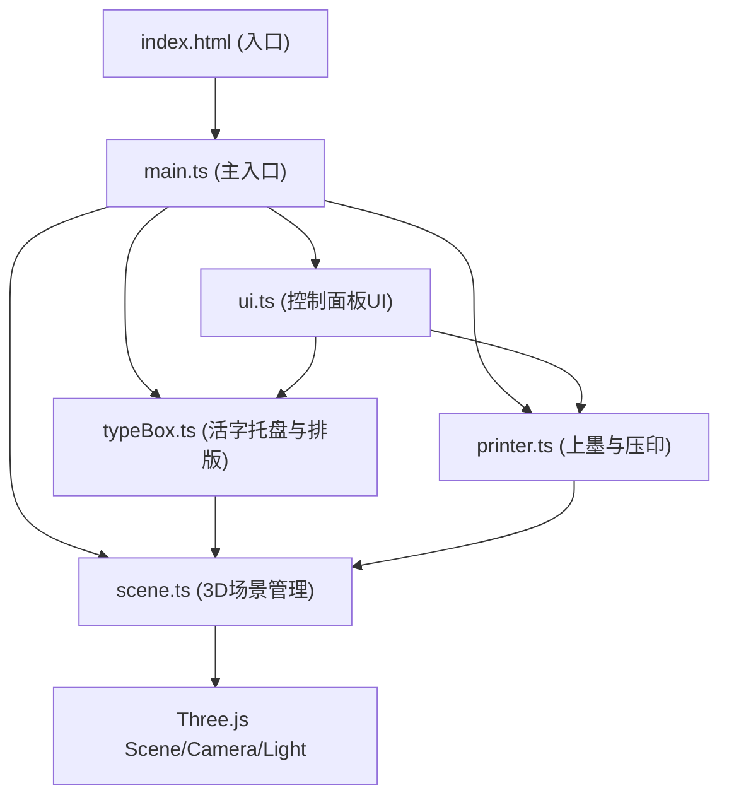

## 1. 架构设计



## 2. 技术说明
- **前端框架**：原生TypeScript + Three.js 0.160
- **构建工具**：Vite 5
- **语言目标**：ES2020
- **样式**：原生CSS + 自定义古风主题
- **动画**：贝塞尔曲线缓动函数，requestAnimationFrame驱动
- **性能优化**：InstancedMesh管理大量活字块，材质复用，LOD策略

## 3. 模块定义
| 模块文件 | 职责 | 对外接口 |
|---------|------|---------|
| src/scene.ts | 初始化Three.js场景、摄像机、灯光，管理3D对象生命周期 | SceneManager类：init(), addObject(), removeObject(), render() |
| src/typeBox.ts | 管理活字托盘、3000字库、抽屉动画、排版轨道、字间距调节 | TypeBox类：init(), pullTray(), pushTray(), setText(), adjustSpacing() |
| src/printer.ts | 上墨滚筒动画、材质切换、宣纸下落、压辊动画、印刷效果 | Printer类：init(), applyInk(), pressPrint() |
| src/ui.ts | 控制面板DOM创建、事件绑定、状态管理、向其他模块发指令 | UIController类：init(), bindEvents(), setButtonState() |
| src/main.ts | 应用入口，初始化所有模块并建立通信 | bootstrap() |

## 4. 核心数据模型

### 4.1 活字数据结构
```typescript
interface TypeCharacter {
  char: string;
  unicode: number;
  mesh?: THREE.InstancedMesh;
  position: THREE.Vector3;
  isInUse: boolean;
}
```

### 4.2 排版状态
```typescript
interface TypesettingState {
  text: string;
  spacing: number;
  characters: TypeCharacter[];
  isInked: boolean;
  isPrinted: boolean;
}
```

### 4.3 动画配置
```typescript
interface AnimationConfig {
  duration: number;
  easing: (t: number) => number;
  onUpdate?: (progress: number) => void;
  onComplete?: () => void;
}
```

## 5. 颜色与材质定义
| 元素 | 颜色值 | 材质属性 |
|-----|-------|---------|
| 背景 | #3e2723 | MeshBasicMaterial |
| 托盘 | #8d6e63 | MeshStandardMaterial + 木质纹理 + 透明度0.7 |
| 活字块 | #d7ccc8 | MeshStandardMaterial + 法线纹理模拟凸起 |
| 活字块(上墨后) | #8b0000 → 暗红色渐变 | MeshStandardMaterial + 半透明墨汁层 |
| 压辊 | #4e342e | MeshStandardMaterial + 金属粗糙度 |
| 宣纸 | #faebd2 | MeshStandardMaterial + 纸张纹理 + 透明度动画 |
| 墨汁 | 半透明深红 | MeshPhysicalMaterial + transmission |

## 6. 性能优化策略
1. **活字块实例化**：3000个活字块使用InstancedMesh，减少draw call
2. **视锥体剔除**：不在视野内的活字块自动隐藏
3. **材质复用**：相同材质的对象共享材质实例
4. **动画节流**：使用requestAnimationFrame统一驱动所有动画
5. **按需加载**：字库按需检索，不一次性创建所有3D文字几何体
