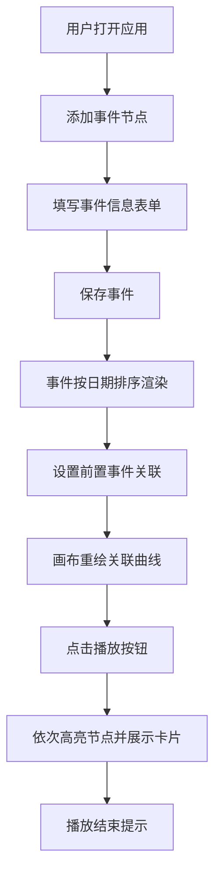

## 1. 产品概述

"时序图谱"是一款基于浏览器的交互式时间线故事编辑与展示应用，让用户像编剧一样在时间线上添加事件节点、调整时间跨度、关联人物关系，并生成可分享的动画叙事页面。

- 主要用途：历史事件梳理、个人故事记录、项目时间线管理、人物关系时间轴可视化
- 目标用户：内容创作者、教育工作者、项目经理、历史爱好者
- 产品价值：将线性时间转化为可视化的叙事图谱，通过关联线和动画播放增强故事表达力

## 2. 核心功能

### 2.1 用户角色

| 角色 | 注册方式 | 核心权限 |
|------|----------|----------|
| 普通用户 | 无需注册，直接使用 | 创建、编辑、删除事件，设置关联关系，播放动画叙事 |

### 2.2 功能模块

1. **时间线编辑面板**：事件列表、添加/编辑/删除事件表单、速度控制滑块
2. **时间线画布展示区**：D3可视化节点图、关联曲线、信息卡片、动画播放控制

### 2.3 页面详情

| 页面名称 | 模块名称 | 功能描述 |
|-----------|-------------|---------------------|
| 主应用页面 | 事件编辑面板 | 添加事件（名称、日期、持续天数、描述、颜色）、编辑事件、删除事件、设置前置事件关联、播放速度控制 |
| 主应用页面 | 时间线画布 | 水平时间轴节点可视化、节点点击展开信息卡片、Bézier曲线关联箭头、动画叙事播放/暂停控制 |

## 3. 核心流程

### 3.1 事件创建流程
用户打开应用 → 点击"添加事件"按钮 → 填写事件信息（名称、日期、持续天数、描述、颜色）→ 提交保存 → 事件自动按日期排序显示在左侧列表和右侧画布上

### 3.2 关联设置流程
用户选择一个事件 → 在编辑表单中选择"前置事件"下拉菜单 → 选择一个已有事件作为前置 → 画布上立即绘制关联曲线箭头

### 3.3 动画播放流程
用户设置播放速度 → 点击右上角播放按钮 → 系统按时间顺序依次高亮节点 → 展开信息卡片停留3秒 → 收起卡片并移动到下一个节点 → 播放完成显示"播放结束"提示

## 4. 用户界面设计

### 4.1 设计风格

- 主色调：深蓝灰 `#2C3E50`，浅灰 `#ECF0F1`
- 12种预置节点色板，默认 `#4A90D9`
- 字体：系统无衬线字体 -apple-system, BlinkMacSystemFont
- 极简主义风格，大量留白
- 圆角12px卡片，柔和阴影
- 按钮：扁平化设计，hover时背景加深
- 动画：0.2秒hover缩放效果，0.3秒ease-out卡片展开/收起动画

### 4.2 页面设计概述

| 页面名称 | 模块名称 | UI元素 |
|-----------|-------------|-------------|
| 主应用页面 | 编辑面板 | 左侧320px宽度、右阴影分隔线、事件列表（可折叠手风琴式）、表单输入控件、颜色选择器、速度滑块（0.5x/1x/2x） |
| 主应用页面 | 时间线画布 | 自适应宽度、水平时间轴、圆形/菱形节点（hover缩放1.15倍）、灰色#888曲线关联箭头、信息卡片（透明度90%）、右上角播放/暂停按钮 |

### 4.3 响应式设计

- 桌面端（≥900px）：左右分栏布局，编辑区320px固定宽度，画布自适应
- 移动端（<900px）：上下布局，编辑区在上，画布在下，事件列表改为可折叠手风琴

