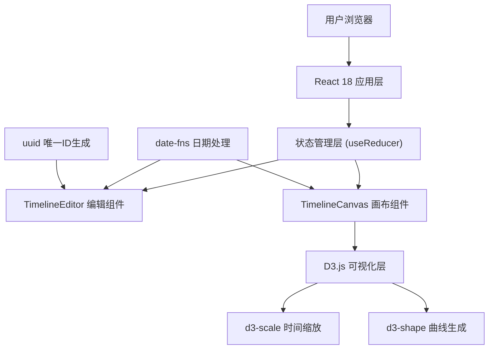

## 1. 架构设计



## 2. 技术描述

- **前端框架**：React 18 + TypeScript 5 + Vite 5
- **构建工具**：Vite 5，基于 @vitejs/plugin-react
- **语言目标**：ES2020，严格模式 TypeScript
- **日期处理**：date-fns
- **可视化库**：d3-scale（时间比例尺）、d3-shape（曲线生成）
- **唯一标识**：uuid
- **状态管理**：React useReducer
- **样式方案**：原生 CSS（CSS Modules 风格，内联样式配合全局 CSS）
- **无后端**：纯前端应用，状态存储于内存中

## 3. 数据模型

### 3.1 数据类型定义

```typescript
// 单个时间线事件
interface TimelineEvent {
  id: string;
  name: string;
  date: string; // YYYY-MM-DD 格式
  durationDays: number; // 0 表示瞬时事件
  description: string;
  color: string;
  predecessorIds: string[]; // 前置事件ID数组
}

// 应用状态
interface AppState {
  events: TimelineEvent[];
  selectedEventId: string | null;
  expandedEventId: string | null;
  playback: {
    isPlaying: boolean;
    currentIndex: number;
    speed: 0.5 | 1 | 2;
  };
}
```

### 3.2 预置颜色板

12种颜色：`#4A90D9`, `#E74C3C`, `#2ECC71`, `#F39C12`, `#9B59B6`, `#1ABC9C`, `#34495E`, `#E67E22`, `#16A085`, `#C0392B`, `#8E44AD`, `#2980B9`

## 4. 组件结构

```
src/
├── main.tsx              # React 入口
├── App.tsx               # 主布局，状态管理 (useReducer)
├── components/
│   ├── TimelineEditor.tsx # 左侧编辑面板
│   └── TimelineCanvas.tsx # 右侧画布(D3可视化)
├── types/
│   └── index.ts          # 类型定义
├── utils/
│   └── dateUtils.ts      # 日期处理工具函数
└── styles/
    └── global.css        # 全局样式
```

## 5. 核心算法

### 5.1 时间缩放算法
- 获取所有事件的最早和最晚日期（含持续时间）
- 使用 d3.scaleTime() 将日期范围映射到画布宽度
- 若总跨度小于30天，水平缩放比例自动放大1.5倍

### 5.2 节点布局算法
- 瞬时事件：绘制半径为8px的圆形
- 持续事件：绘制菱形，水平宽度 = max(16px, durationDays * 缩放比例)
- Y轴位置固定居中，便于横向阅读

### 5.3 关联曲线算法
- 使用 d3.line().curve(d3.curveBasis) 生成B样条曲线
- 箭头使用 SVG marker 元素定义
- 曲线控制点偏移避免节点遮挡

### 5.4 动画播放时序
- 节点高亮呼吸动画：2秒（opacity 0.3-1 循环）
- 信息卡片展示：3秒
- 卡片展开/收起过渡：0.3秒 ease-out
- 播放速度倍率应用于所有时间参数

## 6. 性能优化策略

- 最多50个事件节点，限制渲染复杂度
- D3 渲染纯 SVG，避免 DOM 频繁操作
- CSS transform/opacity 动画，启用 GPU 加速
- 使用 React.memo 优化组件重渲染
- 事件列表虚拟化（如需）
- requestAnimationFrame 控制播放动画帧

