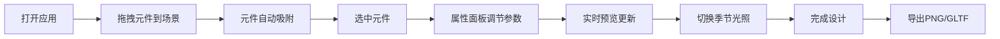

## 1. 产品概述

微缩盆景工坊是一款在浏览器中运行的交互式3D盆景设计与导出工具，专为园艺爱好者和数字艺术家打造。用户可像操作数字园丁一样，通过鼠标拖拽和滑块调节组合、造型、染色盆景元素，实时预览四季光照变化效果，最终导出高分辨率PNG截图或GLTF模型。

- 核心价值：消除传统盆景设计中大量草图和实体模型的制作成本，提供直观的三维空间实时预览体验
- 目标用户：园艺爱好者、数字艺术家、盆景设计师、3D打印爱好者

## 2. 核心功能

### 2.1 功能模块
1. **主设计界面**：3D场景画布、顶部导航栏、左侧元件面板、右侧属性面板、底部季节预设栏
2. **元件系统**：五种基础元件（主干、枝条、叶片、岩石、青苔）的拖拽放置与吸附
3. **造型编辑系统**：主干/枝条弯曲度、高度、旋转调节，枝条生长分支功能
4. **季节调色系统**：叶片密度与四季颜色预设，同步调整枝干色调
5. **光照系统**：六种季节光照预设，平滑过渡动画，环境雾效果
6. **导出系统**：PNG高清截图导出、GLTF模型导出

### 2.2 页面详情
| 页面名称 | 模块名称 | 功能描述 |
|---------|---------|----------|
| 主设计页 | 顶部导航栏 | 标题显示、重置场景按钮（带确认）、导出截图按钮 |
| 主设计页 | 3D场景画布 | 10x10网格地面、陶土盆、OrbitControls视角控制、元件渲染 |
| 主设计页 | 左侧元件面板 | 五种元件圆形图标（40x40px）、悬停放大动画、拖拽提示 |
| 主设计页 | 右侧属性面板 | 选中元件参数调节（滑块、按钮）、实时预览更新 |
| 主设计页 | 底部季节预设栏 | 六个季节光照预设按钮、点击切换带1.5秒过渡动画 |

## 3. 核心流程

用户打开应用 → 从左侧元件面板拖拽元件到3D场景 → 元件吸附到网格或表面 → 点击选中元件 → 在右侧属性面板调节参数（弯曲度、高度、密度、颜色等） → 实时预览效果 → 点击底部季节预设切换光照 → 重复组合多个元件完成盆景设计 → 点击顶部导出按钮保存PNG或GLTF文件

## 4. 用户界面设计

### 4.1 设计风格
- 主色调：奶油白（#faf8f0）、深木色（#5c4033）
- 强调色：绿色（#388e3c）用于导出按钮、红色（#d32f2f）用于重置按钮
- 滑块轨道：#c8b89a，滑块圆形：#5c4033
- 字体：标题使用Bangers字体或系统无衬线字体，正文使用系统无衬线
- 布局：顶部固定导航栏（60px高）、左侧200px元件面板、右侧280px属性面板、中央场景画布、底部预设栏
- 交互细节：图标悬停放大1.1倍、滑块拖拽阴影扩散0.5秒、季节切换1.5秒平滑过渡

### 4.2 页面设计概览
| 页面名称 | 模块名称 | UI元素 |
|---------|---------|--------|
| 主设计页 | 顶部导航 | 深木色背景、奶油白标题文字、按钮悬停淡入效果 |
| 主设计页 | 元件面板 | 圆形图标（40x40px）、名称标签、悬停放大1.1倍动画、"拖拽到地面"提示淡入 |
| 主设计页 | 属性面板 | 标签文字、滑块控件（带步进值）、颜色预设按钮组、参数实时数值显示 |
| 主设计页 | 季节预设栏 | 六个方形按钮、春季/夏季/秋季/冬季/晨雾/黄昏图标与文字、选中高亮 |
| 主设计页 | 3D场景 | 半透明灰色网格地面、深棕色陶土盆、实时阴影渲染、雾化效果 |

### 4.3 响应式设计
- 桌面端（768px以上）：左右面板固定展开，三栏布局
- 移动端（768px以下）：左右面板折叠为底部抽屉式，点击右上角图钉图标展开/收起，画布自适应剩余高度
- 触摸优化：支持双指缩放、单指旋转视角

### 4.4 3D场景指导
- 环境：默认环境光（强度0.4，色温6500K）+ 主光（45度，强度0.8，色温5500K）+ 辅光（-30度，强度0.3，色温7000K）
- 阴影：启用PCFSoftShadowMap，光源投射阴影，地面接收阴影
- 相机：PerspectiveCamera（fov 45），OrbitControls（阻尼0.1，旋转速度0.5，缩放范围0.5-15单位）
- 焦点元素：陶土盆位于场景中心，初始相机距离约8单位，俯视角30度
- 后处理：可选Bloom效果提升叶片和材质质感
- 性能预算：最多200元件单位，目标30FPS以上（普通笔记本电脑）
