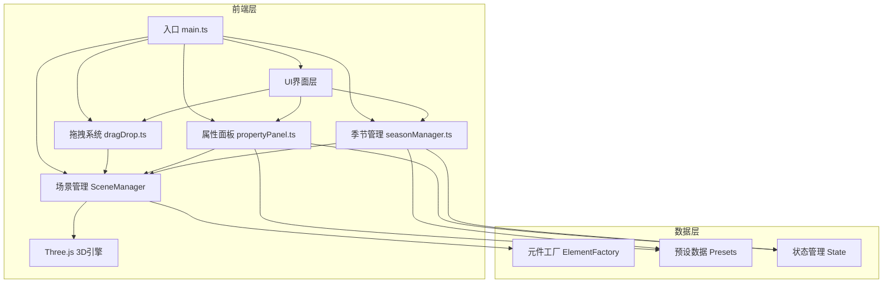

## 1. 架构设计



## 2. 技术说明

- 前端框架：TypeScript@5 + Vite@5（纯原生TypeScript，无UI框架）
- 3D引擎：Three.js@0.160 + @types/three
- UI控件库：Tweakpane@3（属性面板滑块与按钮）
- 工具库：lodash（工具函数）、uuid（元件唯一标识）、simplex-noise@3（程序化纹理与自然随机）
- 初始化方式：Vite vanilla-ts模板手动改造
- 后端：无（纯前端单页应用）
- 数据库：无（本地状态管理，导出文件）

## 3. 文件结构定义

| 文件路径 | 用途 |
|---------|------|
| /package.json | 项目依赖与脚本配置 |
| /index.html | 入口HTML页面，奶油白背景，引入Bangers字体 |
| /tsconfig.json | TypeScript严格模式，目标ES2020 |
| /vite.config.js | Vite基本配置 |
| /src/main.ts | 场景初始化、WebGLRenderer、Scene、PerspectiveCamera、OrbitControls、动画循环、响应式resize |
| /src/dragDrop.ts | 元件拖拽放置系统，pointer事件监听、射线检测、网格/表面吸附 |
| /src/propertyPanel.ts | 属性面板渲染与交互，参数读取/修改、模型几何与材质更新 |
| /src/seasonManager.ts | 季节与光照预设管理，六套预设定义、lerp平滑过渡1.5秒 |
| /src/elements/ | 五种元件的工厂类与更新逻辑 |
| /src/utils/ | 工具函数（颜色转换、网格吸附、几何生成等） |
| /src/types/ | TypeScript类型定义 |

## 4. 核心数据模型

### 4.1 元件类型定义
```typescript
type ElementType = 'trunk' | 'branch' | 'leaves' | 'rock' | 'moss';

interface ElementData {
  id: string;
  type: ElementType;
  position: { x: number; y: number; z: number };
  rotation: { x: number; y: number; z: number };
  scale: { x: number; y: number; z: number };
  userData: {
    bendAngle?: number;      // 弯曲度 0-80度
    height?: number;         // 高度 0.5-6
    density?: number;        // 叶片密度 1-10
    season?: Season;         // 当前季节
    opacity?: number;        // 青苔透明度 0.3-0.9
    coverage?: number;       // 青苔覆盖半径 0.5-2.0
    branchLevel?: number;    // 枝条层级 0-5
    parentId?: string;       // 父元件ID
  };
}
```

### 4.2 季节与光照预设
```typescript
type Season = 'spring' | 'summer' | 'autumn' | 'winter' | 'morning' | 'dusk';

interface LightPreset {
  season: Season;
  name: string;
  ambientIntensity: number;
  ambientColorTemp: number;
  mainLightAngle: number;     // 度数
  mainLightIntensity: number;
  mainLightColorTemp: number;
  fillLightAngle: number;
  fillLightIntensity: number;
  fillLightColorTemp: number;
  fogEnabled: boolean;
  fogVisibility: number;      // 能见度单位
}

interface SeasonColors {
  leaves: string | string[];  // 单色或渐变色区间
  trunk: string;
  branch: string;
}
```

## 5. 性能优化策略

1. **元件计数限制**：场景最多200元件单位（主干=1，每叶片球=0.3，青苔=1）
2. **几何复用**：相同类型元件共享BufferGeometry实例，仅修改matrix
3. **材质实例化**：叶片使用InstancedMesh批量渲染球体
4. **LOD策略**：远距离元件降低几何细分精度
5. **阴影优化**：仅主干、岩石投射阴影，shadowMap尺寸控制在1024x1024
6. **动画节流**：参数调节防抖16ms，避免频繁重建几何
7. **惰性更新**：仅在参数变化时调用updateGeometry，而非每帧重建
