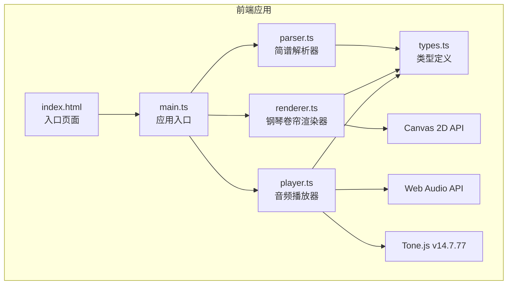

## 1. 架构设计



## 2. 技术描述

- **前端框架**：原生 TypeScript（无UI框架），直接操作DOM和Canvas
- **构建工具**：Vite（支持TypeScript、HMR热更新）
- **音频引擎**：Tone.js v14.7.77 + Web Audio API
- **渲染技术**：HTML5 Canvas 2D API
- **后端**：无（纯前端应用）
- **数据库**：无

## 3. 项目结构

```
auto30/
├── package.json              # 项目依赖与脚本
├── vite.config.js            # Vite构建配置
├── tsconfig.json             # TypeScript编译配置
├── index.html                # 入口HTML页面
├── .trae/
│   └── documents/
│       ├── PRD.md            # 产品需求文档
│       └── ARCHITECTURE.md   # 技术架构文档
└── src/
    ├── types.ts              # 类型定义（Note, Chord, Score接口）
    ├── parser.ts             # 简谱字符串解析器
    ├── renderer.ts           # 钢琴卷帘Canvas渲染器
    ├── player.ts             # 音频播放器（Tone.js封装）
    └── main.ts               # 应用入口，模块协调
```

## 4. 数据模型

### 4.1 核心类型定义

```typescript
// 单个音符
interface Note {
  note: string;        // 音高名称，如 "C4", "D#5"
  duration: number;    // 时值（秒）
  time: number;        // 起始时间（秒，相对于乐谱开头）
  velocity: number;    // 力度 0-1
  highlighted?: boolean; // 是否处于高亮状态
}

// 和弦
interface Chord {
  notes: string[];     // 和弦内音符数组，如 ["C4", "E4", "G4"]
  duration: number;    // 时值（秒）
  time: number;        // 起始时间（秒）
  name?: string;       // 和弦名称，如 "Cmaj7"
}

// 乐谱
interface Score {
  tempo: number;       // 速度 BPM
  notes: Note[];       // 所有单音符
  chords: Chord[];     // 所有和弦
  totalDuration: number; // 总时长（秒）
}
```

### 4.2 简谱解析规则

| 输入格式 | 含义 | 时值 |
|----------|------|------|
| `1-2-3-5` | 4个数字 | 四分音符 |
| `1-2-3-5-6` | 5个数字 | 八分音符 |
| `1-2-3-5-6-7` | 6个数字 | 十六分音符 |
| `[135]` | 方括号包裹 | C大三和弦（同时发声） |
| `# 注释` | #开头 | 注释行，忽略 |

### 4.3 简谱数字到音高映射

| 数字 | 简谱名 | 音高（C大调） |
|------|--------|-------------|
| 1 | Do | C4 |
| 2 | Re | D4 |
| 3 | Mi | E4 |
| 4 | Fa | F4 |
| 5 | Sol | G4 |
| 6 | La | A4 |
| 7 | Si | B4 |

数字后加 `.` 表示高八度，加 `,` 表示低八度，加 `#` 表示升半音，加 `b` 表示降半音。

## 5. 模块职责

### 5.1 parser.ts
- **职责**：将简谱文本解析为 `Score` 对象
- **输入**：多行简谱字符串
- **输出**：`Score` 对象或抛出解析错误
- **关键函数**：
  - `parseScore(input: string, tempo?: number): Score`
  - `parseSingleLine(line: string): Note[] | Chord | null`
  - `jianpuToNoteName(num: string): string`

### 5.2 renderer.ts
- **职责**：Canvas 2D绘制钢琴卷帘视图
- **输入**：`Score` 对象、当前播放时间、滚动速度
- **状态**：Canvas上下文、尺寸、音符位置映射
- **关键函数**：
  - `setScore(score: Score): void`
  - `render(currentTime: number): void`
  - `resize(width: number, height: number): void`
  - `noteToY(noteName: string): number`
  - `timeToX(time: number, currentTime: number): number`

### 5.3 player.ts
- **职责**：使用Tone.js播放乐谱，控制播放状态
- **输入**：`Score` 对象
- **状态**：播放/暂停/停止、当前时间、播放速度
- **关键函数**：
  - `loadScore(score: Score): Promise<void>`
  - `play(): void`
  - `pause(): void`
  - `stop(): void`
  - `seek(time: number): void`
  - `setPlaybackRate(rate: number): void`
  - `getCurrentTime(): number`
  - `onProgress(callback: (time: number) => void): void`

### 5.4 main.ts
- **职责**：应用入口，连接各模块，绑定UI事件
- **功能**：
  - DOM元素获取与初始化
  - 解析按钮点击事件处理
  - 播放控制事件绑定
  - 进度条拖拽逻辑
  - 响应式布局处理
  - 错误提示管理

## 6. 性能优化策略

1. **Canvas渲染优化**：
   - 使用 `requestAnimationFrame` 驱动渲染循环
   - 仅重绘可见区域的音符条
   - 钢琴键盘静态部分预渲染到离屏Canvas

2. **音频播放优化**：
   - 使用Tone.js的Transport调度机制，预先安排所有音符事件
   - 避免播放过程中动态创建音频节点

3. **解析优化**：
   - 简谱解析为纯同步操作，避免复杂正则回溯
   - 解析失败快速返回，不阻塞主线程超过50ms
