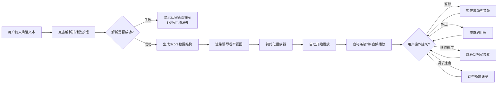

## 1. 产品概述

在线乐谱可视化播放器是一款基于Web的音乐教育与创作辅助工具，让用户通过输入简谱数字和和弦标记，实时生成钢琴卷帘视图并播放对应的音频。

- 主要用途：音乐学习、简谱可视化、简单旋律创作与试听
- 目标用户：音乐爱好者、音乐教师、学生、初学者
- 产品价值：降低音乐创作门槛，提供直观的音高与时序可视化，辅助音乐学习与练习

## 2. 核心功能

### 2.1 功能模块

1. **乐谱输入与解析模块**：多行文本输入简谱，支持注释行，实时解析为结构化数据
2. **钢琴卷帘渲染模块**：Canvas 2D绘制88键钢琴键盘与音符条，支持滚动播放与高亮
3. **音频播放模块**：Web Audio API + Tone.js实现音高发声，支持播放/暂停/停止/跳转
4. **播放控制模块**：进度条、速度控制、播放按钮等完整控制界面

### 2.2 页面详情

| 页面名称 | 模块名称 | 功能描述 |
|-----------|-------------|---------------------|
| 主页面 | 乐谱输入区 | 左侧280px宽文本框，支持多行简谱输入，#开头注释行 |
| 主页面 | 解析按钮 | 点击后调用parser解析，失败显示红色错误提示（3秒自动消失） |
| 主页面 | 钢琴卷帘预览区 | 右侧Canvas显示88键钢琴与音符条，音符条高度6px，按音高映射颜色 |
| 主页面 | 播放进度标记 | 垂直绿线（2px，透明度0.8）标记当前播放位置 |
| 主页面 | 音符高亮 | 音符到达播放线时变金色，0.2秒后恢复 |
| 主页面 | 和弦视觉分组 | 和弦音符条水平堆叠，顶部显示和弦名称标签 |
| 主页面 | 播放控制栏 | 固定底部50px高，包含播放/暂停、停止、进度条、速度滑块 |
| 主页面 | 进度条 | 可拖拽跳转，显示mm:ss时间标签，渐变色已播放区域 |
| 主页面 | 速度滑块 | 0.5x-2.0x范围，步长0.1x，默认1.0x |

## 3. 核心流程

## 4. 用户界面设计

### 4.1 设计风格

- **主色调**：深色主题，背景#1A1A2E，强调色#5BC0EB（青色）
- **辅助色**：#0F3460（深蓝输入框）、#16213E（侧边栏）、#FF5252（错误提示红）、#00B4D8到#0077B6（进度条渐变）
- **音符颜色映射**：
  - 低音区（C2-B2）：深蓝色调
  - 中音区（C3-B4）：绿色调
  - 高音区（C5-B6）：红色调
  - 高亮色：金色
- **按钮风格**：Unicode图标，文字#E0E0E0，悬停变#5BC0EB，0.3s过渡
- **字体**：系统默认等宽字体，确保数字和符号对齐
- **布局**：左侧输入面板（280px固定宽）+ 右侧Canvas预览区（自适应），底部固定控制栏

### 4.2 页面设计概述

| 页面名称 | 模块名称 | UI元素 |
|-----------|-------------|-------------|
| 主页面 | 乐谱输入区 | 深色背景#16213E、文本框背景#0F3460、白色文字、边框#5BC0EB、聚焦发光box-shadow 0 0 8px #5BC0EB |
| 主页面 | Canvas预览区 | 纯黑背景、钢琴键盘88键、半透明键名#333 10px、音符条6px高带1px深色边框 |
| 主页面 | 控制栏 | 背景#0F3460、高度50px、按钮Unicode符号、进度条渐变色、滑块白色圆形16px悬停20px |
| 主页面 | 错误提示 | #FF5252文字、背景#1A1A2E、圆角4px、1px边框#FF5252 |

### 4.3 响应式

- **桌面端（>=900px）**：Canvas占宽度70%，正常高度
- **平板端（600-900px）**：Canvas占满宽度，高度300px
- **手机端（<600px）**：Canvas占满宽度，高度200px
- **控制栏**：始终固定底部，高度50px
- **无障碍**：所有交互元素支持Tab导航和Enter触发，带title提示

## 5. 非功能需求

- **性能**：Canvas刷新率保持30fps以上，解析与绘制主线程执行时间不超过50ms
- **兼容性**：支持现代浏览器（Chrome、Firefox、Safari、Edge最新版）
