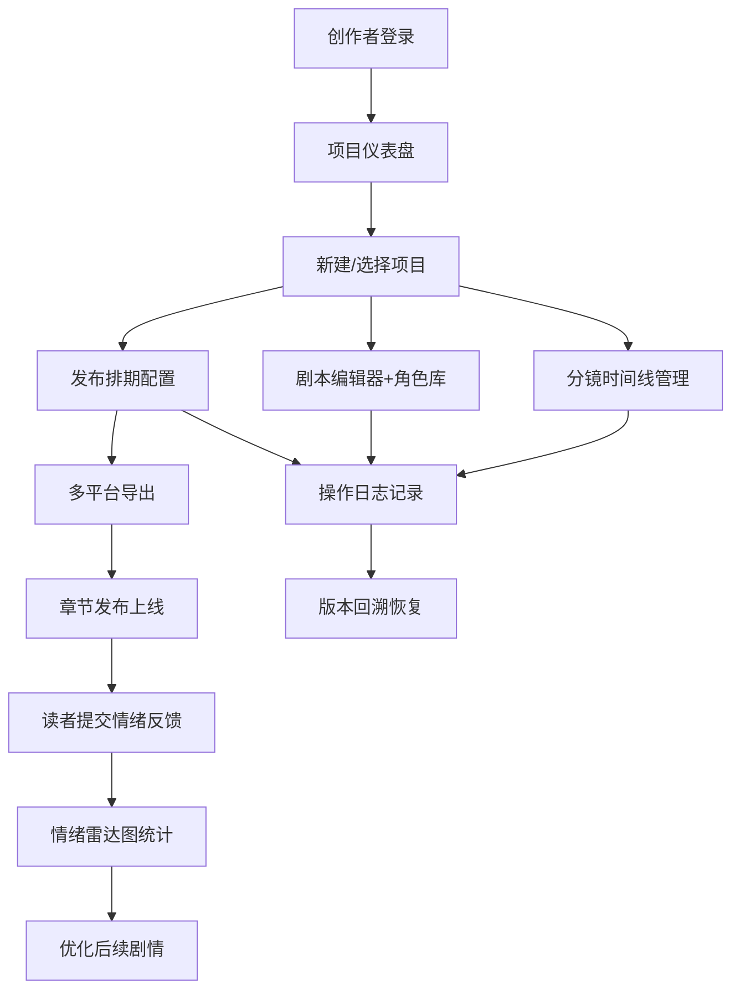

## 1. 产品概述

漫画工作室创作管理系统是面向小型独立漫画工作室或个人漫画家的全栈Web应用，解决传统创作流程中脚本分镜、草稿上色、发布排期和读者评论散落在不同工具里难以统筹的问题。

- 主要目标：让工作室像数字编辑部一样在同一界面管理多个漫画项目、分配画师任务、追踪完成进度，并基于读者情绪反馈优化剧情
- 目标用户：独立漫画家、小型漫画工作室团队、漫画编辑

## 2. 核心功能

### 2.1 用户角色
| 角色 | 注册方式 | 核心权限 |
|------|---------|---------|
| 创作者/管理员 | 模拟登录 | 管理项目、编辑分镜、配置排期、查看反馈统计 |
| 读者用户 | 无需登录 | 阅读章节内容、提交情绪标签和短评 |

### 2.2 功能模块
1. **项目仪表盘**：项目列表卡片展示、进度环标注、拖拽重排项目顺序
2. **项目详情页**：分镜时间线管理、剧本编辑器、角色资料卡、发布排期面板、读者反馈情绪面板
3. **反馈统计后台**：各章节情绪分布雷达图、短评列表展示
4. **操作日志系统**：修改历史记录、版本回溯功能

### 2.3 页面详情
| 页面名称 | 模块名称 | 功能描述 |
|---------|---------|---------|
| 仪表盘 | 项目卡片列表 | 封面缩略图、标题、进度百分比、拖拽排序 |
| 仪表盘 | 进度环组件 | 环形进度条展示项目完成度 |
| 项目详情 | 分镜时间线 | 时间线布局、分镜卡片、拖拽调整顺序、状态切换动画 |
| 项目详情 | 剧本编辑器 | Markdown富文本编辑、角色卡悬浮、快速插入角色对话模板 |
| 项目详情 | 角色资料卡 | 头像、姓名、性格关键词、点击插入脚本 |
| 项目详情 | 发布排期面板 | 日历选择发布日期、多平台配置、48小时脉冲提醒、导出格式选择 |
| 项目详情 | 读者反馈情绪面板 | 6种情绪标签按钮、短评输入、实时统计 |
| 统计后台 | 情绪雷达图 | 各章节情绪分布对比、悬停显示票数和百分比 |
| 操作日志 | 历史记录列表 | 时间倒序、操作人、操作时间、变更摘要 |
| 操作日志 | 版本回溯 | 一键恢复到任意历史快照 |

## 3. 核心流程

创作者登录后进入仪表盘，可新建项目或点击已有项目进入详情页。在项目详情页中管理分镜时间线、编辑剧本、分配画师、设置发布排期。发布后读者可访问章节页提交情绪标签和短评，创作者在统计后台查看情绪雷达图分析，基于反馈优化后续剧情。所有操作自动记录日志，支持版本回溯。

## 4. 用户界面设计

### 4.1 设计风格
- **主色调**：米白色背景 #F5F0E8，深灰色导航栏 #2C2C2C，朱红色强调色 #E63946
- **按钮风格**：漫画对话框式白色圆角卡片，朱红色强调按钮
- **字体**：采用日式漫画杂志风格排版，标题醒目、正文清晰
- **布局**：桌面端三栏布局（左侧项目列表、中间主内容区、右侧详情面板），移动端单栏堆叠
- **动效**：300ms ease-out 过渡，情绪按钮 scale 0.9->1.1 弹跳动画，状态切换展开翻转动画，排期临近橙色脉冲动画

### 4.2 页面设计概述
| 页面名称 | 模块名称 | UI元素 |
|---------|---------|---------|
| 仪表盘 | 项目卡片网格 | 漫画封面缩略图、进度环、朱红色强调按钮、卡片悬停上浮效果 |
| 项目详情 | 分镜时间线 | 浅灰色实线连接、激活卡片4px黑色描边+阴影、状态标签色彩区分、拖拽平滑过渡 |
| 项目详情 | 剧本编辑器 | 漫画对话框样式文本框、右侧悬浮角色卡气泡、Markdown语法高亮 |
| 项目详情 | 发布面板 | 日历选择器、平台图标网格、脉冲提醒动画 |
| 反馈面板 | 情绪按钮 | 6个表情符号按钮、点击弹跳动画、已选状态高亮 |
| 统计后台 | 雷达图 | D3绘制、平滑过渡动画、悬停tooltip |

### 4.3 响应式设计
- 桌面端（1280px以上）：三栏布局，左侧固定宽度项目导航、中间弹性主内容、右侧详情面板
- 平板端（768px-1280px）：双栏布局，主内容+可折叠侧边栏
- 移动端（768px以下）：单栏堆叠布局，触控滑动优化，底部导航栏
