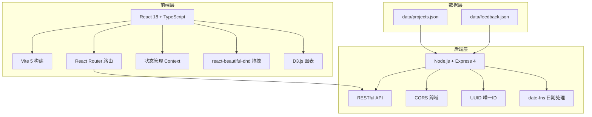
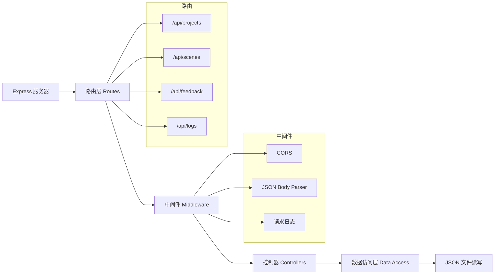
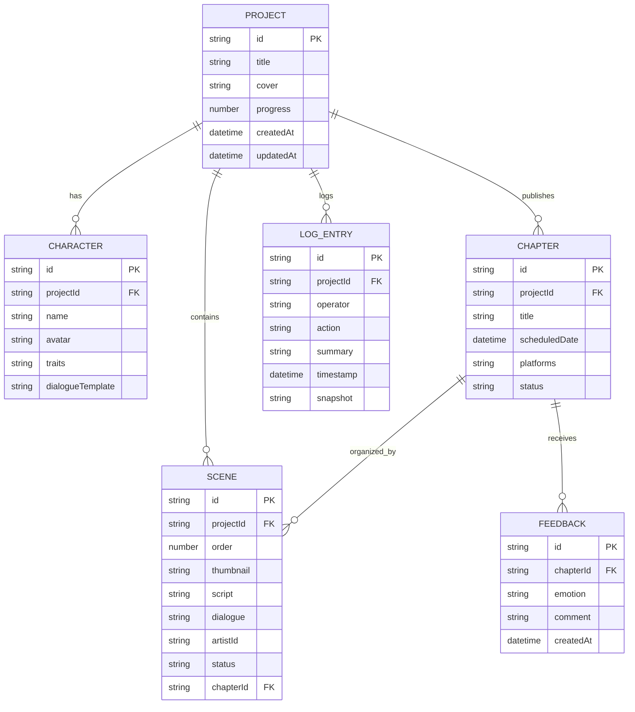

## 1. 架构设计



## 2. 技术说明
- **前端**：React@18 + TypeScript@5 + Vite@5
- **构建工具**：Vite@5，启用HMR热更新，代码分割懒加载
- **后端**：Node.js + Express@4
- **数据库模拟**：本地JSON文件（data/projects.json, data/feedback.json）
- **前端依赖**：react-dom@18、react-router-dom、react-beautiful-dnd、@dnd-kit/core、d3-scale、d3-shape、d3-cloud、date-fns、uuid、cors
- **图标库**：lucide-react

## 3. 路由定义
| 路由 | 用途 |
|-----|------|
| / | 仪表盘 - 项目列表展示 |
| /project/:id | 项目详情页 - 分镜管理、剧本编辑、发布排期 |
| /project/:id/chapter/:chapterId | 章节详情页 - 读者情绪反馈提交 |
| /project/:id/stats | 统计后台 - 情绪雷达图分析 |
| /project/:id/logs | 操作日志 - 历史记录与版本回溯 |

## 4. API 定义

### 4.1 项目相关
```typescript
// GET /api/projects - 获取项目列表
interface Project {
  id: string;
  title: string;
  cover: string;
  progress: number;
  createdAt: string;
  updatedAt: string;
  scenes: Scene[];
  characters: Character[];
  chapters: Chapter[];
  logs: LogEntry[];
}

// POST /api/projects - 新建项目
interface CreateProjectRequest {
  title: string;
  cover: string;
}

// GET /api/projects/:id - 获取项目详情
// PUT /api/projects/:id - 更新项目信息
```

### 4.2 分镜相关
```typescript
// GET /api/projects/:id/scenes - 获取分镜列表
interface Scene {
  id: string;
  projectId: string;
  order: number;
  thumbnail: string;
  script: string;
  dialogue: string;
  artistId: string;
  status: 'draft' | 'lineart' | 'coloring' | 'finished';
  chapterId: string;
}

// POST /api/projects/:id/scenes - 新建分镜
// PUT /api/scenes/:id - 更新分镜信息
```

### 4.3 角色相关
```typescript
interface Character {
  id: string;
  name: string;
  avatar: string;
  traits: string[];
  dialogueTemplate: string;
}
```

### 4.4 发布与章节相关
```typescript
interface Chapter {
  id: string;
  title: string;
  scheduledDate: string;
  platforms: PlatformConfig[];
  status: 'draft' | 'scheduled' | 'published';
}

interface PlatformConfig {
  name: 'website' | 'weibo' | 'pixiv' | 'twitter';
  format: 'longimage' | 'zip' | 'standard';
  resolution: string;
  enabled: boolean;
}

// POST /api/projects/:id/chapters/:chapterId/feedback - 提交读者反馈
interface Feedback {
  id: string;
  chapterId: string;
  emotion: 'excited' | 'touched' | 'suspense' | 'funny' | 'shocked' | 'depressed';
  comment: string;
  createdAt: string;
}

// GET /api/projects/:id/chapters/:chapterId/feedback/stats - 获取情绪统计
interface EmotionStats {
  excited: number;
  touched: number;
  suspense: number;
  funny: number;
  shocked: number;
  depressed: number;
  total: number;
}
```

### 4.5 日志相关
```typescript
// GET /api/projects/:id/logs - 获取操作日志
interface LogEntry {
  id: string;
  projectId: string;
  operator: string;
  action: string;
  summary: string;
  timestamp: string;
  snapshot: Project;
}

// POST /api/projects/:id/restore/:logId - 恢复到历史版本
```

## 5. 服务器架构图



## 6. 数据模型

### 6.1 实体关系图



### 6.2 JSON 文件结构

**data/projects.json**
```json
{
  "projects": [
    {
      "id": "uuid",
      "title": "项目标题",
      "cover": "封面图片URL",
      "progress": 65,
      "createdAt": "2024-01-01T00:00:00Z",
      "updatedAt": "2024-01-15T00:00:00Z",
      "scenes": [],
      "characters": [],
      "chapters": [],
      "logs": []
    }
  ]
}
```

**data/feedback.json**
```json
{
  "feedback": [
    {
      "id": "uuid",
      "chapterId": "uuid",
      "emotion": "excited",
      "comment": "太棒了！",
      "createdAt": "2024-01-15T12:00:00Z"
    }
  ]
}
```
