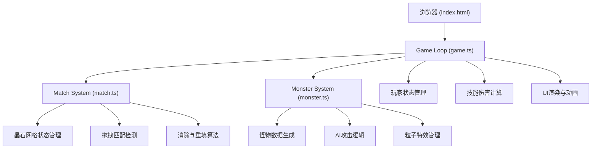

## 1. 架构设计



## 2. 技术描述

- **前端**：TypeScript + Vite，原生DOM操作 + Canvas粒子渲染
- **构建工具**：Vite 5.x，devServer端口3000
- **样式**：内联CSS，CSS变量管理主题色，CSS transition/animation实现动画
- **状态管理**：纯TypeScript类/对象，不引入额外状态库
- **无后端**：纯前端游戏，所有逻辑在浏览器端运行

## 3. 文件组织结构

| 文件路径 | 用途 |
|---------|------|
| `package.json` | 项目依赖配置 (typescript, vite) |
| `vite.config.js` | Vite构建配置，支持TS，端口3000 |
| `tsconfig.json` | TS配置 (严格模式, target ES2020, DOM类型) |
| `index.html` | 入口HTML，游戏容器，启动按钮 |
| `src/game.ts` | 主游戏循环，场景初始化，层数与状态流转 |
| `src/match.ts` | 晶石网格，拖拽匹配，消除重填，随机生成算法 |
| `src/monster.ts` | 怪物数据，攻击动画，伤害计算，粒子特效 |

## 4. 核心数据模型

### 4.1 类型定义

```typescript
type GemColor = 'red' | 'blue' | 'green';

interface Gem {
  id: string;
  color: GemColor;
  row: number;
  col: number;
  isMatched: boolean;
  isFalling: boolean;
  element: HTMLElement | null;
}

interface Monster {
  id: string;
  name: string;
  emoji: string;
  particleColor: string;
  maxHp: number;
  currentHp: number;
  attack: number;
  isSlowed: boolean;
  slowEndTime: number;
  isPoisoned: boolean;
  poisonEndTime: number;
  poisonDamagePerSec: number;
}

interface Player {
  maxHp: number;
  currentHp: number;
  energy: number;
  maxEnergy: number;
}

interface GameState {
  floor: number;
  player: Player;
  monster: Monster | null;
  grid: Gem[][];
  isDragging: boolean;
  matchedGems: Gem[];
  gameStatus: 'start' | 'playing' | 'gameover' | 'victory';
}
```

### 4.2 怪物预设数据

```typescript
const MONSTER_PRESETS = [
  { name: '史莱姆', emoji: '🟢', particleColor: '#3bff7a', baseHp: 80, baseAttack: 8 },
  { name: '蝙蝠', emoji: '🦇', particleColor: '#8b5cf6', baseHp: 90, baseAttack: 10 },
  { name: '骷髅', emoji: '💀', particleColor: '#f0f0f0', baseHp: 100, baseAttack: 12 },
  { name: '石像鬼', emoji: '🗿', particleColor: '#3b8bff', baseHp: 120, baseAttack: 14 },
  { name: '幽灵', emoji: '👻', particleColor: '#a0a0ff', baseHp: 110, baseAttack: 16 },
  { name: '狼人', emoji: '🐺', particleColor: '#8b4513', baseHp: 140, baseAttack: 18 },
  { name: '吸血鬼', emoji: '🧛', particleColor: '#8b0000', baseHp: 150, baseAttack: 20 },
  { name: '恶魔', emoji: '👹', particleColor: '#ff4500', baseHp: 180, baseAttack: 22 },
  { name: '巫妖', emoji: '🧙', particleColor: '#9400d3', baseHp: 200, baseAttack: 25 },
  { name: '龙', emoji: '🐉', particleColor: '#ff3b3b', baseHp: 300, baseAttack: 30 },
];
```

## 5. 核心算法

### 5.1 匹配检测算法
- 相邻判定：8方向（上下左右+4个对角线）均可连接
- 使用DFS/BFS追踪当前拖拽路径上同色相邻晶石
- 至少匹配2个才算有效

### 5.2 防死局生成算法
- 生成新晶石时检查是否存在至少一组可匹配的相邻同色晶石
- 若不存在则重新随机生成，直到满足条件

### 5.3 下落填补算法
- 每列从下向上扫描，遇到空格则上方晶石下落
- 顶部生成新随机晶石填补空缺

### 5.4 伤害计算
- 红色（火球术）：匹配数量 × 30点伤害
- 蓝色（冰冻术）：匹配数量 × 25点伤害 + 减速2秒
- 绿色（毒雾术）：匹配数量 × 5点/秒 × 3秒持续伤害
- 大招（闪电）：当前怪物生命值 × 20%

## 6. 性能优化

- 战斗循环使用requestAnimationFrame，目标30fps
- 拖拽事件使用throttle优化，响应延迟<50ms
- 粒子效果使用离屏Canvas，限制最大粒子数量
- DOM操作最小化，使用CSS transform/opacity实现动画（GPU加速）
- 晶石消除和下落动画使用CSS transition，时长0.3-0.5秒
