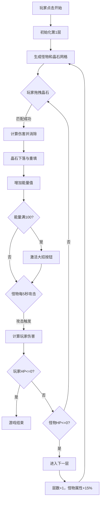

## 1. 产品概述

无尽地下城晶石匹配战斗游戏 - 一款暗黑奇幻风格的三消类RPG游戏，玩家通过拖拽匹配相同颜色的能量晶石来释放技能击败怪物，解决传统RPG战斗操作繁琐、反馈单一的问题。

- 主要目标：提供简单直观的拖拽匹配战斗体验，结合技能释放和怪物战斗的RPG元素
- 目标用户：休闲游戏玩家、RPG游戏爱好者
- 产品价值：将三消玩法与RPG战斗深度结合，创造有策略深度的快节奏战斗体验

## 2. 核心功能

### 2.1 用户角色
| 角色 | 注册方式 | 核心权限 |
|------|---------|---------|
| 玩家 | 无需注册，直接进入 | 游戏体验、查看分数和进度 |

### 2.2 功能模块
1. **战斗主界面**：晶石网格、怪物展示、玩家状态栏、层数显示
2. **拖拽匹配系统**：4x4晶石网格、相邻同色晶石连接检测、消除动画、伤害计算
3. **技能系统**：火球术（红）、冰冻术（蓝）、毒雾术（绿）、大招闪电（能量满）
4. **怪物系统**：10种预设怪物、AI自动攻击、层数递进属性增长、粒子特效
5. **玩家状态**：生命值、能量条、大招释放

### 2.3 页面详情
| 页面名称 | 模块名称 | 功能描述 |
|---------|---------|---------|
| 开始界面 | 启动按钮 | 暗黑风格开始界面，点击启动进入游戏 |
| 战斗主界面 | 顶部状态区 | 显示当前层数、玩家HP条、能量条 |
| 战斗主界面 | 怪物展示区 | 显示当前怪物、HP条、动态粒子光环 |
| 战斗主界面 | 晶石网格区 | 4x4可拖拽晶石网格，霓虹蓝发光边框 |
| 战斗主界面 | 底部控制区 | 大招按钮（能量满时可点击）、战斗日志 |

## 3. 核心流程

玩家点击开始按钮 → 初始化第1层战斗场景 → 生成怪物和晶石网格 → 玩家拖拽匹配晶石 → 消除晶石并计算伤害 → 晶石下落和重新生成 → 怪物定时攻击玩家 → 循环直到一方HP归零 → 怪物死亡进入下一层 / 玩家死亡游戏结束

## 4. 用户界面设计

### 4.1 设计风格
- **主色调**：深紫色到黑色径向渐变背景，霓虹蓝(#00d4ff)作为主强调色
- **晶石颜色**：红色(#ff3b3b)、蓝色(#3b8bff)、绿色(#3bff7a)
- **字体**：使用Cinzel（装饰性标题）和Noto Sans SC（正文），营造暗黑奇幻氛围
- **布局**：垂直居中布局，怪物在上，晶石网格居中，状态栏在顶部和底部
- **动效**：所有交互使用CSS transition 0.3秒，消除动画0.5秒，悬停放大1.1倍
- **图标/粒子**：使用动态粒子效果环绕怪物，晶石有玻璃质感和发光效果

### 4.2 页面设计概览
| 页面名称 | 模块名称 | UI元素 |
|---------|---------|---------|
| 战斗主界面 | 顶部状态区 | 层数数字、红色HP渐变条（低于30%闪烁）、蓝色能量渐变条 |
| 战斗主界面 | 怪物展示区 | 怪物图形（emoji或SVG）、HP条、彩色动态粒子光环 |
| 战斗主界面 | 晶石网格区 | 4x4方格，每个方格半透明玻璃质感晶石，霓虹蓝边框发光 |
| 战斗主界面 | 大招按钮 | 能量满时发光闪烁，点击时屏幕白色闪烁+粒子爆炸 |

### 4.3 响应式
- Desktop-first 设计，移动设备自适应
- 最小宽度支持320px
- 晶石网格根据容器宽度自动缩放，保持正方形比例
- 触摸设备支持触摸拖拽操作

### 4.4 视觉特效
- 晶石悬停：scale(1.1) + box-shadow 光晕
- 消除动画：淡出 + 向上飘散 + 颜色爆炸
- 下落动画：translateY 位移
- 怪物受伤：红色闪烁 + shake 抖动
- 玩家受伤：屏幕边缘红色光晕
- 大招释放：全屏白色闪烁 + 粒子爆炸
