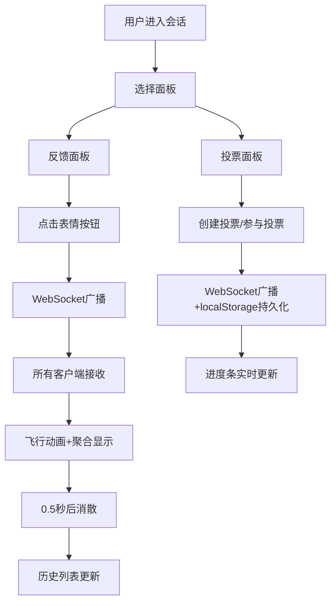

## 1. 产品概述

团队即时反馈与匿名投票系统是一款面向敏捷开发团队的实时协作工具，支持在会议、冲刺回顾、头脑风暴等场景中通过表情反应和匿名投票快速收集团队意见。

- 解决的核心问题：传统会议反馈效率低、沉默成员不敢表达、投票结果统计繁琐
- 目标用户：产品经理、Scrum Master、技术团队负责人及所有团队成员
- 产品价值：提升会议参与度、加速决策流程、降低沟通成本

## 2. 核心功能

### 2.1 用户角色
| 角色 | 注册方式 | 核心权限 |
|------|----------|----------|
| 团队成员 | 自动加入会话 | 发送表情反馈、参与投票、创建投票 |

### 2.2 功能模块
1. **反馈面板**：表情飞行动画、中央聚合区、历史反馈流列表
2. **投票面板**：投票创建表单、选项投票交互、实时进度条显示
3. **头部导航**：会话ID显示、在线人数统计、面板切换导航

### 2.3 页面详情
| 页面名称 | 模块名称 | 功能描述 |
|----------|----------|----------|
| 反馈面板 | 表情发射区 | 6种预设表情按钮，点击发射贝塞尔曲线飞行动画 |
| 反馈面板 | 中央聚合区 | 显示各表情总数，气泡大小与数量成正比，自动消散动画 |
| 反馈面板 | 历史反馈流 | 时间倒序列表，用户头像首字母，相对时间戳，智能自动滚动 |
| 投票面板 | 当前投票展示 | 主题、选项列表、进度条动画、投票/撤销功能 |
| 投票面板 | 创建投票表单 | 主题输入（≤100字符）、动态增删选项（2-5个）、非空校验 |
| 头部导航 | 状态栏 | 绿色圆点+在线人数、会话ID、面板切换按钮 |

## 3. 核心流程

用户进入应用后自动加入会话，可在反馈面板与投票面板间切换。

### 表情反馈流程
用户点击表情按钮 → WebSocket广播消息 → 所有客户端接收 → 触发飞行动画 → 表情聚合至中央区 → 0.5秒后消散 → 历史列表新增条目

### 投票流程
用户创建投票（填写主题+选项）→ WebSocket广播 → 所有用户可见投票 → 用户点击选项投票 → 本地校验每人限一票 → 进度条动画更新 → WebSocket同步结果 → localStorage持久化

## 4. 用户界面设计

### 4.1 设计风格
- 主色调：深色背景#1a1a2e，卡片#16213e，强调色#0f3460
- 字体：Inter（Google Fonts）
- 按钮风格：圆角，悬浮放大1.2倍（0.2s ease），点击缩放0.95
- 布局风格：卡片式布局，顶部导航栏，左右分栏（桌面端）
- 图标风格：原生Emoji（👍👎🎉😕❤️🚀）

### 4.2 页面设计概述
| 页面名称 | 模块名称 | UI元素 |
|----------|----------|--------|
| 反馈面板 | 表情发射区 | 6个圆形emoji按钮，随机大小和初始位置 |
| 反馈面板 | 中央聚合区 | 巨型表情+数字徽章，浮动动画（上下3px，2s周期） |
| 反馈面板 | 历史反馈流 | 列表项从左滑入动画（-20px→0，0.3s），虚拟化滚动 |
| 投票面板 | 投票展示 | 进度条宽度动画（0.3s ease-out），百分比显示 |
| 投票面板 | 创建表单 | 动态选项增删按钮，输入校验提示 |
| 头部导航 | 状态栏 | 绿色脉冲圆点+在线人数，会话ID，路由切换Tab |

### 4.3 响应式设计
- 桌面端（≥768px）：左右分栏布局，左侧表情区+聚合区，右侧历史列表
- 移动端（<768px）：全屏垂直滚动，单列布局，按钮适配触摸手势（tap替代hover）
- 触摸优化：增大点击热区（≥44px），禁用不必要的hover效果

### 4.4 动画与性能
- 表情飞行：贝塞尔曲线CSS动画，随机偏移±50px
- 聚合消散：scale至0 + opacity淡出（0.5s）
- 进度条：width 0.3s ease-out
- 列表虚拟化：仅渲染可视区域，支持50+条流畅滚动
- 帧率保证：CSS动画优先，requestAnimationFrame辅助
