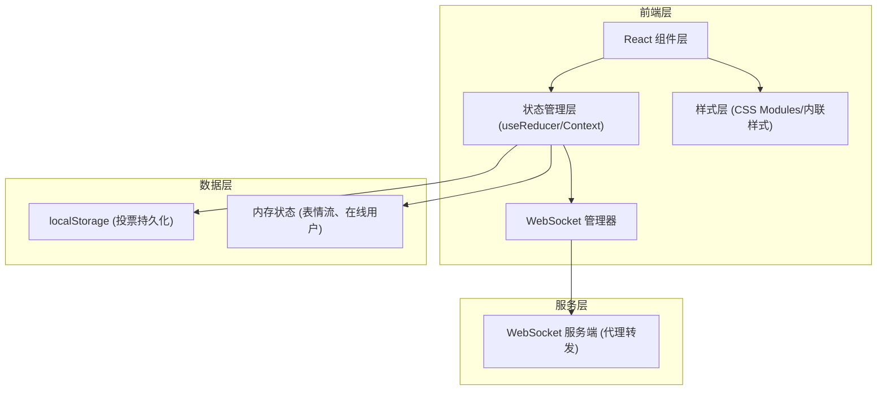
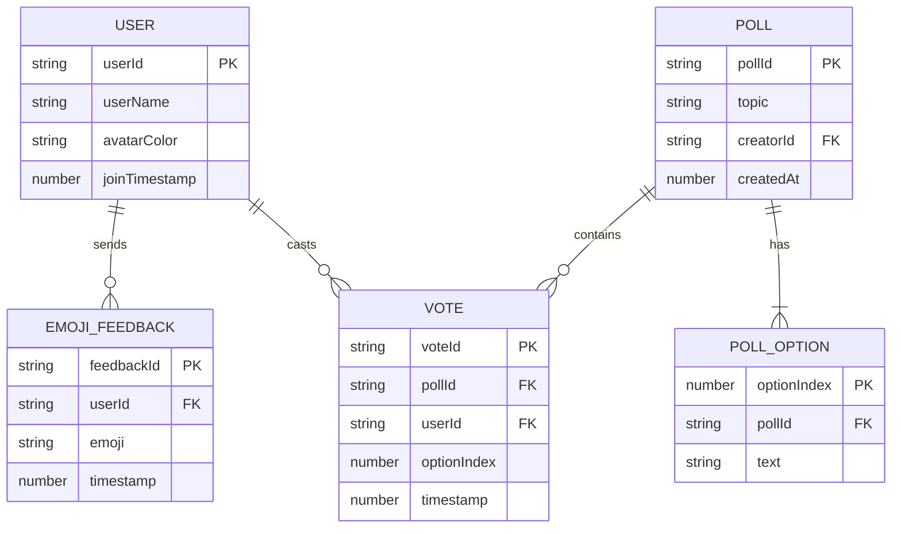

## 1. 架构设计



## 2. 技术描述

- 前端框架：React 18 + TypeScript 5
- 构建工具：Vite 5 + @vitejs/plugin-react
- 实时通信：ws（WebSocket客户端库）
- 路由：React内置状态切换（单页双面板）
- 状态管理：React useState + useReducer + Context API
- 唯一标识生成：uuid
- 样式方案：原生CSS（深色主题、CSS变量、CSS动画）
- 后端代理：Vite devServer代理WebSocket请求至本地ws服务

## 3. 组件结构

| 组件/模块 | 路径 | 职责 |
|-----------|------|------|
| App | src/App.tsx | 根组件，WebSocket初始化，全局状态管理，路由切换 |
| FeedbackPanel | src/components/FeedbackPanel.tsx | 表情反馈面板，包含表情球、聚合区、历史列表 |
| PollPanel | src/components/PollPanel.tsx | 投票面板，投票展示与创建表单 |
| wsManager | src/utils/wsManager.ts | WebSocket连接管理、心跳、重连、消息序列化 |

## 4. WebSocket消息协议

### 消息类型定义

```typescript
type WsMessageType = 
  | 'emoji'       // 表情反馈
  | 'poll_create' // 创建投票
  | 'poll_vote'   // 投票
  | 'poll_revoke' // 撤销投票
  | 'user_join'   // 用户加入
  | 'user_leave'  // 用户离开
  | 'user_list'   // 在线用户列表
  | 'pong'        // 心跳响应

interface WsMessage<T = any> {
  type: WsMessageType;
  sessionId: string;
  userId: string;
  timestamp: number;
  payload: T;
}

interface EmojiPayload {
  emoji: string;
  userName: string;
}

interface PollCreatePayload {
  pollId: string;
  topic: string;
  options: string[];
}

interface PollVotePayload {
  pollId: string;
  optionIndex: number;
}

interface PollRevokePayload {
  pollId: string;
}
```

## 5. 数据模型

### 5.1 数据模型定义



### 5.2 TypeScript类型定义

```typescript
interface User {
  userId: string;
  userName: string;
  avatarColor: string;
}

interface EmojiFeedback {
  id: string;
  userId: string;
  userName: string;
  avatarColor: string;
  emoji: string;
  timestamp: number;
}

interface Poll {
  pollId: string;
  topic: string;
  options: string[];
  votes: Record<string, number>; // userId -> optionIndex
  createdAt: number;
}

interface AggregatedEmoji {
  [emoji: string]: number;
}
```

## 6. 核心算法与实现要点

### 6.1 WebSocket管理器
- 心跳保活：setInterval每30秒发送'ping'消息
- 自动重连：指数退避策略（1s→2s→4s），最多重试3次
- 消息队列：连接未就绪时缓存消息，连接恢复后自动发送

### 6.2 表情飞行动画
- 使用CSS @keyframes + cubic-bezier实现贝塞尔曲线轨迹
- 随机偏移：Math.random() * 100 - 50 （±50px范围）
- 动画时长：0.8s，关键帧：0%（起点）→ 50%（曲线顶点）→ 100%（聚合区）

### 6.3 列表虚拟化
- IntersectionObserver或scrollTop计算可视区域
- 只渲染可视范围内的列表项 + 上下缓冲区（各3条）
- 使用transform: translateY定位虚拟列表项

### 6.4 智能自动滚动
- 监听scroll事件，用户向上滚动时设置暂停标志
- touchend/mouseup事件后5秒重置暂停标志
- 新消息到达时仅当未暂停才执行scrollTop = scrollHeight

## 7. 性能优化策略
- CSS硬件加速：transform和opacity动画触发GPU合成
- 事件委托：历史列表使用事件委托减少监听器
- 防抖节流：滚动监听使用requestAnimationFrame节流
- 内存管理：表情聚合数据定时清理，历史列表限制最大500条
