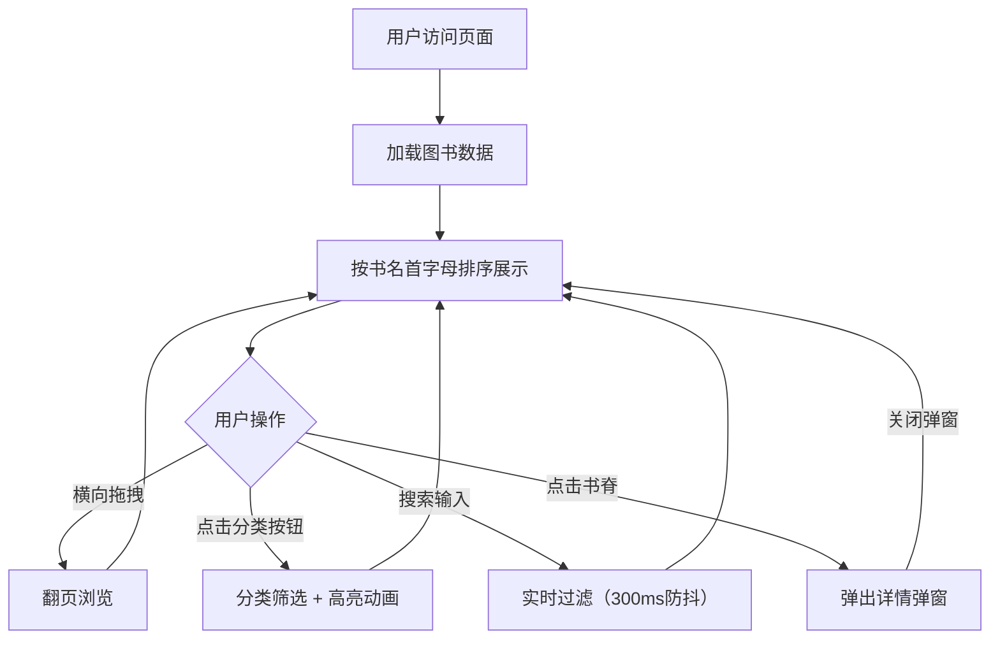

## 1. 产品概述
虚拟书架图书浏览应用是一款为独立书店设计的沉浸式线上图书展示系统，通过Canvas模拟实体书架体验，让顾客能够像在实体店中一样浏览、搜索和分类查看图书，弥补线上购书缺乏沉浸感的缺陷。

- 目标用户：独立书店的线上顾客
- 核心价值：提供接近实体书店的沉浸式浏览体验，展示图书封面、简介和库存状态

## 2. 核心功能

### 2.1 功能模块
1. **书架展示与浏览**：Canvas绘制虚拟书架，支持书籍按书名首字母排序展示、横向拖拽翻页、平滑滚动和翻页动画
2. **分类筛选与实时搜索**：文学/科技/生活三分类按钮筛选，实时搜索框（300ms防抖）过滤书名
3. **书籍详情弹窗**：点击书脊弹出详情模态框，展示完整书名、作者、简介和库存状态

### 2.2 页面详情
| 页面名称 | 模块名称 | 功能描述 |
|-----------|-------------|---------------------|
| 主页面 | 虚拟书架Canvas | 木纹背景渐变、书脊展示（30px宽、120px高、间隔10px）、拖拽翻页、淡入动画 |
| 主页面 | 控制面板 | 三个分类按钮（文学/科技/生活）、搜索输入框（自动聚焦）、页码指示器 |
| 主页面 | 详情弹窗 | 半透明背景rgba(0,0,0,0.6)、居中白色卡片、缩放动画（0.3秒）、库存状态显示 |

## 3. 核心流程
用户进入页面 → 看到按首字母排序的所有图书 → 可通过以下方式浏览：
- 横向拖拽鼠标翻页浏览
- 点击分类按钮筛选特定类别图书
- 在搜索框输入关键词实时搜索
- 点击任意书脊查看书籍详情
- 关闭弹窗继续浏览

## 4. 用户界面设计

### 4.1 设计风格
- **主色调**：暖色调木纹色系
  - 深木纹背景：#2E1A0F
  - 书架木纹渐变：#6F4E37 → #8B5A2B
  - 卡片背景：#F5E6C8（浅米色）
  - 金色点缀：#C7A25A（按钮）→ #E8C844（悬停）
- **按钮风格**：圆角8px、轻微阴影box-shadow: 0 2px 4px rgba(0,0,0,0.2)、悬停背景色渐变
- **字体**：标题使用Georgia衬线体
- **布局**：顶部控制面板（左侧分类按钮、右侧搜索框）、中部Canvas书架、底部页码

### 4.2 页面设计概述
| 页面名称 | 模块名称 | UI元素 |
|-----------|-------------|-------------|
| 主页面 | 控制面板 | 圆角按钮、悬停渐变动画、搜索框自动聚焦带闪烁光标 |
| 主页面 | 虚拟书架 | 木纹渐变背景、直立书脊（带书名和作者缩写）、平滑滚动（0.5px/帧）、翻页淡入动画（0.2s） |
| 主页面 | 详情弹窗 | 缩放展开动画（0.3s）、半透明遮罩、白色卡片、库存状态标签 |
| 主页面 | 页码指示器 | 数字跳转动画（0.1s）、格式"第X页，共Y页" |

### 4.3 响应式设计
- 桌面端优先设计
- 屏幕宽度 < 600px时：
  - 控制面板垂直排列
  - 书脊宽度缩小至20px
- 触摸设备：支持触屏拖拽翻页

### 4.4 动效设计
- 翻页动画：横向拖拽超过20px触发，淡入过渡0.2秒
- 缩放操作：滚轮缩放范围0.8-1.5倍，平滑过渡
- 分类高亮：金色边框闪动0.5秒
- 搜索匹配：匹配书籍放大至130%，其他半透明opacity 0.3
- 弹窗动画：中心向外缩放展开0.3秒，关闭时反向收缩
- 页码动画：数字跳转动画0.1秒

## 5. 性能约束
- 翻页动画和缩放操作帧率 ≥ 30fps
- 输入框防抖延迟 ≤ 300ms
- 弹窗打开/关闭动画 ≤ 0.3秒
- 整体加载时间 ≤ 2秒
