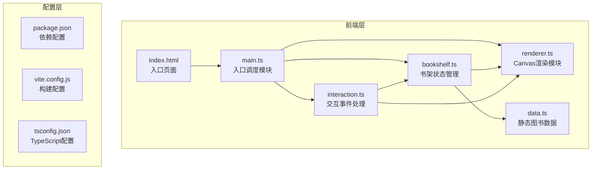

## 1. 架构设计



## 2. 技术说明

- **前端框架**：纯原生TypeScript + Vite构建（无React/Vue框架）
- **渲染引擎**：HTML5 Canvas 2D API
- **构建工具**：Vite 5.x（devServer端口3000）
- **语言版本**：TypeScript 5.x，target ES2020，严格模式
- **工具库**：lodash（用于深度排序）
- **样式**：原生CSS（无Tailwind等CSS框架）
- **后端**：无后端，使用静态mock数据

## 3. 文件结构与职责

| 文件路径 | 职责说明 | 调用关系 |
|---------|---------|---------|
| `package.json` | 项目依赖管理、启动脚本配置 | 被Vite读取 |
| `vite.config.js` | Vite构建配置、devServer端口3000 | 被Vite CLI读取 |
| `tsconfig.json` | TypeScript编译配置（严格模式、ES2020） | 被TSC读取 |
| `index.html` | 入口HTML，包含Canvas容器、控制面板div#controls | 加载main.ts |
| `src/main.ts` | 入口模块：初始化Canvas、加载数据、调度渲染和交互模块 | 读取data.ts → 创建BookShelf → 绑定interaction → 启动renderer |
| `src/data.ts` | 静态图书数据集：20本虚构书籍，含title/author/coverColor/description/category/stock | 被main.ts导入 |
| `src/bookshelf.ts` | 核心状态类：管理当前分类、搜索关键词、图书列表，提供筛选/搜索方法 | 被main.ts和interaction.ts调用，状态变化触发回调通知renderer |
| `src/renderer.ts` | Canvas绘制：书架背景、书脊、封面缩略图、平滑滚动、翻页动画 | 监听bookshelf状态变化，被interaction.ts调用进行缩放/滚动 |
| `src/interaction.ts` | 事件处理：点击详情、拖拽翻页（20px阈值）、滚轮缩放（0.8-1.5倍） | 捕获DOM事件，调用bookshelf的筛选方法和renderer的绘制方法 |

## 4. 数据流向

```
data.ts (静态数据)
    ↓ (导入)
main.ts (初始化)
    ↓ (创建实例)
bookshelf.ts (状态管理)
    ↓ (状态变化回调)
    ↗ (调用筛选/搜索)
interaction.ts  →  renderer.ts (Canvas渲染)
    ↘ (调用滚动/缩放)
```

详细数据流：
1. **初始化流**：`main.ts` 导入 `data.ts` 的图书数据 → 创建 `BookShelf` 实例 → 创建 `Renderer` 实例（传入bookshelf）→ 创建 `Interaction` 实例（传入bookshelf和renderer）→ 启动渲染循环
2. **筛选流**：用户点击分类按钮 → `interaction.ts` 捕获点击 → 调用 `bookshelf.filterByCategory()` → `bookshelf` 更新内部状态 → 触发重绘回调 → `renderer` 重新绘制Canvas
3. **搜索流**：用户输入搜索关键词（300ms防抖）→ `interaction.ts` 捕获input事件 → 调用 `bookshelf.searchByTitle()` → `bookshelf` 更新过滤列表 → 触发重绘 → `renderer` 绘制匹配结果（放大+半透明效果）
4. **翻页流**：用户横向拖拽鼠标 → `interaction.ts` 记录位移 → 超过20px阈值 → 调用 `bookshelf` 翻页 + `renderer` 翻页动画 → 重绘
5. **详情流**：用户点击书脊 → `interaction.ts` 计算点击坐标 → 命中书籍 → 创建/显示模态框DOM → 播放缩放动画

## 5. 核心数据模型

### Book（书籍）
```typescript
interface Book {
  id: number;
  title: string;           // 书名
  author: string;          // 作者
  coverColor: string;      // 封面颜色（16进制）
  description: string;     // 简介（300字以内）
  category: '文学' | '科技' | '生活';  // 分类
  stock: '有货' | '无货' | '预订';      // 库存状态
}
```

### BookShelfState（书架状态）
```typescript
interface BookShelfState {
  books: Book[];           // 全部图书
  filteredBooks: Book[];   // 筛选后图书
  currentCategory: string | null;  // 当前分类
  searchKeyword: string;   // 搜索关键词
  currentPage: number;     // 当前页码
  booksPerPage: number;    // 每页书籍数
  highlightedBookId: number | null;  // 高亮书籍ID
}
```

## 6. 性能优化策略
1. **Canvas渲染优化**：使用requestAnimationFrame循环，每帧仅重绘可见区域
2. **防抖处理**：搜索输入采用300ms防抖，避免频繁重绘
3. **状态管理**：bookshelf状态变化时才触发重绘，避免无效渲染
4. **动画平滑**：滚动速度0.5px/帧，使用CSS transition处理DOM动画
5. **内存控制**：复用Canvas上下文，避免频繁创建对象
