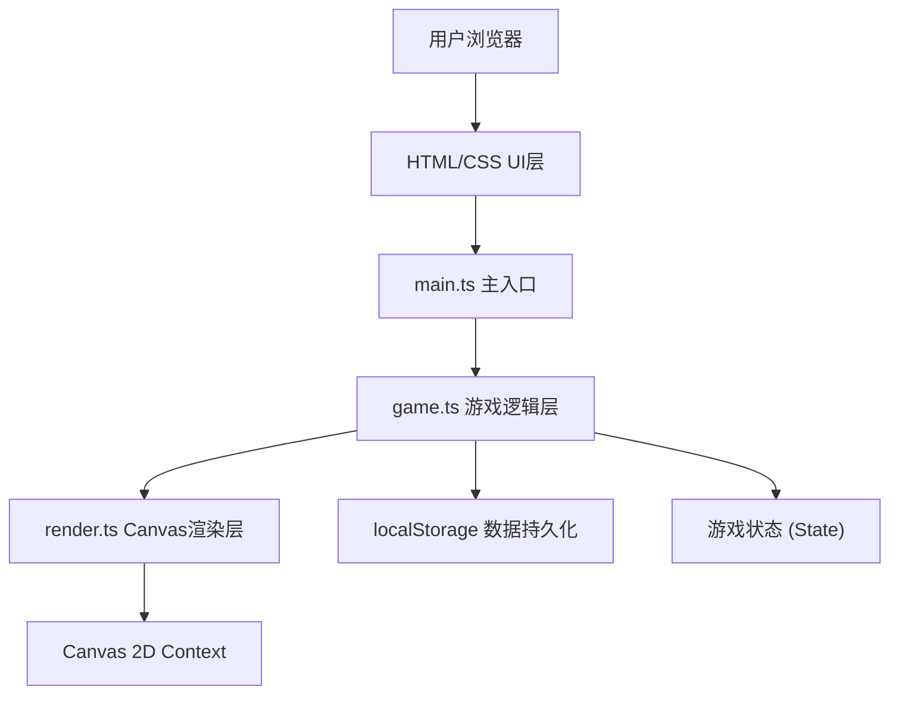

## 1. 架构设计



## 2. 技术描述

- **前端框架**：纯TypeScript + Vite，无额外UI框架
- **渲染方式**：HTML5 Canvas 2D API 绘制像素风游戏画面
- **UI布局**：少量HTML + CSS用于面板、按钮等UI元素
- **数据存储**：浏览器localStorage持久化游戏状态
- **构建工具**：Vite（支持TypeScript、HMR热更新）
- **语言版本**：TypeScript严格模式，target ES2020

## 3. 文件结构

```
项目根目录/
├── package.json          # 项目依赖与脚本配置
├── vite.config.js        # Vite构建配置
├── tsconfig.json         # TypeScript编译配置
├── index.html            # 入口HTML页面
└── src/
    ├── main.ts           # 主入口：初始化、加载数据、启动游戏循环
    ├── game.ts           # 游戏核心逻辑：状态管理、生长计时、操作处理
    └── render.ts         # Canvas渲染：田格、植物、动画、特效
```

## 4. 数据模型

### 4.1 核心类型定义

```typescript
// 植物生长阶段
enum GrowthStage {
  EMPTY = 'empty',      // 空地
  SEED = 'seed',        // 发芽（5秒）
  SPROUT = 'sprout',    // 幼苗（8秒）
  MATURE = 'mature',    // 成熟（15秒）
  FLOWER = 'flower'     // 开花（10秒）
}

// 单个植物数据
interface Plant {
  id: string;
  stage: GrowthStage;
  stageStartTime: number;  // 当前阶段开始时间戳
  water: number;           // 水分值 0-100
  lastWaterDecay: number;  // 上次水分衰减时间戳
}

// 田地网格 8x8
type FarmGrid = Plant[][];

// 游戏统计数据
interface GameStats {
  coins: number;           // 总金币
  planted: number;         // 已种植数量
  harvested: number;       // 已收获数量
  achievements: string[];  // 已解锁成就
}

// 游戏全局状态
interface GameState {
  grid: FarmGrid;
  stats: GameStats;
  selectedCell: { row: number; col: number } | null;
}
```

### 4.2 localStorage存储键
- `pixel_garden_state`：存储完整游戏状态（JSON序列化）

## 5. 核心模块设计

### 5.1 game.ts - 游戏逻辑层
**职责**：
- 管理8x8田地数组和植物状态
- 处理生长计时逻辑（基于时间戳计算阶段进度）
- 处理浇水、收获、种植等玩家操作
- 水分衰减系统（每3秒-5点）
- 成就检测与解锁
- 数据读写localStorage持久化

**核心函数**：
- `loadState(): GameState` - 从localStorage加载状态
- `saveState(): void` - 保存状态到localStorage
- `plantSeed(row, col): boolean` - 种植种子
- `waterPlant(row, col): void` - 浇水（水分+20）
- `harvestPlant(row, col): boolean` - 收获开花植物
- `update(deltaTime): void` - 每帧更新：生长阶段推进、水分衰减

### 5.2 render.ts - Canvas渲染层
**职责**：
- 接收game.ts的状态数据进行纯渲染
- 绘制田地网格（8x8或响应式4xN）
- 根据植物阶段绘制16x16像素精灵
- 绘制水滴动画、收获闪烁特效
- 响应式适配画布尺寸

**核心函数**：
- `render(state: GameState): void` - 主渲染入口
- `drawGrid(): void` - 绘制田格网格线
- `drawPlant(row, col, plant): void` - 绘制单个植物像素精灵
- `drawWaterAnimation(fromX, fromY, toX, toY, progress): void` - 水滴动画
- `drawHarvestFlash(row, col, progress): void` - 收获闪烁特效

### 5.3 main.ts - 主入口
**职责**：
- 初始化Canvas和DOM元素
- 加载localStorage数据
- 绑定事件监听（点击种植、拖拽工具）
- 启动requestAnimationFrame游戏循环
- 连接game.ts和render.ts的数据流向

## 6. 性能要求
- 页面加载后1.5秒内可交互
- 动画帧率不低于30fps
- 使用requestAnimationFrame驱动游戏循环
- 像素精灵预缓存，避免重复计算
