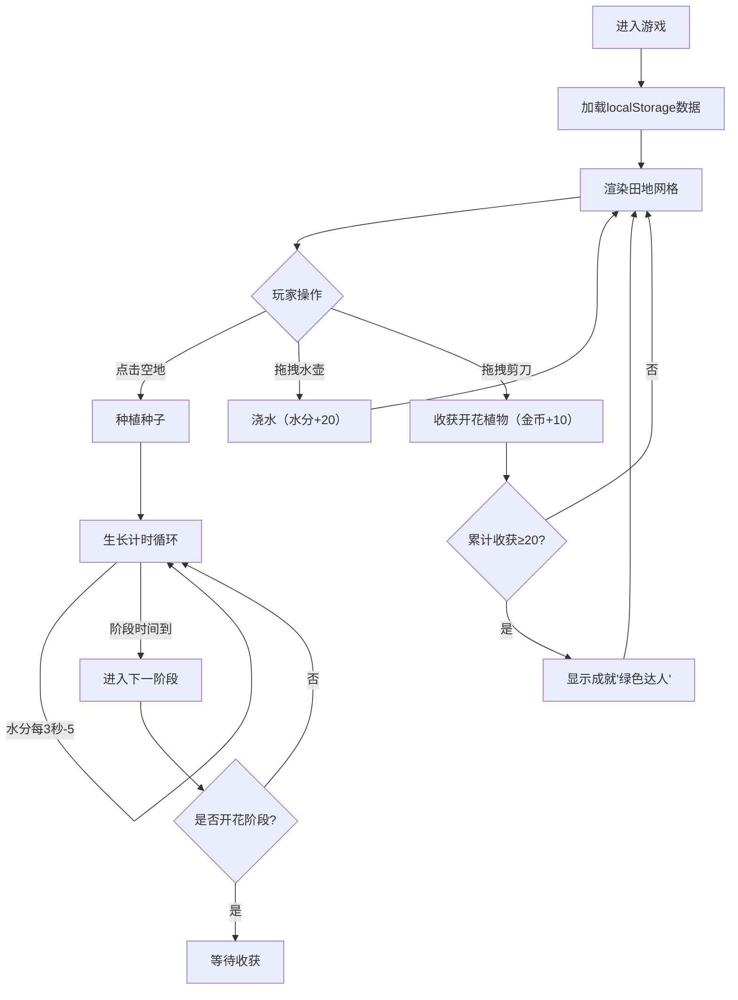

## 1. 产品概述

像素花园是一款在浏览器中运行的像素风格植物培育游戏，为玩家提供沉浸式的虚拟种植体验。通过模拟植物真实生长阶段变化和精致的视觉细节，解决传统农业游戏画面单调、缺乏生长阶段感的问题。

- 核心目标：为休闲游戏爱好者提供轻松愉悦的种植培育体验，通过像素美学和真实生长阶段模拟带来成就感
- 目标用户：喜欢像素风格、休闲模拟经营类游戏的玩家群体

## 2. 核心功能

### 2.1 功能模块
1. **主游戏界面**：顶部数据统计栏、左侧工具区、中央8x8田地网格、右侧植物状态面板
2. **生长系统**：4阶段植物生长（发芽→幼苗→成熟→开花），每个阶段外观显著不同
3. **交互操作系统**：浇水、收获功能，支持拖拽操作
4. **数据持久化**：植物状态、游戏统计、成就数据通过localStorage存储
5. **成就系统**：累计收获达成条件后解锁成就提示

### 2.2 页面详情
| 页面名称 | 模块名称 | 功能描述 |
|-----------|-------------|---------------------|
| 主游戏界面 | 数据统计栏 | 显示总金币、已种植数量、已收获数量、当前存活数 |
| 主游戏界面 | 工具区 | 水壶（浇水）、剪刀（收获）工具图标，支持拖拽 |
| 主游戏界面 | 田地网格 | 8x8像素风田地格，点击空地种植种子 |
| 主游戏界面 | 状态面板 | 显示选中植物的阶段名称、剩余时间、水分值 |
| 主游戏界面 | 成就弹窗 | 半透明遮罩，中央显示奖杯图标和成就文字 |

## 3. 核心流程

玩家进入游戏后，首先看到8x8的田地网格。点击空地即可种植种子，种子开始进入生长周期。玩家需要通过拖拽水壶到植物上进行浇水，维持植物水分。当植物进入开花阶段后，玩家可以用剪刀工具进行收获获得金币。游戏数据自动保存，刷新页面后可继续游戏。

## 4. 用户界面设计

### 4.1 设计风格
- **主色调**：#4CAF50（柔和绿色）
- **辅色调**：#81C784（浅绿色）、#388E3C（深绿色网格线）
- **背景色**：#E8F5E9（极浅绿背景）
- **按钮风格**：像素风图标，圆角4px，悬停有轻微放大效果
- **字体**：等宽像素风字体，标题16px，正文12-14px
- **布局风格**：顶部统计栏 + 左右工具面板 + 中央游戏区的经典布局
- **像素精灵**：16x16像素风格植物，发芽为绿点、幼苗三片叶、成熟带花苞、开花彩色花

### 4.2 页面设计概述
| 页面名称 | 模块名称 | UI元素 |
|-----------|-------------|-------------|
| 主游戏界面 | 数据统计栏 | 像素风数字显示，四个数据横向排列，每个数据带图标 |
| 主游戏界面 | 工具区 | 水壶💧和剪刀✂️图标，可拖拽状态有视觉反馈 |
| 主游戏界面 | 田地网格 | 6px实线#388E3C分割，每个格子约64x64px，植物居中绘制 |
| 主游戏界面 | 状态面板 | 阶段名称大号字体，进度条显示剩余时间，水分条显示当前值 |
| 主游戏界面 | 成就弹窗 | 半透明黑色遮罩，中央奖杯图标🏆，成就文字"绿色达人" |

### 4.3 响应式设计
- **桌面端（≥768px）**：8x8田地网格布局，工具图标标准尺寸
- **移动端（<768px）**：田地网格变为每行4格（4x16布局），水壶和剪刀图标放大1.5倍便于触屏操作
- **触屏优化**：增大点击热区，拖拽操作支持触摸事件

### 4.4 动画与特效
- **浇水动画**：蓝色水滴（直径8px）从水壶位置斜向落入植物格子，持续0.4秒
- **收获特效**：植物格子闪烁金色0.3秒后变为空地
- **交互反馈**：所有操作响应时间≤0.2秒
- **帧率要求**：动画帧率≥30fps
