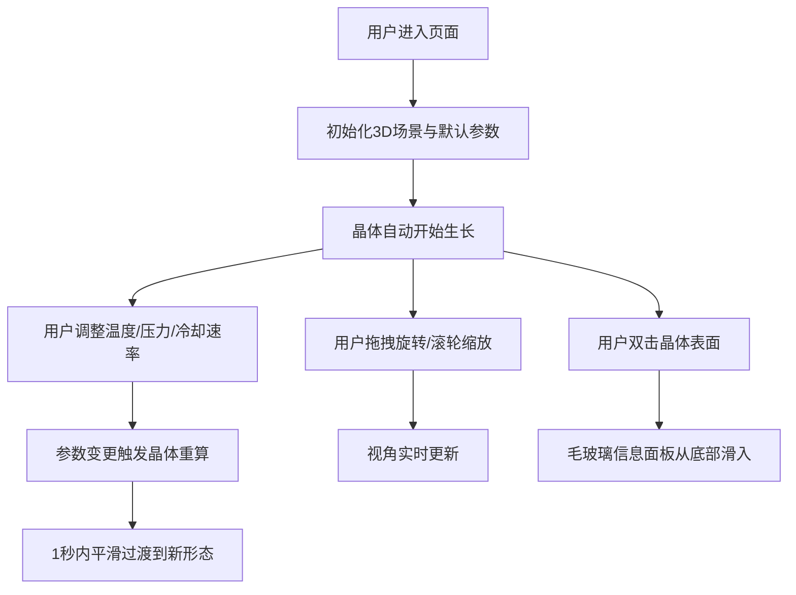

## 1. 产品概述

3D矿物晶体生长模拟器是一款面向学生和矿物爱好者的Web端交互式教育工具，通过实时3D渲染展示不同矿物（石英、方解石、萤石）在特定温度和压力条件下的结晶生长过程，用户可调整环境参数观察晶体形态变化。

- 目标用户：地质学学生、矿物爱好者、科普教育工作者
- 产品价值：将抽象的矿物结晶过程可视化，通过交互式学习加深对晶体形态与环境参数关系的理解

## 2. 核心功能

### 2.1 功能模块
1. **3D晶体渲染场景**：透明立方体容器、动态晶体生长、半透明渐变着色、表面纹理与气泡效果
2. **环境参数控制面板**：温度调节（200-1200°C）、压力调节（1-100atm）、冷却速率选择（快/中/慢）
3. **晶体信息展示**：双击显示矿物名称、晶系、Mohs硬度、折射率、生长进度
4. **相机交互**：轨道旋转、滚轮缩放、视角控制

### 2.2 页面详情

| 页面名称 | 模块名称 | 功能描述 |
|---------|---------|---------|
| 主页面 | 3D渲染区域 | 实时渲染晶体生长过程，支持鼠标交互，深色太空主题背景 |
| 主页面 | 右侧控制面板 | 参数滑块、实时数值显示、矿物选择、重置按钮 |
| 主页面 | 信息浮窗 | 双击晶体弹出毛玻璃信息面板，显示矿物属性和生长进度 |

## 3. 核心流程

## 4. 用户界面设计

### 4.1 设计风格
- **主色调**：深色太空主题（#0a0a1a 至 #1a1a3a 渐变星空背景）
- **强调色**：青色发光（#00ffff）、紫色辉光（#9966ff）
- **控制面板**：半透明磨砂玻璃（rgba(20,20,40,0.6)，backdrop-filter: blur(12px)，圆角16px）
- **按钮/滑块**：柔和发光轨道，悬停/点击弹性缩放（0.2s ease-out）
- **字体**：显示字体使用 Orbitron（科幻风格），正文字体使用 JetBrains Mono（等宽易读）

### 4.2 页面设计概述

| 页面名称 | 模块名称 | UI元素 |
|---------|---------|--------|
| 主页面 | 3D渲染区 | 全屏Three.js Canvas，渐变星空背景，粒子效果，透明立方体容器 |
| 主页面 | 控制面板 | 固定右侧宽320px，顶部标题，三个滑块组+冷却速率按钮组，底部矿物选择和重置 |
| 主页面 | 信息浮窗 | 固定底部居中，毛玻璃卡片，淡入+滑入动画，3秒后可自动隐藏 |

### 4.3 响应性
- 桌面端优先设计，右侧固定控制面板
- 移动端自适应：控制面板转为底部抽屉式布局
- 触控优化：双指缩放、单指旋转

### 4.4 3D场景指导
- **环境**：深空渐变背景 + 程序化星空粒子，无HDRI以保持性能
- **光照**：主光源（方向光，冷白色，带轻微阴影） + 环境光（低强度蓝色） + 晶体边缘发光（点光源跟随）
- **相机**：PerspectiveCamera，fov=50，初始距离8单位，OrbitControls启用阻尼
- **构图**：晶体居中，透明立方体容器略大于最大晶体尺寸，留出观察空间
- **交互**：每秒生长1个晶面，参数变更后200ms内完成几何体重算，1秒平滑过渡
- **后处理**：轻微泛光（Bloom）增强晶体发光感，FXAA抗锯齿
- **性能**：目标帧率≥25fps，几何更新使用BufferGeometry，避免主线程阻塞
