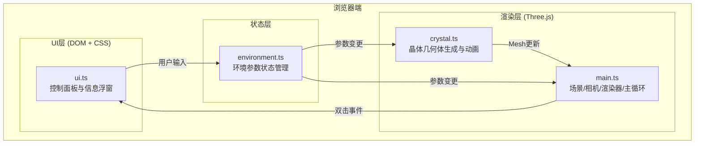

## 1. 架构设计



## 2. 技术选型

- **前端框架**：原生 TypeScript（无框架，轻量化3D应用）
- **3D渲染**：Three.js @ 0.160.0
- **构建工具**：Vite @ latest
- **UI工具**：lil-gui（可选，用于开发调试，最终UI手写DOM）
- **类型系统**：TypeScript @ latest，严格模式
- **初始化工具**：npm create vite-init（vanilla-ts模板）

## 3. 项目文件结构

| 文件路径 | 职责 |
|---------|------|
| `package.json` | 项目依赖与脚本配置 |
| `vite.config.js` | Vite构建配置（端口3000，src别名） |
| `tsconfig.json` | TypeScript严格模式配置 |
| `index.html` | 入口HTML，挂载容器与样式 |
| `src/main.ts` | 入口：初始化场景、相机、渲染器、轨道控制、主循环 |
| `src/crystal.ts` | 核心：晶体几何体生成、参数驱动形态、顶点/法线更新、材质与气泡效果 |
| `src/environment.ts` | 状态：温度/压力/冷却速率管理、参数变更回调、光照与背景控制 |
| `src/ui.ts` | 界面：控制面板DOM构建、滑块绑定、信息浮窗展示与动画 |

## 4. 数据模型

### 4.1 矿物类型定义
```typescript
type MineralType = 'quartz' | 'calcite' | 'fluorite';

interface MineralInfo {
  name: string;           // 中文名称
  nameEn: string;         // 英文名称
  crystalSystem: string;  // 晶系
  mohsHardness: number;   // Mohs硬度
  refractiveIndex: number; // 折射率
  baseColor: THREE.Color; // 基础颜色
  faces: number;          // 晶面数量
}
```

### 4.2 环境参数
```typescript
interface EnvironmentParams {
  temperature: number;    // 200-1200°C
  pressure: number;       // 1-100atm
  coolingRate: 'fast' | 'medium' | 'slow';
  mineral: MineralType;
}
```

### 4.3 晶体生长状态
```typescript
interface CrystalState {
  growthProgress: number;    // 0-1 生长进度
  targetVertices: Float32Array;
  currentVertices: Float32Array;
  defectDensity: number;     // 由压力决定
  transparency: number;      // 由冷却速率决定
  crystalSize: number;       // 由冷却速率决定
}
```

## 5. 核心接口定义

### 5.1 Crystal 类
```typescript
class CrystalSimulator {
  mesh: THREE.Mesh;
  updateParams(params: EnvironmentParams): void;   // 参数变更，200ms内重算
  grow(deltaTime: number): void;                    // 每帧调用，推进生长
  getInfo(): { mineral: MineralInfo; progress: number };
}
```

### 5.2 Environment 类
```typescript
class EnvironmentManager {
  params: EnvironmentParams;
  onChange(callback: (params: EnvironmentParams) => void): void;
  setTemperature(value: number): void;
  setPressure(value: number): void;
  setCoolingRate(rate: 'fast' | 'medium' | 'slow'): void;
  setMineral(mineral: MineralType): void;
  applyLighting(scene: THREE.Scene): void;
  applyBackground(scene: THREE.Scene): void;
}
```

### 5.3 UI 管理
```typescript
class UIController {
  constructor(env: EnvironmentManager, crystal: CrystalSimulator);
  showInfoPanel(info: MineralInfo, progress: number): void;
  hideInfoPanel(): void;
}
```

## 6. 性能优化策略

1. **几何体重用**：使用 `BufferGeometry` + `morphAttributes` 或手动插值顶点位置，避免频繁创建新几何体
2. **参数变更节流**：滑块输入使用 `requestAnimationFrame` 合并，确保 200ms 内完成一次重算
3. **生长动画**：当前顶点 → 目标顶点线性插值，1 秒过渡时间，每帧仅更新 position attribute
4. **材质优化**：晶体使用单一 `ShaderMaterial` 或 `MeshPhysicalMaterial`，半透明 + 透明 + 高光
5. **气泡效果**：使用 `Points` + 着色器实现 GPU 粒子，避免 CPU 逐粒子更新
6. **主线程不阻塞**：顶点计算分片进行（每帧处理一部分），或使用简单数学公式即时生成顶点
