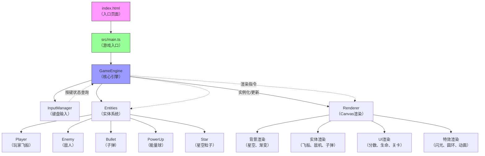

## 1. 架构设计



### 1.1 数据流向

```
键盘事件 → InputManager（存储状态）
     ↓
GameEngine（每帧查询）
     ↓
更新Player位置/射击 → 更新Enemy/Bullet位置
     ↓
空间哈希碰撞检测
     ↓
处理碰撞结果（得分/扣血/掉落能量球）
     ↓
生成渲染指令（实体列表 + UI数据 + 特效状态）
     ↓
Renderer（绘制到Canvas）
```

## 2. 技术说明

- **前端框架**：原生 TypeScript + HTML5 Canvas 2D
- **构建工具**：Vite 5.x
- **编程语言**：TypeScript 5.x（strict模式，target ES2020）
- **字体**：Google Fonts - Press Start 2P（通过CDN加载）
- **数据存储**：localStorage（保存最高分）

### 2.1 文件结构

```
auto4/
├── index.html                 # 入口HTML，Canvas容器，引入Google Fonts
├── package.json               # 项目依赖与启动脚本
├── vite.config.js             # Vite构建配置
├── tsconfig.json              # TypeScript配置（strict，ES2020）
└── src/
    ├── main.ts                # 游戏入口：初始化Canvas、启动游戏循环
    ├── gameEngine.ts          # 核心引擎：状态管理、更新循环、碰撞检测
    ├── entities.ts            # 实体定义：Player、Enemy、Bullet、PowerUp、Star
    ├── renderer.ts            # 渲染器：Canvas绘制、UI、特效
    └── input.ts               # 输入管理：键盘事件监听、状态查询
```

### 2.2 模块职责与调用关系

| 文件 | 职责 | 被谁调用 | 调用谁 |
|------|------|----------|--------|
| main.ts | 初始化Canvas，创建GameEngine实例，启动requestAnimationFrame循环 | index.html | gameEngine.ts |
| gameEngine.ts | 游戏状态机、实体更新、空间哈希碰撞检测、关卡逻辑 | main.ts | entities.ts, input.ts, renderer.ts |
| entities.ts | 所有实体类定义（位置、速度、生命、绘制方法） | gameEngine.ts | - |
| renderer.ts | Canvas上下文操作，绘制所有视觉元素 | gameEngine.ts | - |
| input.ts | 键盘事件监听，按键状态Map，提供查询接口 | gameEngine.ts | - |

## 3. 核心数据模型

### 3.1 实体基类与派生类

```typescript
// 位置接口
interface Vector2 { x: number; y: number }

// 实体基类
interface Entity {
  id: number;
  position: Vector2;
  velocity: Vector2;
  width: number;
  height: number;
  active: boolean;
}

// 玩家
interface Player extends Entity {
  lives: number;
  speed: number;
  baseSpeed: number;
  shootCooldown: number;
  lastShotTime: number;
  hasShield: boolean;
  speedBoostEndTime: number;
}

// 敌人类型
type EnemyType = 'small' | 'large';
interface Enemy extends Entity {
  type: EnemyType;
  health: number;
  maxHealth: number;
}

// 子弹
interface Bullet extends Entity {
  isPlayerBullet: boolean;
  damage: number;
}

// 能量球
interface PowerUp extends Entity {
  type: 'energy';
}

// 星星粒子
interface Star {
  x: number;
  y: number;
  size: number;
  speed: number;
  brightness: number;
  twinkleSpeed: number;
}
```

### 3.2 游戏状态

```typescript
type GameState = 'title' | 'playing' | 'gameover';

interface GameData {
  state: GameState;
  score: number;
  highScore: number;
  level: number;
  player: Player;
  enemies: Enemy[];
  bullets: Bullet[];
  powerUps: PowerUp[];
  stars: Star[];
  effects: {
    flashAlpha: number;      // 能量收集闪光
    ringRadius: number;     // 结束圆环扩散
    ringAlpha: number;
  };
  enemySpawnTimer: number;
  enemySpawnInterval: number;
  titleSwingAngle: number;
}
```

## 4. 性能优化策略

### 4.1 空间哈希碰撞检测

```
网格大小: 64x64像素
每个实体根据position映射到对应网格单元
仅检测同一网格及相邻8个网格内的实体碰撞
复杂度从 O(n²) 降至 O(n) 平均情况
```

### 4.2 游戏循环优化

```
- 使用 requestAnimationFrame (RAF) 实现60FPS
- 固定时间步长：deltaTime 归一化到 16.67ms
- 实体对象池复用，避免频繁GC
- 离屏实体自动标记为 inactive，跳过更新与渲染
```

### 4.3 渲染优化

```
- Canvas单次清空，分层绘制
- 星空背景使用预缓存的粒子数据
- UI文字仅在数据变化时重新计算布局
```

## 5. 性能监控指标

| 指标 | 目标值 | 测量方式 |
|------|--------|----------|
| FPS | ≥ 60 | RAF时间差计算 |
| 输入延迟 | ≤ 16ms | 键盘事件到渲染输出的时间差 |
| 实体数上限 | 100+ | 同时存在的敌人+子弹+能量球 |
| 内存占用 | 稳定 | Chrome DevTools Memory面板 |
