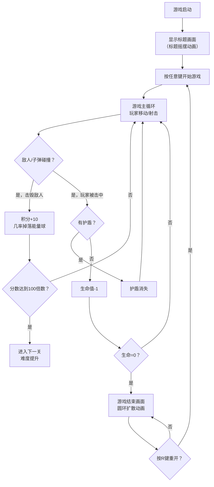

## 1. 产品概述

一款复古街机风格的2D飞行射击游戏，玩家操控飞船在无限生成的太空中躲避障碍、击落敌人并收集能量。目标是获得尽可能高的分数，支持PC和移动端自适应显示。

- **主要用途**：提供休闲娱乐体验，复刻经典街机射击游戏的玩法和视觉风格
- **目标用户**：复古游戏爱好者、休闲游戏玩家
- **产品价值**：轻量级、易上手、具有挑战性的浏览器端小游戏体验

## 2. 核心功能

### 2.1 功能模块

1. **游戏主循环**：60FPS游戏循环、实体更新、碰撞检测、渲染输出
2. **玩家控制系统**：WASD键盘移动、空格键射击、子弹冷却机制
3. **敌人系统**：多类型敌人生成（小型/大型）、随机生成位置和速度、大型敌人分裂机制
4. **能量收集系统**：能量球掉落、加速效果（50%速度提升，3秒）、护盾效果（免疫一次碰撞）
5. **分数与关卡系统**：积分计算、关卡递进、难度提升（生成速度加快、敌人类型增加）
6. **游戏状态管理**：开始界面、游戏进行、游戏结束、重新开始、最高分持久化存储
7. **视觉效果系统**：星空背景粒子、像素风UI、能量闪光特效、标题摇摆动画、结束圆环扩散动画

### 2.2 功能详情

| 功能模块 | 子功能 | 描述 |
|----------|--------|------|
| 玩家控制 | 移动控制 | WASD控制上下左右移动，边界检测 |
| 玩家控制 | 射击系统 | 空格键发射子弹，0.2秒冷却，按住可连射 |
| 敌人生成 | 小型敌人 | 1点生命，移动速度快 |
| 敌人生成 | 大型敌人 | 3点生命，移动速度慢，击毁后分裂为2个小型敌人 |
| 能量收集 | 能量球掉落 | 击毁敌人有几率掉落能量球 |
| 能量收集 | 加速效果 | 收集后3秒内速度提升50% |
| 能量收集 | 护盾效果 | 收集后获得护盾，免疫一次碰撞伤害，半透明圆形显示 |
| 分数关卡 | 积分规则 | 击毁敌人+10分，收集能量球+5分 |
| 分数关卡 | 关卡递进 | 每100分进入下一关，敌人刷新率提升 |
| 游戏结束 | 生命系统 | 被击中3次后游戏结束 |
| 游戏结束 | 最高分 | 使用localStorage保存最高分 |
| 游戏结束 | 重新开始 | 按R键重新开始游戏 |

## 3. 核心流程

### 3.1 用户游戏流程

## 4. 用户界面设计

### 4.1 设计风格

- **主色调**：深空蓝黑色渐变背景 (#0a0a1a → #000011)
- **强调色**：
  - 玩家飞船：绿色 (#00ff66)
  - 敌机：红色 (#ff3333)
  - 子弹：亮黄色 (#ffff00)
  - 能量球：青蓝色 (#00ffff)
  - UI文字：白色像素字体
- **字体**：Google Fonts - Press Start 2P（像素风格）
- **按钮风格**：像素风边框，无圆角，复古质感
- **布局风格**：Canvas居中显示，16:9比例，最大600x900像素

### 4.2 页面设计

| 画面 | 模块 | UI元素 |
|------|------|--------|
| 标题画面 | 标题区域 | 摇摆动画的"SPACE SHOOTER"标题，像素字体 |
| 标题画面 | 提示区域 | "Press any key to start"闪烁提示 |
| 游戏进行 | 状态栏 | 左上角显示：分数(SCORE)、生命(LIVES x3)、关卡(LEVEL) |
| 游戏进行 | 游戏区域 | 星空背景、玩家飞船、敌机、子弹、能量球、护盾效果 |
| 游戏进行 | 能量特效 | 收集能量时全屏白色半透明闪光（0.1秒） |
| 游戏结束 | 分数显示 | "GAME OVER"标题，最终分数，最高分 |
| 游戏结束 | 圆环动画 | 从中心向外扩散的圆环动画 |
| 游戏结束 | 提示区域 | "Press R to Restart"闪烁提示 |

### 4.3 响应式设计

- **设计策略**：桌面优先，移动端自适应
- **Canvas尺寸**：保持16:9比例，最大600x900像素
- **布局方式**：CSS Flex居中，适配各种屏幕尺寸
- **移动端**：自动缩放Canvas，保持游戏画面比例不变形
