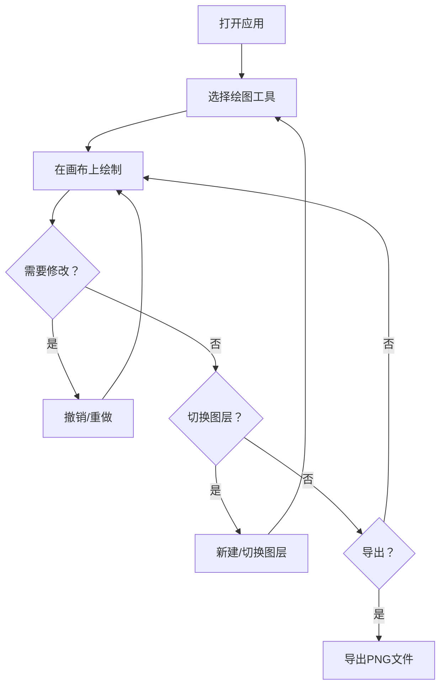

## 1. 产品概述

在线多人协作白板绘图应用，提供实时绘制、图层管理、历史撤销重做等功能，适用于团队头脑风暴、远程教学、设计评审等场景。支持多种绘图工具和导出功能，模拟多人实时协作体验。

### 目标与价值
- 提供流畅的绘图体验，延迟低于50ms
- 支持专业的图层管理能力
- 提供可靠的历史回溯机制
- 模拟多人协作场景，展示实时协同效果

## 2. 核心功能

### 2.1 用户角色
| 角色 | 注册方式 | 核心权限 |
|------|----------|----------|
| 普通用户 | 无需注册，直接使用 | 绘制图形、管理图层、撤销重做、导出画布 |

### 2.2 功能模块
1. **白板绘制**：画笔、橡皮、矩形、圆形、文本工具
2. **工具栏**：工具切换、颜色选择、粗细调整、导出功能
3. **图层管理**：图层列表、缩略图、锁定/隐藏/删除、拖拽排序、新建图层
4. **历史记录**：撤销、重做、快照管理
5. **多人协作模拟**：伪用户光标显示、随机移动、点击闪烁

### 2.3 页面详情
| 页面名称 | 模块名称 | 功能描述 |
|----------|----------|----------|
| 主页面 | 顶部工具栏 | 工具按钮、颜色选择器、粗细滑块、导出PNG按钮 |
| 主页面 | 中央画布 | SVG画布、网格背景、绘制交互、用户光标 |
| 主页面 | 右侧图层面板 | 图层缩略图、图层名称、锁定/可见/删除按钮、拖拽排序、新建图层按钮 |

## 3. 核心流程

用户打开应用 → 选择绘图工具 → 在画布上绘制图形 → 可切换图层继续绘制 → 使用撤销/重做修正操作 → 点击导出保存画布

## 4. 用户界面设计

### 4.1 设计风格
- **主色调**：#2c3e50（深灰蓝）、#3498db（亮蓝）、#ecf0f1（浅灰）、#ffffff（白）
- **按钮样式**：扁平圆角，悬停有背景色变化，点击有下沉动画（0.1s）
- **字体**：系统无衬线字体，保持简洁专业
- **布局**：顶部工具栏 + 中央画布 + 右侧图层侧边栏
- **图标**：简洁线性图标，白色为主

### 4.2 页面设计概述
| 页面名称 | 模块名称 | UI元素 |
|----------|----------|--------|
| 主页面 | 工具栏 | 背景#2c3e50，工具按钮白色图标，悬停#34495e，圆形颜色选择器 |
| 主页面 | 画布 | 白色背景，浅灰网格（20px间距，0.15透明度），响应式尺寸 |
| 主页面 | 图层面板 | 宽280px，背景#ecf0f1，图层条目高48px，选中边框#3498db |

### 4.3 响应式设计
- 桌面端（≥768px）：顶部水平工具栏 + 右侧固定图层管理面板
- 移动端（<768px）：左侧垂直工具栏 + 底部抽屉式图层管理面板（点击按钮展开）
- 画布始终自适应剩余空间，触摸操作优化

### 4.4 动效设计
- 工具按钮点击：0.1s下沉动画
- 撤销/重做：0.2s淡入淡出过渡
- 所有过渡：ease-in-out，0.25s
- 伪用户光标点击闪烁：0.3s高亮效果
