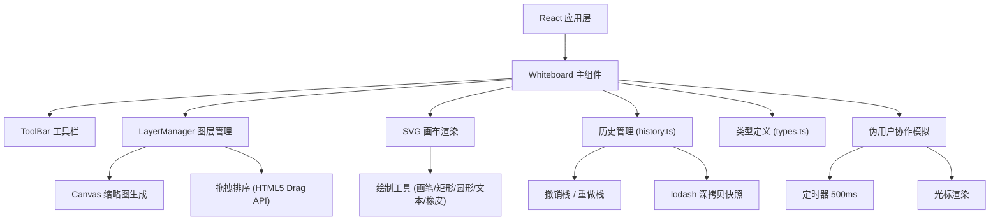
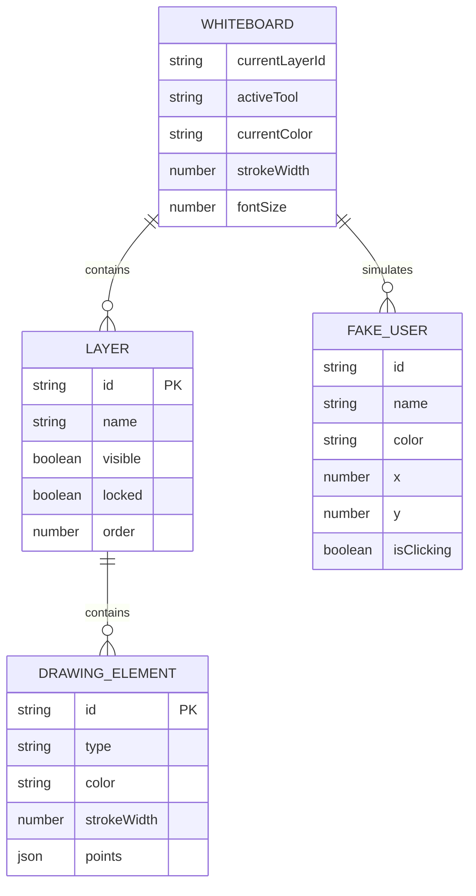

## 1. 架构设计



## 2. 技术描述
- **前端框架**：React@18 + TypeScript + Vite
- **状态管理**：React useState/useReducer（局部状态）
- **绘图技术**：SVG（主画布）+ Canvas（缩略图、导出）
- **工具库**：uuid（图层ID生成）、lodash（深拷贝）
- **样式方案**：内联CSS + CSS变量
- **初始化方式**：Vite脚手架

## 3. 路由定义
| 路由 | 用途 |
|------|------|
| / | 白板主页面，包含所有功能 |

## 4. 数据模型

### 4.1 数据模型定义



### 4.2 核心TypeScript类型
- **Point**: `{ x: number; y: number }` - 坐标点
- **DrawingElement**: 绘图元素基类（包含画笔、矩形、圆形、文本）
- **Layer**: 图层对象（id、名称、可见性、锁定状态、元素数组）
- **FakeUserCursor**: 伪用户光标状态
- **ToolType**: 工具类型枚举
- **HistoryState**: 历史快照状态

## 5. 文件结构
```
├── package.json          # 依赖和脚本
├── vite.config.js        # Vite配置
├── tsconfig.json         # TypeScript配置
├── index.html            # 入口HTML
└── src/
    ├── types.ts          # 类型定义
    ├── history.ts        # 撤销/重做历史管理
    ├── ToolBar.tsx       # 工具栏组件
    ├── LayerManager.tsx  # 图层管理组件
    ├── Whiteboard.tsx    # 白板主组件
    └── index.tsx         # React入口
```

## 6. 关键技术实现
- **SVG绘制**：使用SVG的path、rect、circle、text元素实现绘制
- **橡皮擦**：通过路径裁剪或透明叠加实现擦除效果
- **图层缩略图**：使用Canvas API将SVG元素渲染为28x28缩略图
- **拖拽排序**：HTML5 Drag and Drop API实现图层重排
- **历史快照**：使用lodash.cloneDeep深拷贝图层状态，限制200步
- **PNG导出**：将所有可见图层的SVG元素绘制到1920x1080 Canvas后导出
- **伪用户模拟**：setInterval每500ms更新3-5个伪用户的光标位置
- **响应式布局**：CSS Media Queries实现桌面/移动端适配
