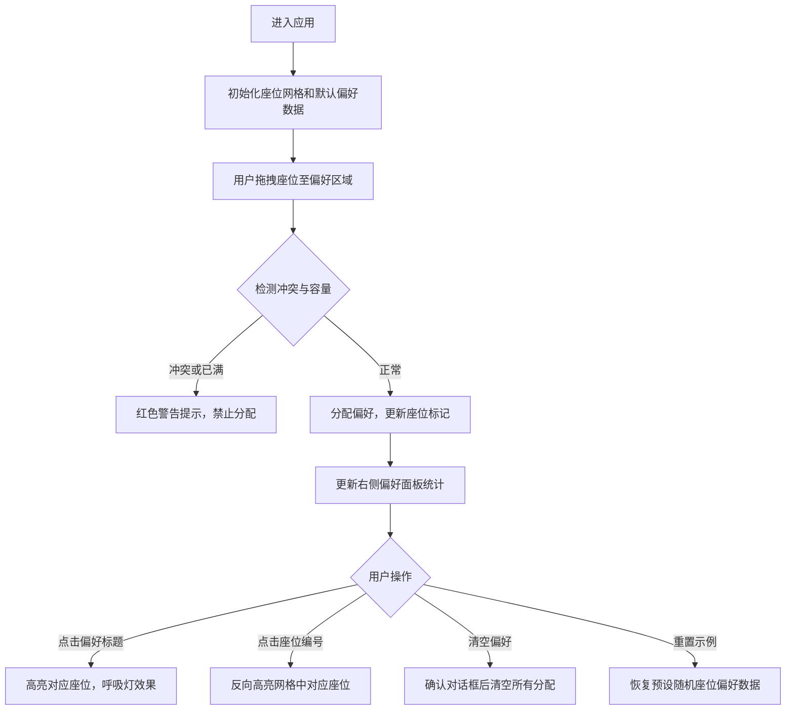

## 1. 产品概述
本产品是一个基于拖拽与可视化的活动座位与饮食偏好协同订制应用，旨在解决社区活动组织者难以统一收集参会者座位区和食物忌口偏好的痛点。通过直观的拖拽交互和可视化展示，组织者可以高效地分配座位偏好、检测冲突、达成共识。

## 2. 核心功能

### 2.1 功能模块
1. **主应用页面**：座位网格、偏好面板、统计与操作区

### 2.2 页面详情
| 页面名称 | 模块名称 | 功能描述 |
|-----------|-------------|---------------------|
| 主应用 | 座位网格 | 6×8 座位网格展示，支持拖拽座位到偏好区域，显示偏好圆点标记 |
| 主应用 | 偏好面板 | 右侧六个偏好区域卡片，显示已分配座位编号和容量统计 |
| 主应用 | 冲突预警 | 互斥偏好检测、容量超限提示、红色闪烁警告 |
| 主应用 | 高亮互查 | 点击偏好区域标题高亮对应座位，其他座位变暗 |
| 主应用 | 清空与重置 | 清空当前用户分配偏好、重置为默认示例数据 |

## 3. 核心流程

## 4. 用户界面设计

### 4.1 设计风格
- **主色调**：#1976d2（蓝色）
- **背景色**：#ffffff（白色），浅色主题
- **偏好颜色映射**：
  - 靠窗A：天蓝 #4fc3f7
  - 靠窗B：海蓝 #2196f3
  - 靠过道：橙 #ff9800
  - 需插座：紫 #9c27b0
  - 素食：绿 #4caf50
  - 坚果过敏：红 #f44336
- **座位样式**：40×40px 格子，间距 4px，深色边框 #2c3e50，浅灰底色 #f8f9fa
- **卡片样式**：圆角 12px，垂直堆叠布局
- **字体**：正文 14px，标题层级清晰
- **交互效果**：拖拽光标 grab，hover 上浮 2px 阴影，过渡动画 0.2s ease-out

### 4.2 页面设计概述
| 页面名称 | 模块名称 | UI 元素 |
|-----------|-------------|-------------|
| 主应用 | 座位网格 | 4:3 宽高比容器，6×8 网格，偏好圆点标记，拖拽半透明跟随，hover 阴影 |
| 主应用 | 偏好面板 | 六张圆角卡片，颜色色块标题，座位编号列表，容量统计（如 3/6） |
| 主应用 | 操作按钮 | 清空偏好、重置示例按钮，确认对话框 |

### 4.3 响应式设计
- **桌面端**：左右布局，左侧座位网格（最小 550px），右侧偏好面板
- **移动端（768px 以下）**：上下布局，座位网格宽度 100%，面板置于下方

### 4.4 动画与交互
- 拖拽时座位半透明跟随鼠标
- 目标区域高亮提示
- 冲突时红色闪烁警告（2 秒脉动动画）
- 偏好高亮：呼吸灯效果 0.5 秒周期，闪烁 3 次
- 重置时整体数据平滑过渡 0.3s
- hover 时座位上浮 2px 阴影
