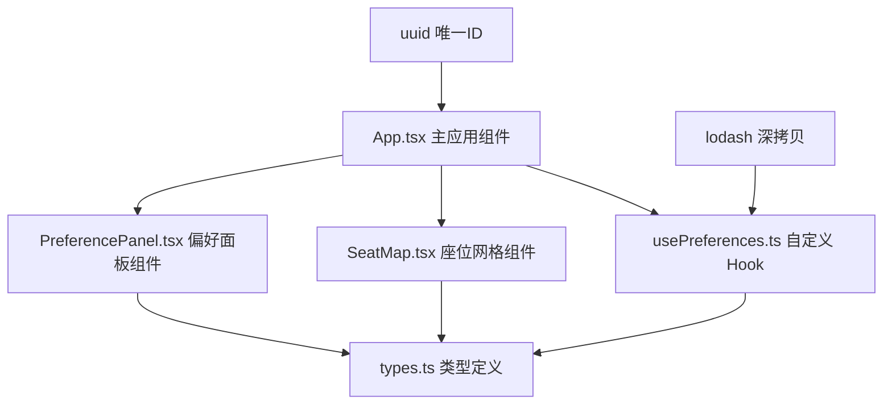
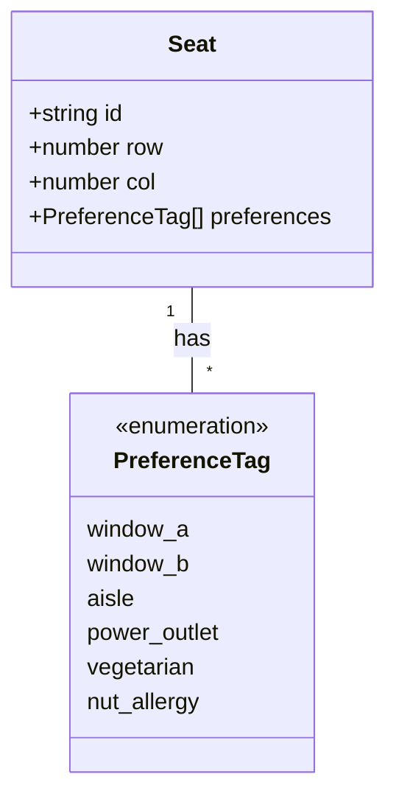

## 1. 架构设计

**数据流向说明：**
- `App.tsx` 作为顶层组件，初始化座位网格数据与偏好状态
- `usePreferences.ts` 维护核心状态 `Map<座位id, 偏好标签[]>`，提供增删改查操作
- `SeatMap.tsx` 从 `App.tsx` 接收座位列表，渲染可拖拽座位，座位被拖拽后触发回调更新偏好
- `PreferencePanel.tsx` 从 `App.tsx` 接收偏好映射，展示总览并支持反向高亮

## 2. 技术说明
- **前端框架**：React@18 + TypeScript + Vite
- **状态管理**：React 自定义 Hook (usePreferences) + useState
- **工具库**：uuid（生成唯一ID）、lodash（深拷贝确保不可变状态）
- **构建工具**：Vite，devServer 端口 3000
- **样式方案**：原生 CSS + CSS Modules（内联样式处理动态颜色与动画）

## 3. 文件结构与职责

| 文件路径 | 职责 | 调用关系 |
|----------|------|----------|
| `package.json` | 项目依赖与脚本配置 | 入口配置 |
| `vite.config.js` | Vite 构建配置，支持 React 和 TypeScript | 构建层 |
| `tsconfig.json` | TypeScript 编译配置（严格模式，ES2020，DOM） | 类型层 |
| `index.html` | 应用入口页面，挂载点 | 入口 HTML |
| `src/types.ts` | TypeScript 类型定义（Seat 接口、PreferenceTag 联合类型） | 被所有组件引用 |
| `src/hooks/usePreferences.ts` | 核心自定义 Hook，维护座位-偏好映射，提供增删清空操作 | 被 App.tsx 调用 |
| `src/components/SeatMap.tsx` | 座位网格渲染，拖拽交互，偏好圆点显示 | 被 App.tsx 调用，调用 types.ts |
| `src/components/PreferencePanel.tsx` | 偏好面板展示，容量统计，高亮互查 | 被 App.tsx 调用，调用 types.ts |
| `src/App.tsx` | 主应用组件，初始化数据，协调状态流转 | 调用所有子组件与 Hook |

## 4. 数据模型

### 4.1 核心类型定义

### 4.2 偏好颜色与容量映射
| 偏好标签 | 中文名称 | 颜色代码 | 最大容量 |
|----------|----------|----------|----------|
| window_a | 靠窗A | #4fc3f7 | 6 |
| window_b | 靠窗B | #2196f3 | 6 |
| aisle | 靠过道 | #ff9800 | 6 |
| power_outlet | 需插座 | #9c27b0 | 6 |
| vegetarian | 素食 | #4caf50 | 6 |
| nut_allergy | 坚果过敏 | #f44336 | 6 |

### 4.3 互斥偏好规则
- `window_a` 与 `window_b` 互斥（一个座位不能同时靠窗A和靠窗B）

## 5. 性能优化策略

1. **拖拽性能**：使用 HTML5 原生 Drag & Drop API，结合 CSS transform 实现半透明跟随，确保帧率 ≥45fps
2. **状态更新**：使用 lodash 深拷贝 + Map 数据结构，偏好映射更新响应时间 ≤50ms
3. **动画优化**：使用 CSS 动画（@keyframes）实现呼吸灯、脉动等效果，避免 JS 动画导致的卡顿
4. **不可变状态**：所有状态更新通过深拷贝生成新对象，避免副作用导致的意外重渲染
