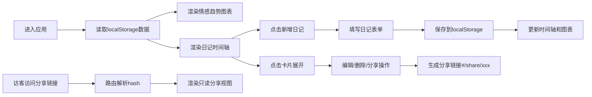

## 1. 产品概述

心情时间轴是一款帮助用户在浏览器中创建并分享个人心情日记的时间轴可视化应用，解决传统日记写作形式单调、缺乏情感趋势分析以及难以与他人互动的问题。

- 核心价值：以可视化时间轴呈现日记，结合情感趋势分析，让用户直观了解自己的情绪变化
- 目标用户：希望记录日常心情、追踪情绪变化、与朋友分享心情的普通用户

## 2. 核心功能

### 2.1 用户角色
| 角色 | 注册方式 | 核心权限 |
|------|----------|----------|
| 普通用户 | 无需注册（本地存储） | 撰写/编辑/删除日记、查看情感趋势、生成分享链接 |
| 分享访客 | 无需注册 | 通过分享链接查看单篇日记的只读视图 |

### 2.2 功能模块
1. **首页（主视图）**：情感趋势图表、日记时间轴、年份/月份筛选、新增日记
2. **分享视图**：只读模式展示单篇日记、返回主页面按钮

### 2.3 页面详情
| 页面名称 | 模块名称 | 功能描述 |
|----------|----------|----------|
| 首页 | 情感趋势图表 | Canvas 绘制近30天心情折线图，X轴日期/Y轴分值，动态增长动画，悬停tooltip，显示平均分和总日记数 |
| 首页 | 日记时间轴 | 卡片形式按日期倒序展示，心情颜色泡泡，点击展开/收起，入场滑入动画，平滑过渡 |
| 首页 | 筛选与新增 | 按年份和月份筛选，新建日记表单（标题、正文、心情图标、天气、星级满意度） |
| 分享视图 | 只读展示 | 隐藏编辑删除功能，只展示卡片内容和心情图标，返回主页按钮 |

## 3. 核心流程

用户首次进入应用 → 查看空状态引导 → 点击新增日记 → 填写标题/正文/选择心情/天气/星级 → 保存 → 时间轴卡片从底部滑入 → 情感图表自动更新 → 点击卡片展开查看详情 → 编辑/删除/生成分享链接 → 访客通过分享链接查看只读视图

## 4. 用户界面设计

### 4.1 设计风格
- 主色调：浅灰蓝背景（#f0f4f8），白色卡片，深灰文字（#2d3748）
- 心情配色：快乐-暖黄色、悲伤-深蓝色、愤怒-红色、平静-薄荷绿
- 按钮样式：悬停背景浅蓝（#e2e8f0）+ 放大1.05倍（0.15s过渡）
- 字体：系统默认无衬线字体
- 布局风格：桌面端左右两栏（左图表30%高度 + 右时间轴可滚动），移动端单列堆叠
- 图标风格：Emoji字符显示心情图标

### 4.2 页面设计概述
| 页面名称 | 模块名称 | UI元素 |
|----------|----------|--------|
| 首页 | 趋势图表区 | Canvas画布、统计数据卡片、折线渐变色、tooltip跟随鼠标、2秒增长动画 |
| 首页 | 时间轴区 | 纵向时间轴线、彩色心情泡泡、日记卡片、滑入动画（0.3s ease-out）、展开过渡（0.2s）、操作按钮组 |
| 分享视图 | 日记卡片 | 单卡片居中布局、心情图标突出、隐藏操作按钮、返回主页按钮 |

### 4.3 响应式设计
- 桌面优先（>768px）：左右两栏布局，左栏图表区占整页高度30%，右栏时间轴可滚动
- 移动端（≤768px）：单列堆叠布局，图表在上、时间轴在下，均可独立滚动

## 5. 性能指标
- 渲染50条日记首次加载时间 ≤ 2秒
- 情感趋势图表帧率 ≥ 30fps
- 本地存储读写操作异步处理，不阻塞UI
