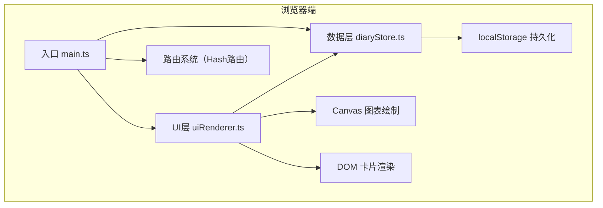

## 1. 架构设计



## 2. 技术栈说明
- 前端框架：无框架（原生 TypeScript + DOM 操作）
- 构建工具：Vite 5.x
- 语言：TypeScript 5.x（严格模式，target ES2020）
- 图表渲染：原生 Canvas 2D API
- 数据存储：浏览器 localStorage
- 路由方案：URL Hash 路由（#/ 与 #/share/:id）

## 3. 文件结构与路由定义

### 3.1 项目文件结构
```
/
├── package.json
├── vite.config.js
├── tsconfig.json
├── index.html
└── src/
    ├── main.ts          # 应用入口，路由初始化
    ├── diaryStore.ts    # 数据层，localStorage封装
    ├── uiRenderer.ts    # UI渲染层（时间轴/图表/分享视图）
    └── style.css        # 全局样式
```

### 3.2 路由定义
| 路由路径 | 用途 | 渲染函数 |
|----------|------|----------|
| `#/` 或空hash | 首页：情感图表 + 日记时间轴 | `renderTimeline()` + `renderChart()` |
| `#/share/:hash` | 分享只读视图 | `renderShareView(hash)` |

## 4. 数据模型

### 4.1 数据类型定义
```typescript
interface Diary {
  id: string;           // 唯一ID（时间戳+随机数）
  date: string;         // ISO日期字符串 YYYY-MM-DD
  title: string;        // 日记标题
  content: string;      // 日记正文
  mood: MoodType;       // 心情类型
  weather: string;      // 天气标签（Emoji）
  stars: 1 | 2 | 3 | 4 | 5; // 星级满意度
  shareHash?: string;   // 分享链接哈希（可选）
}

type MoodType = 'happy' | 'sad' | 'angry' | 'calm';

interface MoodTrendPoint {
  date: string;
  stars: number;
  mood: MoodType;
}
```

### 4.2 心情颜色映射
| 心情 | 类型值 | 颜色 | 图标 |
|------|--------|------|------|
| 快乐 | happy | #FFD93D（暖黄） | 😊 |
| 悲伤 | sad | #4A6FA5（深蓝） | 😢 |
| 愤怒 | angry | #E74C3C（红色） | 😠 |
| 平静 | calm | #6BCB77（薄荷绿） | 😌 |

## 5. 核心模块设计

### 5.1 diaryStore.ts（数据层）
| 方法 | 签名 | 说明 |
|------|------|------|
| `addDiary` | `(diary: Omit<Diary, 'id'>) => Diary` | 新增日记，自动生成ID，持久化到localStorage |
| `updateDiary` | `(id: string, patch: Partial<Diary>) => Diary \| null` | 更新指定日记 |
| `deleteDiary` | `(id: string) => boolean` | 删除指定日记 |
| `getDiaries` | `(year?: number, month?: number) => Diary[]` | 获取日记列表，可按年月筛选，按日期倒序 |
| `getDiaryById` | `(id: string) => Diary \| undefined` | 根据ID获取单篇日记 |
| `getDiaryByHash` | `(hash: string) => Diary \| undefined` | 根据分享哈希获取日记 |
| `generateShareHash` | `(id: string) => string` | 为日记生成唯一分享哈希 |
| `getMoodTrends` | `(days: number = 30) => MoodTrendPoint[]` | 获取近N天的心情趋势数据，用于图表 |

### 5.2 uiRenderer.ts（UI渲染层）
| 函数 | 签名 | 说明 |
|------|------|------|
| `renderTimeline` | `(container: HTMLElement, diaries: Diary[]) => void` | 渲染日记时间轴卡片列表 |
| `renderChart` | `(canvas: HTMLCanvasElement, trends: MoodTrendPoint[]) => void` | Canvas绘制情感趋势折线图（含动画、tooltip） |
| `renderShareView` | `(container: HTMLElement, diary: Diary) => void` | 渲染分享页只读视图 |
| `renderDiaryForm` | `(container: HTMLElement, onSubmit: (data: DiaryFormData) => void, initialData?: Diary) => void` | 渲染新增/编辑日记表单 |

### 5.3 main.ts（应用入口）
- 监听 `hashchange` 事件实现路由切换
- 初始化时读取 localStorage 数据
- 根据路由渲染对应视图
- 绑定卡片点击、编辑、删除、分享等交互事件

## 6. 性能优化策略
- Canvas 图表使用 requestAnimationFrame 实现动画，确保 ≥30fps
- 时间轴卡片使用 CSS transform 实现入场动画，避免重排
- localStorage 读写操作在空闲时执行，不阻塞主线程
- 年份/月份筛选使用缓存数组，避免重复过滤计算
- 图表 tooltip 采用节流更新，减少重绘次数
