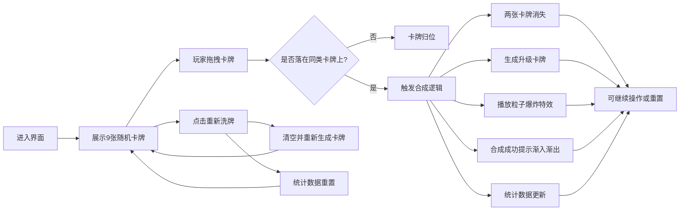

## 1. 产品概述
Roguelike卡牌游戏的动态卡牌合成与升级界面，玩家可通过拖拽相同卡牌融合升级，实时预览属性变化，提升策略深度与操作沉浸感。
- 目标用户：Roguelike卡牌游戏玩家
- 核心价值：战斗间隙的策略性卡牌管理，流畅的拖拽合成交互体验

## 2. 核心功能

### 2.1 功能模块
1. **卡牌展示区**：3×3网格展示9张随机卡牌，支持拖拽交互
2. **卡牌合成系统**：相同名称与等级卡牌拖拽重叠触发合成升级
3. **粒子特效系统**：合成成功时播放爆炸粒子动画
4. **数据统计面板**：实时显示卡牌总数、最高等级、合成次数
5. **重置刷新功能**：重新洗牌按钮，清空并重生成卡牌与统计数据

### 2.2 页面详情
| 页面名称 | 模块名称 | 功能描述 |
|---------|---------|---------|
| 主界面 | 卡牌展示区 | Canvas渲染3×3卡牌网格，支持鼠标拖拽、半透明跟随效果 |
| 主界面 | 合成引擎 | 检测卡牌重叠，生成升级卡牌，属性1.5倍随机浮动 |
| 主界面 | 粒子特效层 | 合成成功时100个随机方向粒子扩散，持续0.6秒 |
| 主界面 | 数据统计面板 | 毛玻璃效果面板，实时更新统计数据，金色数字突出 |
| 主界面 | 重置按钮 | 左上角"重新洗牌"按钮，按下缩放反馈动画 |

## 3. 核心流程
玩家进入界面 → 浏览9张随机卡牌 → 拖拽一张卡牌 → 卡牌半透明跟随鼠标移动 → 若落在同类卡牌上 → 触发合成：两张消失，生成升级卡牌，播放粒子特效，提示"合成成功！+1"渐入渐出，统计数据更新 → 可重复操作或点击重新洗牌重置

## 4. 用户界面设计

### 4.1 设计风格
- **主题色调**：深色宇宙主题，背景 `#0b0b1a`，蓝色与金色点缀
- **稀有度配色**：
  - 普通：白色边框，无外发光
  - 稀有：蓝色 `#4488ff` 边框与阴影
  - 史诗：紫色 `#aa44ff` 边框与阴影
- **按钮样式**：圆角设计，悬停变亮，点击脉冲缩放（scale:0.95，0.1秒）
- **字体**：卡牌名称使用等宽字体，14px浅灰色；统计数据亮金色突出
- **布局风格**：三栏布局，左控制面板（20%）、Canvas卡牌区（70%）、右统计面板（10%）
- **特效风格**：粒子大小2-6px随机，半透明颜色，ease-out缓动扩散

### 4.2 页面设计概览
| 页面名称 | 模块名称 | UI元素 |
|---------|---------|--------|
| 主界面 | 重置按钮区 | 左上角，"重新洗牌"文字按钮，缩放反馈动画 |
| 主界面 | Canvas卡牌区 | 中央70%宽度，3×3网格，卡牌128×180px圆角12px，间距12px |
| 主界面 | 合成提示 | 左下角，"合成成功！+1"文字渐入渐出动画 |
| 主界面 | 统计面板 | 右侧固定，毛玻璃backdrop-filter:blur(5px)，白色字体，金色数据 |

### 4.3 响应式
- 桌面端优先，浏览器缩放时卡牌网格自适应居中，卡牌尺寸保持不变
- 卡牌网格使用flex居中布局，确保窗口变化时卡牌位置合理

### 4.4 性能约束
- 交互帧率不低于45fps
- 拖拽与合成动画响应时间≤16ms
- 粒子特效同时存在上限200个，超出自动丢弃
