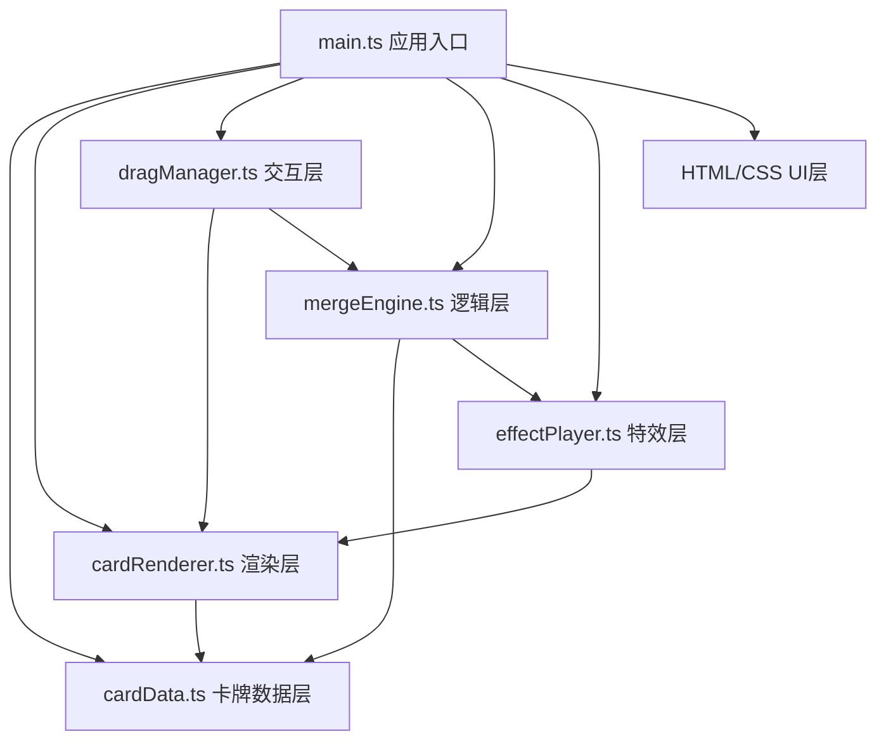

## 1. 架构设计



**数据流向说明：**
- `cardData.ts` → 被 `cardRenderer.ts` 读取，被 `mergeEngine.ts` 修改
- `dragManager.ts` → 调用 `cardRenderer.ts` 更新画布，调用 `mergeEngine.ts` 触发合成
- `mergeEngine.ts` → 修改卡牌数据，调用 `effectPlayer.ts` 生成粒子数据
- `effectPlayer.ts` → 粒子数据传递给 `cardRenderer.ts` 绘制
- `main.ts` → 初始化各模块，协调数据流和事件绑定

## 2. 技术选型
- **构建工具**：Vite (devServer端口: 3000)
- **编程语言**：TypeScript (strict模式, target: ES2020)
- **渲染技术**：HTML5 Canvas 2D API
- **UI技术**：原生HTML/CSS
- **无后端依赖**：纯前端应用，所有数据内存存储

## 3. 项目文件结构
```
auto44/
├── package.json
├── vite.config.js
├── tsconfig.json
├── index.html
├── src/
│   ├── main.ts              # 应用入口，初始化与事件绑定
│   ├── cardData.ts          # 卡牌数据结构与预设卡牌库
│   ├── cardRenderer.ts      # Canvas卡牌渲染
│   ├── dragManager.ts       # 鼠标拖拽交互管理
│   ├── mergeEngine.ts       # 合成逻辑引擎
│   └── effectPlayer.ts      # 粒子特效播放器
└── .trae/documents/
    ├── PRD.md
    └── TechArch.md
```

## 4. 数据模型

### 4.1 数据结构定义

```typescript
// 卡牌稀有度
type Rarity = 'common' | 'rare' | 'epic';

// 卡牌数据结构
interface Card {
  id: string;          // 唯一标识
  name: string;        // 卡牌名称
  level: number;       // 等级 (1-3)
  rarity: Rarity;      // 稀有度
  attack: number;      // 攻击力
  defense: number;     // 防御力
  gridX: number;       // 网格X坐标 (0-2)
  gridY: number;       // 网格Y坐标 (0-2)
  color: string;       // 卡牌主题色
}

// 粒子数据
interface Particle {
  x: number;           // 起始X
  y: number;           // 起始Y
  vx: number;          // X方向速度
  vy: number;          // Y方向速度
  size: number;        // 粒子大小
  color: string;       // 粒子颜色
  alpha: number;       // 透明度
  life: number;        // 剩余生命周期
  maxLife: number;     // 最大生命周期
}

// 拖拽状态
interface DragState {
  isDragging: boolean;
  cardIndex: number | null;
  offsetX: number;
  offsetY: number;
  mouseX: number;
  mouseY: number;
}

// 游戏统计
interface GameStats {
  totalCards: number;
  maxLevel: number;
  mergeCount: number;
}
```

### 4.2 模块间调用关系
| 模块 | 输入 | 输出 | 依赖 |
|-----|------|------|------|
| cardData.ts | - | Card[], 升级规则映射 | - |
| cardRenderer.ts | CanvasRenderingContext2D, Card[], Particle[], DragState | 绘制到Canvas | cardData.ts |
| dragManager.ts | HTMLElement, Card[], DragState | 合成触发事件, DragState更新 | cardRenderer.ts, mergeEngine.ts |
| mergeEngine.ts | Card, Card | 升级后的Card, Particle[] | cardData.ts, effectPlayer.ts |
| effectPlayer.ts | 坐标x,y, 颜色color | Particle[] | - |
| main.ts | - | 模块初始化与协调 | 全部模块 |

## 5. 核心算法

### 5.1 合成检测算法
- 拖拽结束时，计算鼠标坐标与每张卡牌中心点的距离
- 若距离 < 卡牌宽度的60%，且卡牌名称与等级相同 → 触发合成

### 5.2 属性升级算法
- 新攻击力 = 圆(原攻击力 × 1.5 × (0.95 + Math.random() × 0.1))
- 新防御力 = 圆(原防御力 × 1.5 × (0.95 + Math.random() × 0.1))
- 等级 +1，稀有度随等级提升

### 5.3 粒子运动算法
- 位置更新：x += vx × easeOut(t), y += vy × easeOut(t)
- 缓动函数：easeOut(t) = 1 - (1-t)³
- 透明度：alpha = life / maxLife
- 生命周期 0.6秒，60fps约36帧

## 6. 性能优化策略
1. **Canvas脏矩形渲染**：仅重绘变化区域（卡牌移动区域、粒子区域）
2. **粒子池上限**：最多200个粒子同时存在，超出丢弃新粒子
3. **requestAnimationFrame**：统一使用RAF驱动渲染循环
4. **事件节流**：mousemove事件内不做复杂计算，仅更新坐标
5. **内存管理**：粒子生命周期结束立即从数组移除，避免GC压力
