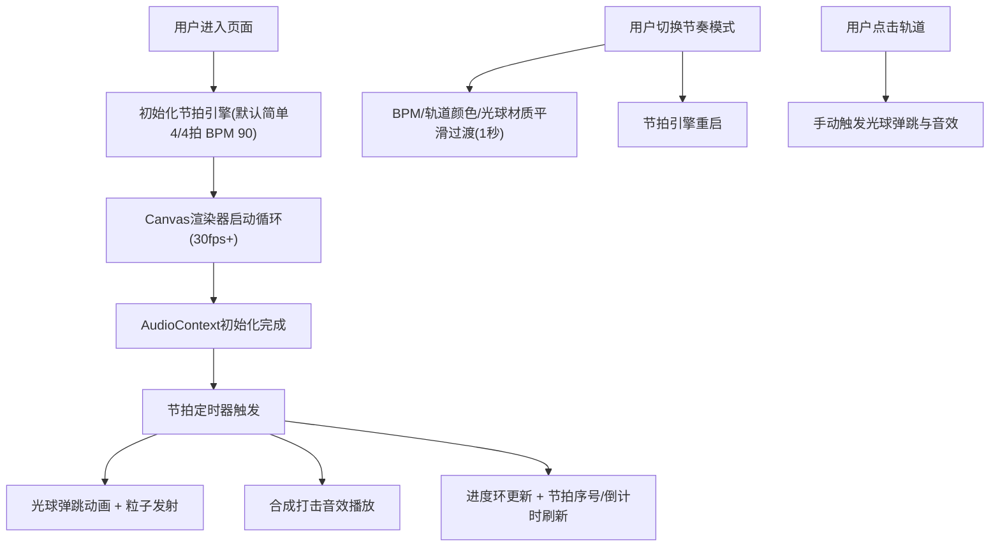

## 1. 产品概述

街舞初学者节奏训练可视化工具，通过圆形轨道上彩色光球的弹跳动画与实时音效合成，帮助用户直观感受和练习嘻哈鼓点节奏。

- **目标用户**：街舞初学者、节奏训练爱好者
- **核心价值**：将抽象的节拍转化为可视化的运动轨迹，降低节奏感学习门槛

## 2. 核心功能

### 2.1 功能模块
1. **主画布区域**：圆形轨道、4个彩色光球、拖尾粒子、环形进度条
2. **左侧控制面板**：节奏模式切换（简单4/4拍、切分节奏、16分音符加速）
3. **右侧信息面板**：实时节拍序号、下一拍毫秒倒计时
4. **交互系统**：点击轨道手动触发光球弹跳与音效

### 2.2 页面详情
| 页面名称 | 模块名称 | 功能描述 |
|-----------|-------------|---------------------|
| 主页面 | 圆形轨道 | 直径占屏幕60%，支持手动点击触发 |
| 主页面 | 彩色光球 | 红/黄/蓝/绿四色，每拍对应弹起40px放大动画 |
| 主页面 | 拖尾粒子 | 20个粒子，0.5秒消散效果 |
| 主页面 | 环形进度条 | 扇形填充显示当前节拍进度 |
| 主页面 | 节奏控制面板 | 三种预设模式切换，毛玻璃卡片样式 |
| 主页面 | 信息显示 | 当前节拍序号，下一拍倒计时（毫秒级） |

## 3. 核心流程

## 4. 用户界面设计

### 4.1 设计风格
- **主色调**：深色背景 `#121212`，霓虹渐变高亮 `#FF6B6B` → `#4ECDC4`
- **光球颜色**：红 `#FF6B6B`、黄 `#FFE66D`、蓝 `#4ECDC4`、绿 `#95E1D3`
- **面板样式**：毛玻璃效果（`backdrop-filter: blur(12px)`），圆角16px，半透明背景
- **动效**：弹性缓动（cubic-bezier(0.68, -0.55, 0.265, 1.55)），切换过渡1秒

### 4.2 页面设计概览
| 页面名称 | 模块名称 | UI元素 |
|-----------|-------------|-------------|
| 主页面 | 布局 | 三栏式：左控制面板(250px) + 中Canvas(自适应) + 右信息区(200px) |
| 主页面 | 控制面板 | 垂直排列的3个模式按钮，当前选中状态有霓虹发光效果 |
| 主页面 | 信息区 | 大号节拍序号，毫秒级倒计时数字，环形进度环 |
| 主页面 | Canvas | 居中圆形轨道，光球沿轨道均匀分布 |

### 4.3 响应式设计
- **桌面端（>768px）**：三栏布局，轨道直径为屏幕60%
- **移动端（≤768px）**：控制面板变为底部横向滑动条，轨道直径为屏幕宽度80%，信息区整合到顶部
