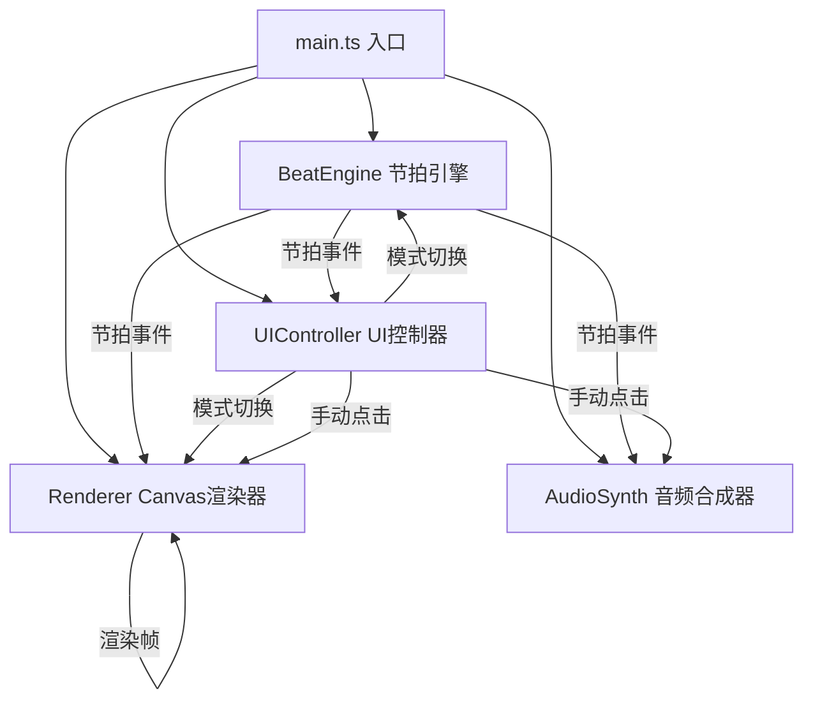

## 1. 架构设计



## 2. 技术说明

- **构建工具**：Vite@5 + TypeScript@5
- **渲染技术**：HTML5 Canvas 2D API，requestAnimationFrame驱动
- **音频技术**：Web Audio API (AudioContext) 实时合成打击乐
- **样式方案**：原生CSS + 内联样式，backdrop-filter实现毛玻璃
- **状态管理**：TypeScript类封装，事件回调机制

## 3. 文件结构

| 文件路径 | 职责说明 |
|---------|---------|
| `package.json` | 依赖管理、启动脚本 |
| `vite.config.js` | Vite配置（TypeScript支持、端口3000） |
| `tsconfig.json` | TS严格模式、ES2020目标、DOM类型 |
| `index.html` | 入口HTML骨架 |
| `src/main.ts` | 入口脚本，初始化各模块并绑定事件 |
| `src/beatEngine.ts` | 节拍逻辑：高精度定时器、BPM计算、节拍状态通知 |
| `src/renderer.ts` | Canvas渲染：轨道、光球、粒子、进度环绘制与动画 |
| `src/audioSynth.ts` | AudioContext合成短促打击音效 |
| `src/uiController.ts` | 控制面板UI、模式切换、响应式布局、事件监听 |

## 4. 核心数据模型

### 4.1 节奏模式定义
```typescript
type RhythmPattern = {
  name: string;
  bpm: number;
  subdivision: 1 | 2 | 4;  // 每拍细分：1=四分音符、2=八分、4=十六分
  trackColor: string;
  glowIntensity: number;
};
```

### 4.2 光球状态
```typescript
type OrbState = {
  index: number;
  color: string;
  angle: number;      // 轨道上的角度位置
  bounceProgress: number; // 0-1 弹跳进度
  scale: number;
};
```

### 4.3 粒子状态
```typescript
type Particle = {
  x: number;
  y: number;
  vx: number;
  vy: number;
  life: number;       // 剩余寿命 0-1
  maxLife: number;    // 总寿命(ms)
  color: string;
  size: number;
};
```

## 5. 关键实现策略

### 5.1 高精度节拍定时
- 使用 `performance.now()` 计算时间偏差
- `setTimeout` 动态调整下一次触发间隔，补偿漂移
- 节拍事件携带：当前拍序号、小节号、时间戳

### 5.2 Canvas渲染优化
- 单Canvas分层绘制（轨道→进度环→粒子→光球）
- requestAnimationFrame主循环，插值计算动画帧
- 粒子对象池复用，避免频繁GC

### 5.3 音频合成
- Kick: 低频正弦波 + 快速包络衰减
- Snare: 白噪声 + 带通滤波 + 包络
- Hi-hat: 高通噪声 + 极短包络
- 每拍对应不同音色，避免单调

### 5.4 响应式适配
- window.resize 监听动态调整Canvas尺寸
- CSS媒体查询切换布局模式
- 触摸事件兼容移动端点击
