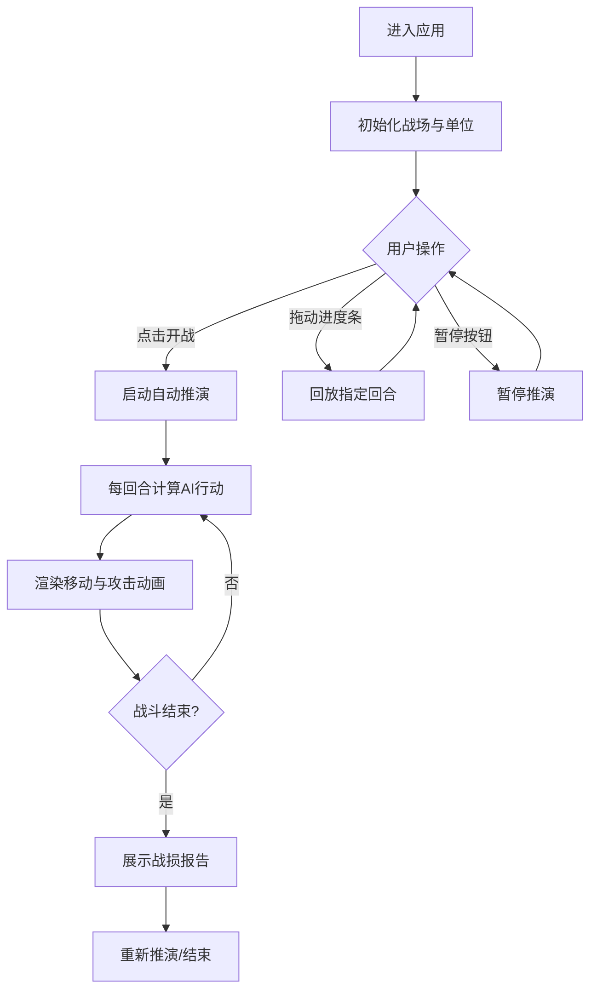

## 1. 产品概述

古代战争实时策略推演应用是一款面向历史爱好者和游戏设计师的浏览器端工具，通过可视化的六边形网格战场和回合制自动推演系统，让用户直观预览不同兵种配置下的战场动态走向。

- 核心价值：将抽象的战术思考转化为可观测、可回放的动态战场演示
- 目标用户：历史军事爱好者、策略游戏设计师、战棋推演玩家

## 2. 核心功能

### 2.1 用户角色

| 角色 | 注册方式 | 核心权限 |
|------|----------|----------|
| 普通用户 | 无需注册，直接访问 | 配置兵种、启动推演、回放查看、导出战报 |

### 2.2 功能模块

1. **战场地图模块**：20x15六边形网格渲染、坐标转换、单位位置显示
2. **兵种配置模块**：四种兵种（步兵、弓兵、骑兵、将领）的属性定义与部署
3. **战斗推演引擎**：回合制AI决策、寻路算法、伤害计算、状态更新
4. **渲染与特效模块**：Canvas绘制、粒子爆炸、拖尾动画、旗帜飘动
5. **推演控制模块**：开战/暂停/继续、进度条回放、战损报告

### 2.3 页面详情

| 页面名称 | 模块名称 | 功能描述 |
|----------|----------|----------|
| 主推演页面 | 顶部信息栏 | 回合计数器（金色大号字体）、双方兵力条（动态生命值） |
| 主推演页面 | 中央战场区 | 20x15六边形网格、红蓝双方单位、移动路径轨迹 |
| 主推演页面 | 底部控制栏 | 开战/暂停按钮、回放进度条、战损报告面板 |
| 主推演页面 | 侧边装饰 | 棕色旗帜CSS动画、羊皮纸纹理背景 |

## 3. 核心流程

用户进入应用后，系统自动初始化红蓝双方默认兵种配置并展示在战场两侧。用户点击"开战"按钮启动自动推演，系统按回合制执行AI决策（优先攻击残血→最近敌人）并实时渲染战斗过程。用户可随时暂停推演或拖动进度条回放历史回合（回放显示半透明移动轨迹）。推演结束后展示战损报告（存活数、总伤害、回合数）。

## 4. 用户界面设计

### 4.1 设计风格

- **主色调**：羊皮纸米色 #F5DEB3（背景）、深棕色 #4A2F1A（边框与文字）、金色 #FFD700（强调）
- **阵营色**：红方 #B22222、蓝方 #1E90FF
- **网格线**：浅灰色 #C0C0C0
- **按钮风格**：深棕色边框、羊皮纸底色、悬停金色高亮、圆角4px
- **字体**：标题使用衬线体（Georgia/"Times New Roman"），正文使用系统无衬线体
- **图标**：单位使用emoji符号（🏹弓兵、🐎骑兵、🗡️步兵、👑将领）
- **整体氛围**：古代军事地图风格，羊皮纸质感，棕色边框装饰

### 4.2 页面设计概览

| 页面名称 | 模块名称 | UI元素 |
|----------|----------|--------|
| 主推演页面 | 回合计数器 | 金色大号字体，左上角位置，带发光效果 |
| 主推演页面 | 兵力条 | 红方在左、蓝方在右，渐变填充，数值实时更新 |
| 主推演页面 | 六边形网格 | 浅灰描边，羊皮纸底色，悬停高亮 |
| 主推演页面 | 单位标记 | 圆形彩色底+emoji图标，带阴影 |
| 主推演页面 | 控制按钮 | 深棕边框，历史风格图标，悬停动效 |
| 主推演页面 | 进度条 | 棕色轨道，金色滑块，带刻度 |
| 主推演页面 | 战损报告 | 半透明深棕面板，金色标题，居中弹出 |
| 主推演页面 | 旗帜装饰 | 四角棕色旗帜，CSS飘动动画 |

### 4.3 响应式设计

- **桌面端**（≥768px）：六边形网格，标准单位间距
- **移动端**（<768px）：自动切换为四边形网格，单位间距缩小30%，控制栏适配触屏尺寸
- 整体采用响应式布局，Canvas自适应容器尺寸

### 4.4 动效设计

- **旗帜飘动**：CSS `@keyframes` 实现正弦波动动画
- **单位移动**：残影拖尾效果，透明度递减，延后0.3秒
- **攻击命中**：目标格子红光闪烁0.2秒
- **单位阵亡**：Canvas粒子爆炸特效
- **回放轨迹**：半透明线条展示移动路径
- **按钮悬停**：金色光晕过渡效果
