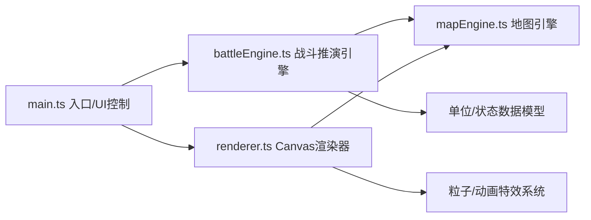
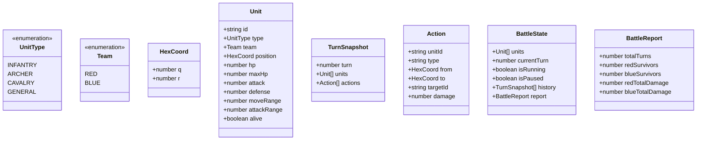

## 1. 架构设计

纯前端浏览器应用，采用TypeScript + Vite构建，基于Canvas进行高性能渲染。整体采用分层架构：UI控制层调用推演引擎，推演引擎操作数据模型，渲染器从引擎读取状态进行绘制。



## 2. 技术说明

- **前端框架**：原生TypeScript（无框架），直接操作DOM与Canvas API
- **构建工具**：Vite 5.x，devServer端口3000
- **类型系统**：TypeScript 5.x，严格模式，target ES2020
- **渲染方案**：HTML5 Canvas 2D API，`requestAnimationFrame`驱动渲染循环（目标≥30fps）
- **样式方案**：内联CSS + `<style>`标签，CSS变量管理主题色
- **后端**：无（纯前端应用，数据保存在内存）

## 3. 项目文件结构

| 文件路径 | 职责说明 |
|----------|----------|
| `package.json` | 项目依赖与脚本配置 |
| `vite.config.js` | Vite构建配置（TypeScript支持，端口3000） |
| `tsconfig.json` | TypeScript编译配置（严格模式，ES2020，DOM类型） |
| `index.html` | 入口页面（标题"古代战争推演"，内联样式与脚本引用） |
| `src/main.ts` | 应用入口：初始化Canvas、事件绑定、协调各模块 |
| `src/mapEngine.ts` | 地图引擎：六边形/四边形网格生成、坐标转换、几何计算 |
| `src/battleEngine.ts` | 战斗引擎：单位管理、AI决策（寻路/攻击优先级）、回合状态、回放快照 |
| `src/renderer.ts` | 渲染器：网格、单位、特效、UI组件的Canvas绘制，动画帧循环 |

## 4. 核心数据模型

### 4.1 类型定义



### 4.2 兵种属性表

| 兵种 | 移动力 | 生命值 | 攻击力 | 防御力 | 射程 | 特殊能力 | 图标 |
|------|--------|--------|--------|--------|------|----------|------|
| 步兵 INFANTRY | 2 | 50 | 20 | 10 | 1 | 无 | 🗡️ |
| 弓兵 ARCHER | 2 | 30 | 15 | 5 | 3 | 远程攻击 | 🏹 |
| 骑兵 CAVALRY | 4 | 35 | 25 | 2 | 1 | 高机动 | 🐎 |
| 将领 GENERAL | 3 | 60 | 18 | 8 | 1 | 相邻友方攻击+20% | 👑 |

## 5. 核心算法

### 5.1 六边形坐标系统

采用轴向坐标系统（axial coordinates，q, r），提供以下转换方法：
- `hexToPixel(hex: HexCoord): {x, y}` — 六边形坐标转屏幕像素
- `pixelToHex(x, y): HexCoord` — 屏幕像素转六边形坐标
- `hexDistance(a, b): number` — 两个六边形之间的距离
- `hexNeighbors(hex): HexCoord[]` — 获取相邻6格

### 5.2 AI决策优先级

每回合每个存活单位按以下逻辑行动：
1. **寻找攻击目标**：在射程范围内的敌方单位
   - 优先级1：可击杀（攻击后HP≤0）
   - 优先级2：残血目标（HP百分比最低）
   - 优先级3：距离最近
2. **如无可攻击目标**：向最近敌方单位移动（贪心寻路，每步朝目标方向）
3. **将领光环**：计算攻击时检查相邻是否有己方将领，如有则攻击力×1.2

### 5.3 伤害计算公式

```
实际伤害 = max(1, 攻击力 × 将师光环加成 - 防御力)
```

### 5.4 回放系统

- 每回合开始前对所有单位状态打快照（TurnSnapshot）
- 拖动进度条时：按回合数加载对应快照，渲染历史位置
- 回放模式下渲染移动轨迹（半透明折线，连接该单位历史位置）

## 6. 性能约束

| 指标 | 目标值 | 实现策略 |
|------|--------|----------|
| 回合计算 | ≤50ms | O(n²)内完成，避免深拷贝，使用对象池 |
| Canvas帧率 | ≥30fps | 脏矩形渲染，只重绘变化区域，粒子数量上限 |
| 回放响应 | ≤100ms | 快照预存数组，O(1)索引访问 |
| 内存占用 | <100MB | 限制最大历史回合数（≤200），粒子自动回收 |

## 7. 响应式策略

- 通过`window.matchMedia('(max-width: 767px)')`检测视口
- 移动端模式：`isMobile = true`，网格切换为四边形（方格），单位尺寸×0.7
- Canvas容器使用`width: 100%; height: auto`自适应，内部坐标按比例缩放
- 触屏设备：按钮与进度条触控区域≥44px
