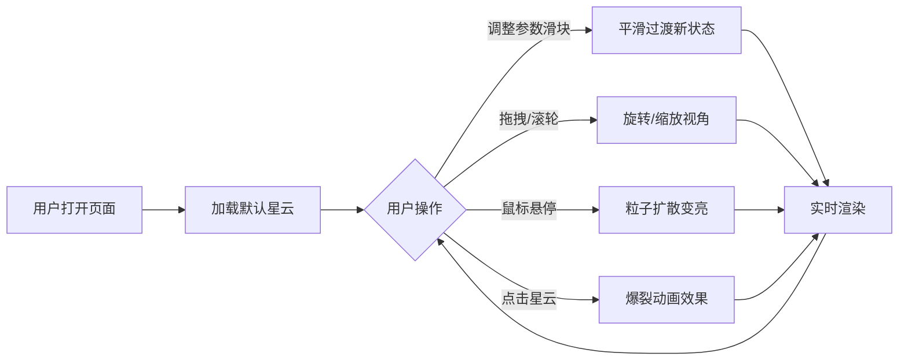

## 1. 产品概述

3D星云形态交互式生成器是一款基于Web的可视化创意工具，让用户在浏览器中通过实时调整粒子参数生成并观察不同颜色、形状和运动状态的星云效果。

- **核心目标**：提供沉浸式的3D星云生成体验，支持丰富的参数调节和鼠标交互
- **目标用户**：视觉设计师、创意工作者、3D可视化爱好者、教育演示场景
- **市场价值**：无需安装软件，在浏览器中即可体验专业级3D粒子效果，可用于背景生成、艺术创作、科普展示等场景

## 2. 核心功能

### 2.1 用户角色

| 角色 | 注册方式 | 核心权限 |
|------|----------|----------|
| 访客用户 | 无需注册 | 访问所有功能，调整参数，交互体验 |

### 2.2 功能模块

1. **3D星云渲染页面**：粒子系统渲染、相机控制、背景星空
2. **参数控制面板**：粒子数量、颜色、速度、半径调节
3. **鼠标交互系统**：视角控制、悬停高亮、点击爆裂效果
4. **性能监控面板**：实时FPS显示、粒子数量统计

### 2.3 页面详情

| 页面名称 | 模块名称 | 功能描述 |
|----------|----------|----------|
| 3D星云渲染页面 | 粒子星云系统 | 默认5000个粒子球状分布，中心暖色到边缘冷色渐变，Y轴缓慢自转 |
| 3D星云渲染页面 | 背景星空 | 500个固定白色微小星星，深空渐变背景 |
| 3D星云渲染页面 | 性能监控 | 左上角FPS和粒子数量实时显示 |
| 参数控制面板 | 粒子数量滑块 | 1000-10000范围，步长1000，默认5000 |
| 参数控制面板 | 颜色选择器 | 中心颜色和边缘颜色独立设置 |
| 参数控制面板 | 自转速度滑块 | 0-0.05 rad/s范围 |
| 参数控制面板 | 扩散半径滑块 | 10-25范围，默认15 |
| 鼠标交互系统 | 视角控制 | OrbitControls拖拽旋转、滚轮缩放 |
| 鼠标交互系统 | 悬停效果 | 悬停区域粒子扩散变亮，移开恢复 |
| 鼠标交互系统 | 点击爆裂 | 点击触发粒子飞散聚拢动画，带缓动曲线 |

## 3. 核心流程

用户打开页面 → 自动加载默认星云效果（5000粒子，暖色→冷色渐变）→ 用户通过右侧面板调整参数（实时预览平滑过渡）→ 用户鼠标拖拽旋转视角/滚轮缩放 → 鼠标悬停观察粒子高亮扩散效果 → 点击星云触发爆裂动画 → 循环交互创作。

## 4. 用户界面设计

### 4.1 设计风格

- **主色调**：深空蓝黑 #0d0d2b，星空渐变 #0a0a2e → #000000
- **强调色**：粒子中心暖色 RGB(255,200,100)，边缘冷色 RGB(50,100,200)
- **文字颜色**：控制标签 #c0c0ff，性能显示白色半透明
- **毛玻璃效果**：控制面板背景 rgba(255,255,255,0.1)，backdrop-filter: blur(10px)
- **圆角风格**：面板 12px，颜色选择器 4px
- **过渡动画**：所有交互 0.2秒渐变过渡
- **字体**：14px 无衬线字体，清晰易读

### 4.2 页面设计概览

| 页面名称 | 模块名称 | UI元素 |
|----------|----------|--------|
| 主页面 | Canvas容器 | 全屏3D渲染区域，深空渐变背景 |
| 主页面 | 右侧控制面板 | 280px宽，毛玻璃半透明，圆角12px，内边距20px |
| 主页面 | 滑块控件 | 轨道高度4px，thumb直径16px，颜色与中心色联动 |
| 主页面 | 颜色选择器 | 原生input[type="color"]，外框圆角4px |
| 主页面 | 性能显示 | 左上角叠加，14px白色半透明文字 |
| 主页面 | 响应式适配 | <768px时面板折叠至底部横向滑动 |

### 4.3 响应式设计

- **桌面端**（默认）：右侧垂直控制面板，宽度280px
- **移动端**（<768px）：面板折叠至底部，横向排列，可滑动浏览控件
- **触摸优化**：支持触摸拖拽旋转、双指缩放

### 4.4 3D场景指引

- **环境背景**：深空渐变从 #0a0a2e（深蓝）到 #000000（纯黑）
- **光照设置**：无额外光源，粒子使用自发光材质（PointsMaterial）
- **相机设置**：PerspectiveCamera，初始位置距离星云中心约40单位，启用OrbitControls
- **构图与焦点**：星云居中，四周环绕500个背景微小星星增加深度感
- **交互与动画**：Y轴自转、悬停高亮扩散、点击爆裂飞散聚拢
- **性能预算**：5000粒子时FPS≥30，10000粒子时FPS≥20
