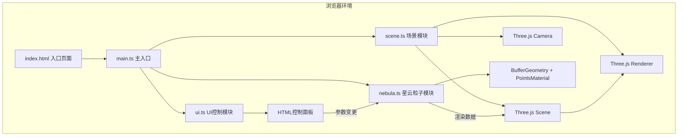

## 1. 架构设计



## 2. 技术描述

- **前端框架**：原生 TypeScript（无UI框架）
- **3D渲染引擎**：Three.js（three、@types/three）
- **构建工具**：Vite 5.x
- **开发语言**：TypeScript 5.x（strict模式，target ES2020）
- **CSS**：原生CSS（无CSS框架，使用自定义样式）

## 3. 项目文件结构

| 文件路径 | 职责说明 |
|----------|----------|
| `package.json` | 项目依赖（three、@types/three、typescript、vite）与启动脚本 |
| `vite.config.js` | Vite构建配置，devServer端口3000 |
| `tsconfig.json` | TypeScript配置，严格模式，ES2020，DOM类型 |
| `index.html` | 入口页面，全屏Canvas容器 + 界面容器 |
| `src/scene.ts` | Three.js场景、相机、渲染器初始化，窗口自适应，导出核心对象 |
| `src/nebula.ts` | 星云粒子系统创建、更新、销毁；粒子位置/颜色/大小/运动逻辑 |
| `src/ui.ts` | HTML控制面板生成与事件绑定；滑块、颜色选择器、按钮交互 |
| `src/main.ts` | 初始化场景和星云，启动动画循环，连接各模块 |

## 4. 核心模块接口定义

### 4.1 scene.ts 导出

```typescript
import * as THREE from 'three';
import { OrbitControls } from 'three/examples/jsm/controls/OrbitControls.js';

export const scene: THREE.Scene;
export const camera: THREE.PerspectiveCamera;
export const renderer: THREE.WebGLRenderer;
export const controls: OrbitControls;
export function initScene(container: HTMLElement): void;
export function handleResize(): void;
```

### 4.2 nebula.ts 导出

```typescript
import * as THREE from 'three';

export interface NebulaParams {
  particleCount: number;      // 粒子数量 1000-10000
  centerColor: string;        // 中心颜色 HEX
  edgeColor: string;          // 边缘颜色 HEX
  rotationSpeed: number;      // 自转速度 rad/s
  radius: number;             // 扩散半径 10-25
}

export function createNebula(scene: THREE.Scene, params: NebulaParams): void;
export function updateNebula(deltaTime: number, mouse: THREE.Vector2, camera: THREE.Camera): void;
export function updateNebulaParams(newParams: Partial<NebulaParams>): void;
export function explodeNebula(): void;
export function destroyNebula(scene: THREE.Scene): void;
export function getParticleCount(): number;
```

### 4.3 ui.ts 导出

```typescript
export interface UIControls {
  onParamsChange: (params: Partial<NebulaParams>) => void;
  onExplode: () => void;
}

export function initUI(controls: UIControls): void;
export function updateFPSDisplay(fps: number): void;
export function updateParticleCount(count: number): void;
```

## 5. 数据流向

```
用户输入 → UI滑块/颜色选择器 → ui.ts事件处理 
    → nebula.ts updateNebulaParams() 
    → BufferAttribute lerp插值更新 
    → 渲染循环每帧读取最新属性 
    → Three.js渲染输出
```

## 6. 关键实现策略

### 6.1 粒子系统性能优化

- 使用 `BufferGeometry` + `Float32BufferAttribute` 存储位置、颜色、大小数据
- 所有粒子共享单个 `PointsMaterial`，启用 `vertexColors: true` 支持独立颜色
- 粒子大小通过 `ShaderMaterial` 或 `PointsMaterial.sizeAttenuation` 实现
- 参数变更时使用 `lerp` 线性插值在0.3秒内平滑过渡

### 6.2 鼠标交互实现

- **悬停检测**：使用 `Raycaster` 每帧检测鼠标与星云包围球的交点
- **悬停效果**：计算粒子到鼠标交点的距离，距离<阈值时位置外推+颜色提亮
- **爆裂效果**：状态机管理（normal→exploding→imploding→normal），使用 easeOutQuad 缓动

### 6.3 动画循环

- 使用 `requestAnimationFrame` 驱动
- 每帧计算 `deltaTime` 确保运动速度与帧率无关
- 顺序：OrbitControls更新 → 星云参数插值 → 悬停/爆裂效果 → 渲染

### 6.4 响应式适配

- CSS `@media (max-width: 768px)` 媒体查询
- 桌面端：`position: fixed; right: 20px; top: 50%; transform: translateY(-50%)`
- 移动端：`position: fixed; bottom: 0; left: 0; right: 0; overflow-x: auto; white-space: nowrap`
