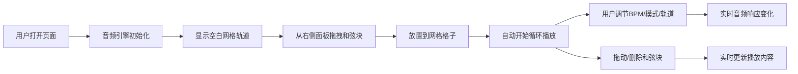

## 1. 产品概述

和弦循环音序器是一款面向音乐制作人的交互式创作工具，通过可视化的乐高式和弦块拖拽，让用户快速试听不同和弦进行组合，降低灵感捕捉门槛。解决传统DAW操作复杂、学习成本高的问题。

- 目标用户：音乐制作人、词曲作者、音乐爱好者
- 核心价值：快速试听和弦组合，捕捉创作灵感，降低音乐创作技术门槛

## 2. 核心功能

### 2.1 用户角色
| 角色 | 注册方式 | 核心权限 |
|------|---------|---------|
| 普通用户 | 无需注册 | 使用全部音序器功能 |

### 2.2 功能模块
1. **主界面**：网格轨道区、和弦块面板、控制面板、播放位置指示器
2. **网格轨道**：4行×8列可滚动网格，支持拖拽放置和弦块
3. **和弦块面板**：右侧和弦库，支持拖拽到网格
4. **音频引擎**：Web Audio API实时合成钢琴音色
5. **控制面板**：BPM调节、循环模式切换、轨道静音/独奏
6. **播放指示器**：实时高亮当前播放列、进度条滚动

### 2.3 页面详情
| 页面名称 | 模块名称 | 功能描述 |
|---------|---------|---------|
| 主界面 | 网格轨道区 | 4×8水平滚动网格，每个格子代表一拍，支持拖拽放置/移动/删除和弦块 |
| 主界面 | 和弦块面板 | 右侧展示可用和弦（C大七、Dm7、G7等），按颜色分类（C类橙色、D类蓝色、E类绿色） |
| 主界面 | 播放控制区 | 播放/暂停按钮、当前小节显示、播放进度条 |
| 主界面 | BPM控制 | 滑块+数字输入联动，范围60-180，步进5 |
| 主界面 | 循环模式 | 正向/反向/随机三种模式切换 |
| 主界面 | 轨道控制 | 4行轨道的静音/独奏按钮 |

## 3. 核心流程

用户从右侧面板拖拽和弦块到网格上 → 系统自动开始循环播放 → 用户调节BPM/循环模式/轨道控制实时听到变化 → 用户可拖动/删除网格上的和弦块 → 播放位置实时高亮显示

## 4. 用户界面设计

### 4.1 设计风格
- **主色调**：深色背景 #1a1a2e，霓虹蓝 #00d9ff，霓虹粉 #ff00ff
- **和弦颜色**：C类橙色 #ff6b35，D类蓝色 #4dabf7，E类绿色 #51cf66
- **视觉风格**：赛博朋克 - 像素风边框、扫描线纹理、柔和发光效果
- **圆角**：和弦块 8px 圆角，带轻微内阴影
- **字体**：等宽字体用于BPM数字，现代无衬线用于界面文字
- **动效**：拖拽半透明残影（300ms消失）、播放高亮脉冲动画、平滑进度滚动

### 4.2 页面设计概述
| 页面名称 | 模块名称 | UI元素 |
|---------|---------|---------|
| 主界面 | 网格轨道 | 4行×8列格子，发光边框线 #4a4a6a，当前列高亮霓虹蓝脉冲 |
| 主界面 | 和弦块 | 圆角8px、内阴影、悬停放大、拖拽时半透明残影 |
| 主界面 | BPM控制 | 霓虹发光滑块、数字输入框联动、范围60-180 |
| 主界面 | 控制按钮 | 像素风边框、悬停发光效果、激活状态高亮 |
| 主界面 | 进度条 | 平滑滚动、霓虹蓝发光 |

### 4.3 响应式
- Desktop-first 设计，最小宽度 768px
- 平板屏幕自适应缩放，网格水平滚动
- 触摸设备支持长按拖拽

### 4.4 性能要求
- 拖拽到播放延迟 ≤ 300ms
- 帧率 ≥ 30fps
- 音频合成无爆音或延迟
- 内存：缓存最近32个和弦配置
