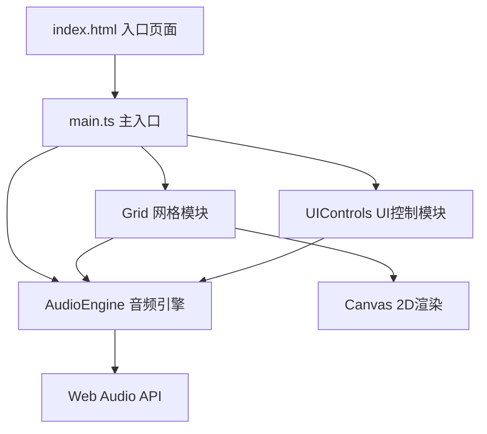

## 1. 架构设计



## 2. 技术描述

- **前端框架**：纯 TypeScript + Vite（无额外UI框架）
- **构建工具**：Vite 5.x
- **音频引擎**：原生 Web Audio API
- **渲染引擎**：Canvas 2D API
- **样式方案**：原生 CSS（CSS变量管理主题色）
- **开发端口**：3000

## 3. 文件结构

```
/
├── index.html              # 入口HTML，包含Canvas和UI容器
├── package.json            # 依赖：typescript、vite
├── vite.config.js          # Vite配置，devServer端口3000
├── tsconfig.json           # TS配置，严格模式，ES2020，DOM类型
└── src/
    ├── main.ts             # 入口：初始化Grid、AudioEngine、UIControls
    ├── grid.ts             # 网格轨道管理：绘制、拖拽、放置、删除
    ├── audioEngine.ts      # Web Audio API合成器：钢琴音色、BPM、循环模式
    └── uiControls.ts       # 控制面板：BPM滑块、循环模式、静音/独奏
```

## 4. 核心模块接口定义

### 4.1 类型定义
```typescript
// 和弦类型
interface Chord {
  name: string;        // 和弦名称，如 'Cmaj7'
  type: 'C' | 'D' | 'E' | 'F' | 'G' | 'A' | 'B';
  notes: number[];     // MIDI音符编号数组
  color: string;       // 显示颜色
}

// 和弦块在网格中的位置
interface ChordBlock {
  id: string;
  chord: Chord;
  row: number;         // 0-3 轨道行
  col: number;         // 0-7 列（拍）
}

// 循环模式
type LoopMode = 'forward' | 'reverse' | 'random';

// 轨道状态
interface TrackState {
  muted: boolean;
  solo: boolean;
}
```

### 4.2 AudioEngine 接口
```typescript
class AudioEngine {
  setBPM(bpm: number): void;
  setLoopMode(mode: LoopMode): void;
  setTrackState(row: number, state: Partial<TrackState>): void;
  playChord(chord: Chord, when: number, duration: number): void;
  start(): void;
  stop(): void;
  onBeat(callback: (col: number) => void): void;
}
```

### 4.3 Grid 接口
```typescript
class Grid {
  constructor(canvas: HTMLCanvasElement, audioEngine: AudioEngine);
  addBlock(chord: Chord, row: number, col: number): void;
  removeBlock(id: string): void;
  moveBlock(id: string, newRow: number, newCol: number): void;
  render(): void;
  setCurrentCol(col: number): void;
  getBlocks(): ChordBlock[];
}
```

### 4.4 UIControls 接口
```typescript
class UIControls {
  constructor(container: HTMLElement, audioEngine: AudioEngine, grid: Grid);
  onBPMChange(callback: (bpm: number) => void): void;
  onLoopModeChange(callback: (mode: LoopMode) => void): void;
  onTrackStateChange(callback: (row: number, state: Partial<TrackState>) => void): void;
}
```

## 5. 音频合成方案

### 5.1 钢琴音色合成
- 使用多个正弦/三角波振荡器叠加模拟钢琴泛音结构
- 包络：ADSR - Attack 5ms, Decay 200ms, Sustain 0.6, Release 300ms
- 低通滤波器模拟钢琴音色特性
- 和弦音符微调失谐增加温暖感

### 5.2 时序调度
- 使用 `AudioContext.currentTime` 预调度下一个节拍
- Lookahead 25ms 调度窗口，确保无延迟
- BPM变化即时影响下一拍调度
- 循环播放使用 requestAnimationFrame 同步UI

## 6. 性能优化

- **Canvas渲染**：仅在和弦变化或当前列变化时重绘
- **拖拽响应**：使用离屏Canvas绘制拖拽残影
- **内存管理**：和弦配置缓存最近32条，LRU淘汰
- **音频调度**：预调度 + 动态调度窗口，避免爆音
- **CSS动画**：优先使用 transform 和 opacity，触发GPU加速
