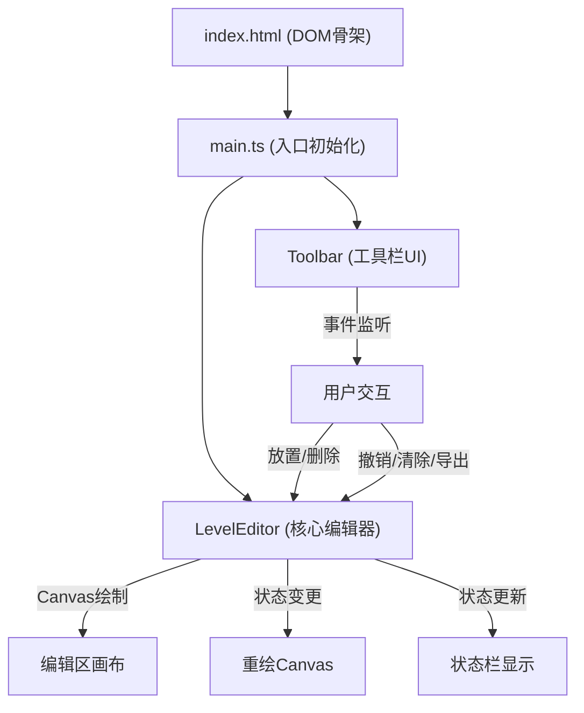

## 1. 架构设计



## 2. 技术描述

- **前端框架**：原生 TypeScript（无框架）
- **构建工具**：Vite 5.x
- **渲染技术**：HTML5 Canvas 2D API
- **UI层**：原生 HTML + CSS
- **语言版本**：ES2020，严格模式TypeScript

## 3. 文件结构

```
e:\solo\VersionFast\tasks\auto50\
├── .trae/documents/
│   ├── prd.md                    # 产品需求文档
│   └── architecture.md           # 技术架构文档
├── src/
│   ├── main.ts                   # 入口文件，初始化编辑器和UI
│   ├── levelEditor.ts            # 核心编辑器类
│   ├── toolbar.ts                # 工具栏模块
│   └── styles/
│       └── main.css              # 样式文件
├── index.html                    # HTML入口
├── vite.config.js                # Vite配置
├── tsconfig.json                 # TypeScript配置
└── package.json                  # 项目依赖
```

## 4. 模块职责与数据流向

### 4.1 levelEditor.ts - 核心编辑器类

**职责**：
- 网格数据管理（二维数组存储方块类型）
- Canvas绘制（网格线、方块、高亮、动画）
- 鼠标事件处理（悬停、点击、右键）
- 历史快照管理（撤销功能）
- 数据导出（JSON序列化）

**数据流向**：
```
鼠标事件 → 网格数据修改 → 生成历史快照 → 重绘Canvas → 更新状态栏
```

**核心接口**：
```typescript
type BlockType = 'ground' | 'spike' | 'coin' | 'enemy' | null;

interface LevelEditor {
  setSelectedTool(type: BlockType): void;
  placeBlock(x: number, y: number): void;
  removeBlock(x: number, y: number): void;
  clearAll(): void;
  undo(): void;
  exportToJSON(): string;
  render(): void;
}
```

### 4.2 toolbar.ts - 工具栏模块

**职责**：
- 方块类型按钮事件绑定
- 清除、导出、撤销按钮事件绑定
- 按钮选中态样式管理
- Tooltip和提示信息显示

**数据流向**：
```
按钮点击 → 调用LevelEditor方法 → 回调更新UI状态
```

### 4.3 main.ts - 入口文件

**职责**：
- 创建LevelEditor实例
- 创建Toolbar实例并关联编辑器
- 绑定键盘快捷键（Ctrl+Z）
- 处理窗口resize事件
- 初始化默认状态

## 5. 数据模型

### 5.1 网格数据

```typescript
// 单个方块数据
interface GridCell {
  x: number;
  y: number;
  type: BlockType;
}

// 导出格式
interface LevelData {
  grid: GridCell[];
}
```

### 5.2 历史快照

```typescript
// 历史记录（最多20步）
type HistoryState = BlockType[][];  // 二维数组快照
```

## 6. 性能优化策略

1. **Canvas渲染优化**：
   - 使用requestAnimationFrame进行绘制调度
   - 脏矩形标记：仅重绘变化区域
   - 离屏Canvas预渲染方块图案

2. **事件节流**：
   - mousemove事件节流处理
   - resize事件debounce处理

3. **内存管理**：
   - 历史快照限制为20步，超出自动丢弃最早记录
   - 动画完成后立即清除定时器
